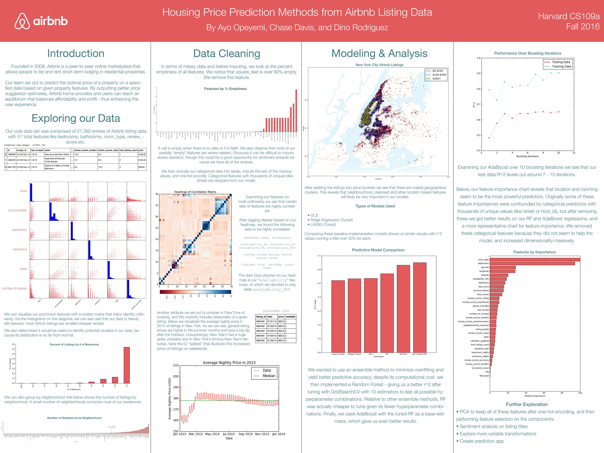

## [Overview](../index.md)

## [Data Exploration](../data_exploration/exploration.md)

## [Preprocessing](../preprocessing/cleaning.md)

## [Feature Creation](../feature_creation/features.md)

## [Model Building](../model_building/model.md)

### Conclusion

Since the initial baseline exploration and modeling presented on the poster below, much more cleaning, feature building, model tuning and more helped improve the model's pricing prediction accuracy. Namely some of these enhancements included:

* Imputation using KNN.
* Trimming categorical features to keep sample size down after one-hot encoding.
* Feature construction based on distances like *proximity to station* and *on central park*.
* Feature construction from sentiment analysis (TextBlob Package gave best results).
* Imputation using K-Nearest Neighbors on all relevant missing features.
* Tuning our AdaBoost + RF Model. It was somewhat of an unorthodox approach, but we wanted to try something new. After it gave us good results we pursued it further in this model and got even better results.

There were also strategies we implemented or considered that did not increase predictive accuracy or make sense in our model: 

* Alternative ensemble methods.
* Seasonality data (could not really implement it as a predictor, but was useful to see general trends).
* Scheduled city-wide or neighborhood-wide events.

#### Initial Model Poster

### Key Takeaway
With a multi-dimensional dataset containing listing information, we learned that ensemble methods like Random Forests and ADA Boosting gave us much more predictive accuracy compared to baseline models like OLS, Ridge Regression, and LASSO. Creating new features, and thoroughly cleaning our dataset to minimize predictor count allowed our model to predict variable importance far better. This is clearly visible by looking at the variable importance graph from the poster above and comparing it to the current one in the Model Building section. 

### More Further Exploration

* Local hotel listing prices.
* Multinomial vector feature.
* More sentiment analysis using features like negations, parts-of-speech, n-grams, and property-specific corpera.
* Visual feature extraction based on listing photos.
* Using Support Vector Machines for listing classification.

### Thanks For Reading!
Altogether we had a great time building this model and appreciate all of the support from the CS109a staff!
