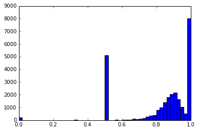

### Import Libaries:


```python
import numpy as np
import pandas as pd
import scipy as sp
import re
import csv
import nltk
from datetime import datetime
from scipy.stats import mode
from sklearn.model_selection import train_test_split
from sklearn.linear_model import LinearRegression as LinReg
from sklearn.linear_model import RidgeCV
from sklearn.datasets import load_digits
from matplotlib.path import Path
import matplotlib.patches as patches
from sklearn.model_selection import learning_curve
from sklearn.model_selection import ShuffleSplit
from sklearn.linear_model import Ridge
from sklearn.linear_model import Lasso
from sklearn.tree import DecisionTreeRegressor
from sklearn.model_selection import GridSearchCV
from sklearn.linear_model import LassoCV
from sklearn.ensemble import RandomForestRegressor
from sklearn.ensemble import AdaBoostRegressor
import matplotlib
import matplotlib.pyplot as plt
from sklearn import discriminant_analysis
from sklearn.decomposition import PCA
from sklearn import preprocessing
from collections import Counter
%matplotlib inline
```

### Concatenation of Listing Titles with Reviews


```python
# Read in the data 
listings = pd.read_csv('listings.csv', delimiter=',')
reviews = pd.read_csv('reviews.csv', delimiter=',')

# Split into predictor and response
y = listings['price']

# Append price at the end of the listings table
del listings['price']
x = listings
              
listings = listings.join(y)
```

Below is a preview of some of the titles in our listings datafile.


```python
x['name'].head(n=5)
```


    0          Stay like a real New Yorker! 
    1      Apartment 20 Minutes Times Square
    2    Option of 2 Beds w Private Bathroom
    3    Charming Bright West Village Studio
    4          Charming Apartment in Chelsea
    Name: name, dtype: object


In addition, below are some of the reviews on the listings that guests have left behind. Right away we can see that the reviews range with regards to their lengths and content. In addition, they also range in the language in which they are written in. For exampel the second review appears to be written in German, while the fifth review appears to be written in French. This is something we should be cognizant of when constructing our bag of words feature.

We may have to do a little bit of cleaning on our review dataset as well.


```python
# Preview Dataframe
reviews.head(n=10)
```


<div>
<table border="1" class="dataframe">
  <thead>
    <tr style="text-align: right;">
      <th></th>
      <th>listing_id</th>
      <th>id</th>
      <th>date</th>
      <th>reviewer_id</th>
      <th>reviewer_name</th>
      <th>comments</th>
    </tr>
  </thead>
  <tbody>
    <tr>
      <th>0</th>
      <td>1180670</td>
      <td>14705995</td>
      <td>2014-06-24</td>
      <td>10875598</td>
      <td>Gregory</td>
      <td>Ok, if you like the location and don't mind an...</td>
    </tr>
    <tr>
      <th>1</th>
      <td>4457617</td>
      <td>24432844</td>
      <td>2014-12-28</td>
      <td>24502047</td>
      <td>Amber</td>
      <td>Kleine süße WG, super gelegen, sehr freundlich...</td>
    </tr>
    <tr>
      <th>2</th>
      <td>722394</td>
      <td>9248781</td>
      <td>2013-12-16</td>
      <td>6821360</td>
      <td>Giri</td>
      <td>Extremely disappointed.</td>
    </tr>
    <tr>
      <th>3</th>
      <td>4074444</td>
      <td>23983183</td>
      <td>2014-12-15</td>
      <td>8822691</td>
      <td>Wendy</td>
      <td>Exactly as described.</td>
    </tr>
    <tr>
      <th>4</th>
      <td>68046</td>
      <td>11797670</td>
      <td>2014-04-15</td>
      <td>12231047</td>
      <td>Virginie</td>
      <td>Appartement très sympa, accueillant. A quelque...</td>
    </tr>
    <tr>
      <th>5</th>
      <td>68774</td>
      <td>23987149</td>
      <td>2014-12-15</td>
      <td>23170531</td>
      <td>Anthony</td>
      <td>The reservation was canceled the day before ar...</td>
    </tr>
    <tr>
      <th>6</th>
      <td>920951</td>
      <td>16985911</td>
      <td>2014-08-05</td>
      <td>16614692</td>
      <td>Anthony</td>
      <td>Very Nice and comfortable. Great location - Ma...</td>
    </tr>
    <tr>
      <th>7</th>
      <td>462454</td>
      <td>13159495</td>
      <td>2014-05-20</td>
      <td>14129237</td>
      <td>Amanda</td>
      <td>Sunserae was a phenomenal host. Incredible loc...</td>
    </tr>
    <tr>
      <th>8</th>
      <td>2207015</td>
      <td>13088178</td>
      <td>2014-05-19</td>
      <td>14336410</td>
      <td>Laurie</td>
      <td>Our rental was great. It was just as described...</td>
    </tr>
    <tr>
      <th>9</th>
      <td>1773664</td>
      <td>11945863</td>
      <td>2014-04-20</td>
      <td>9979725</td>
      <td>Eric</td>
      <td>fantastique\ndavid simply the best !</td>
    </tr>
  </tbody>
</table>
</div>


We can see that some of our reviews aren't in English, that there are additional non-English characters and symbols (\n) and also we know that some cells are empty.


```python
print 'Reviews before NaNs dropped: ', reviews.shape[0]
# Delete reviews entries with NaN values (empty review)
reviews = reviews.dropna(axis=0)
print 'Reviews after NaNs dropped: ', reviews.shape[0]
```

    Reviews before NaNs dropped:  277659
    Reviews after NaNs dropped:  277495


**Concatentation Function:**


```python
# creates empty array to store concatenated text
empty_concat = []

# iterates through each listing id
for item in x['id'].unique():
    # checks to see if the corresponding listing id has a review
    # if so it concatenates the listing title with the reivew
    if item in reviews['listing_id'].unique():
        empty_concat.append(str(x['name'].loc[x['id'] == item].values[-1]) + ' ' + str(reviews['comments'].loc[reviews['listing_id'] == item].values[:-1]))
    else:
        empty_concat.append(str(x['name'].loc[x['id'] == item].values[-1]))
```


```python
# Get Neighborhood words to remove geographic correlation from our 'bag-of-wods'
nbs = x['neighbourhood_cleansed'].unique().tolist()
nbs = [nb.lower().split() for nb in nbs]
nbs = set([item for sublist in nbs for item in sublist])
```

### Getting the reviews in shape for analysis


```python
from nltk.stem import SnowballStemmer
stemmer = SnowballStemmer('english')

from nltk.corpus import stopwords
stops = set(stopwords.words("english"))

bags = empty_concat
bag_of_words = []

# Make characters all english alphabet
for review in bags:
    # Use regular expressions to do a find-and-replace for alphabet
    replaced = re.sub("[^a-zA-Z]", " ", review)
        
    # All lower
    lower_case = replaced.lower()
    
    # Put in list
    words = lower_case.split()
        
    words = [stemmer.stem(w) for w in words if ((not w in stops) & (not w in nbs))]
        listing_words = ' '.join(words)
        
    bag_of_words.append(" ".join(words))
    
```

    Hip Luxury in the East Village  BD    Great apartment  legit   bedroom with a comfy couch to easily sleep a third  good location  couldn t ask for much more   Jen was very easy to work with  available  responsive and helpful   I landed a bit late in the evening from London and Jen made it easy to coordinate checking in and getting settled   Definitely recommend     This was a really great experience   n nFast responses  super clean and comfortable apartment in a very fun neighborhood  Everything you could possibly need   n nJen was awesome and we would definitely stay here again      We had a great stay at Jenn s apartment which was very cosy and located on  st Avenue in East Village  The apartment was clean and warm and the beds were very comfortable to sleep in  The apartment was also nice and quiet so easy to sleep  Jenn was a great host and was very good at being in touch      Jen was so sweet and accommodating  The apartment is in a great location  very comfortable and clean  We would definitely stay here again     Jen was great  very welcoming and easy to communicate with  The flat is warm and cozy  Comfy beds  The location is perfect  a five minute walk to great food  cinema  shops  and the subway     minutes and you re at Union Square and can pick up the L train to Williamsburg     Jen s place was exactly what we were expecting from the photos posted   Great location as well nearby subway and lots of food bar options   Jen was very accommodating re  check in check out times  which was appreciated      Jen s apartment was great  I was in New York for a weekend with a friend  We found the apartment clean  updated and comfortable  Great location in the East Village walking distance to bars and restaurants   n nShe worked around us to make it easy to pick up the key  and was prompt in responding to any questions we had  n nI would highly recommend Jen s place     Perfect  exactly as advertised  Jen is charming and was accommodating for our check in  also very responsive when a question arose  Would definitely recommend      Jen s apartment was just like she described  It is on the  rd floor  no lift but we didn t mind the stairs   two comfortable double bedrooms  small kitchen living area and clean bathroom  Small  which is normal for NYC  but perfect for visiting the city since we only really slept there  It is on a busy street but on the inside of the building  therefore very quiet  Location was perfect  East Village is a really cool  trendy area with great restaurants and bars  Do a little research to ensure you don t miss hidden gems like the speakeasy bars  The closest subway station is only   blocks away  one block from a City Bike stand and easy to hail a cab  Jen was extremely helpful and friendly and made our stay very enjoyable  Would definitely recommend it and stay there again     Kleine gem xc  xbctliche Wohnung in toller Lage mitten in East Village  Das Appartement war sauber  alle vorhandenen Shampoos und K xc  xbcchenutensilien  sowie Bier konnten benutzt werden     Perfection  Just enough space  Great location and looks just like photos  Jen is adorable and her decor is a true reflection of her  Simple      Apartment is just as its description  cozy  small and neat  two bedrooms with queen size beds and closets  and doors  I thought it nice to be able to have a bit of privacy  to the living room entrance kitchen  Third floor  walk up   not noisy except for the air conditioning of the neighbors via backyard  bathroom tiny but new and everything clean  Situated in a great location  shops with anything you might need for your stay within one block   nJen is a great host  always available by phone  text   great suggestions for bar restaurants just around the corner  Would definitely stay there again     Jen was a a great host and very flexible with the check in and check out times  The apartment is great and located near some great bars and restaurants    
    [u'hip', u'luxuri', 'bd', u'apart', u'legit', u'bedroom', u'comfi', u'couch', u'easili', u'sleep', u'third', u'good', u'locat', u'ask', u'much', u'jen', u'easi', u'work', u'avail', u'respons', u'help', u'land', u'bit', u'late', u'even', u'london', u'jen', u'made', u'easi', u'coordin', u'check', u'get', u'settl', u'definit', u'recommend', u'realli', u'experi', 'n', u'nfast', u'respons', u'super', u'clean', u'comfort', u'apart', u'fun', u'neighborhood', u'everyth', u'could', u'possibl', u'need', 'n', u'njen', u'awesom', u'would', u'definit', u'stay', u'stay', u'jenn', u'apart', u'cosi', u'locat', 'st', u'avenu', u'apart', u'clean', u'warm', u'bed', u'comfort', u'sleep', u'apart', u'also', u'nice', u'quiet', u'easi', u'sleep', u'jenn', u'host', u'good', u'touch', u'jen', u'sweet', u'accommod', u'apart', u'locat', u'comfort', u'clean', u'would', u'definit', u'stay', u'jen', u'welcom', u'easi', u'communic', u'flat', u'warm', u'cozi', u'comfi', u'bed', u'locat', u'perfect', u'five', u'minut', u'walk', u'food', u'cinema', u'shop', u'subway', u'minut', u'pick', 'l', u'train', u'jen', u'place', u'exact', u'expect', u'photo', u'post', u'locat', u'well', u'nearbi', u'subway', u'lot', u'food', u'bar', u'option', u'jen', u'accommod', u'check', u'check', u'appreci', u'jen', u'apart', u'weekend', u'friend', u'found', u'apart', u'clean', u'updat', u'comfort', u'locat', u'walk', u'distanc', u'bar', u'restaur', 'n', u'nshe', u'work', u'around', 'us', u'make', u'easi', u'pick', u'key', u'prompt', u'respond', u'question', 'n', 'ni', u'would', u'high', u'recommend', u'jen', u'place', u'perfect', u'exact', u'advertis', u'jen', u'charm', u'accommod', u'check', u'also', u'respons', u'question', u'aros', u'would', u'definit', u'recommend', u'jen', u'apart', u'like', u'describ', 'rd', u'floor', u'lift', u'mind', u'stair', u'two', u'comfort', u'doubl', u'bedroom', u'small', u'live', u'area', u'clean', u'bathroom', u'small', u'normal', u'nyc', u'perfect', u'visit', u'sinc', u'realli', u'slept', u'busi', u'insid', u'build', u'therefor', u'quiet', u'locat', u'perfect', u'realli', u'cool', u'trendi', u'area', u'restaur', u'bar', u'research', u'ensur', u'miss', u'hidden', u'gem', u'like', u'speakeasi', u'bar', u'closest', u'subway', u'station', u'block', u'away', u'one', u'block', u'bike', u'stand', u'easi', u'hail', u'cab', u'jen', u'extrem', u'help', u'friend', u'made', u'stay', u'enjoy', u'would', u'definit', u'recommend', u'stay', u'klein', u'gem', 'xc', u'xbctlich', u'wohnung', u'toller', u'lage', u'mitten', u'das', u'appart', u'war', u'sauber', u'all', u'vorhandenen', u'shampoo', u'und', 'k', 'xc', u'xbcchenutensilien', u'sowi', u'bier', u'konnten', u'benutzt', u'werden', u'perfect', u'enough', u'space', u'locat', u'look', u'like', u'photo', u'jen', u'ador', u'decor', u'true', u'reflect', u'simpl', u'apart', u'descript', u'cozi', u'small', u'neat', u'two', u'bedroom', u'queen', u'size', u'bed', u'closet', u'door', u'thought', u'nice', u'abl', u'bit', u'privaci', u'live', u'room', u'entranc', u'third', u'floor', u'walk', u'noisi', u'except', u'air', u'condit', u'neighbor', u'via', u'backyard', u'bathroom', u'tini', u'everyth', u'clean', u'situat', u'locat', u'shop', u'anyth', u'might', u'need', u'stay', u'within', u'one', u'block', u'njen', u'host', u'alway', u'avail', u'phone', u'text', u'suggest', u'bar', u'restaur', u'around', u'corner', u'would', u'definit', u'stay', u'jen', u'host', u'flexibl', u'check', u'check', u'apart', u'locat', u'near', u'bar', u'restaur']


```python
# Output bag_of_words feature to csv
bag = pd.DataFrame(x['id'])
bag['bag_of_words'] = bag_of_words
bag.to_csv('bag_of_words.csv')

bag
```


<div>
<table border="1" class="dataframe">
  <thead>
    <tr style="text-align: right;">
      <th></th>
      <th>id</th>
      <th>bag_of_words</th>
    </tr>
  </thead>
  <tbody>
    <tr>
      <th>0</th>
      <td>1069266</td>
      <td>[stay, like, real, yorker, love, place, mentio...</td>
    </tr>
    <tr>
      <th>1</th>
      <td>1846722</td>
      <td>[apart, minut, probabl, find, better, host, co...</td>
    </tr>
    <tr>
      <th>2</th>
      <td>2061725</td>
      <td>[option, bed, w, privat, bathroom, miao, one, ...</td>
    </tr>
    <tr>
      <th>3</th>
      <td>44974</td>
      <td>[charm, bright, studio, locat, bus, subway, ci...</td>
    </tr>
    <tr>
      <th>4</th>
      <td>4701675</td>
      <td>[charm, apart]</td>
    </tr>
    <tr>
      <th>5</th>
      <td>68914</td>
      <td>[calm, sunni, apt, tr, xc, xa, bell, exp, xc, ...</td>
    </tr>
    <tr>
      <th>6</th>
      <td>4832596</td>
      <td>[larg, furnish, sunni, room]</td>
    </tr>
    <tr>
      <th>7</th>
      <td>2562510</td>
      <td>[br, privat, room, li]</td>
    </tr>
    <tr>
      <th>8</th>
      <td>3005360</td>
      <td>[hip, luxuri, bd, apart, legit, bedroom, comfi...</td>
    </tr>
    <tr>
      <th>9</th>
      <td>2431607</td>
      <td>[bright, airi, room, would, definit, recommend...</td>
    </tr>
    <tr>
      <th>10</th>
      <td>1322641</td>
      <td>[beauti, ft, furnish, apt]</td>
    </tr>
    <tr>
      <th>11</th>
      <td>4833061</td>
      <td>[]</td>
    </tr>
    <tr>
      <th>12</th>
      <td>234327</td>
      <td>[girl, share, nice, apart, neighborhood, perfe...</td>
    </tr>
    <tr>
      <th>13</th>
      <td>2000287</td>
      <td>[fabul, fall, gtwi, eastern, parkway, vaughn, ...</td>
    </tr>
    <tr>
      <th>14</th>
      <td>2525956</td>
      <td>[beauti, bdr, heart, nyc, neighborhood, apart,...</td>
    </tr>
    <tr>
      <th>15</th>
      <td>809929</td>
      <td>[clean, cozi, apt, megan, awesom, accommod, ea...</td>
    </tr>
    <tr>
      <th>16</th>
      <td>753622</td>
      <td>[privat, bedroom, recommend, place, get, nice,...</td>
    </tr>
    <tr>
      <th>17</th>
      <td>1781041</td>
      <td>[beauti, apt, min, reserv, cancel, day, arriv,...</td>
    </tr>
    <tr>
      <th>18</th>
      <td>4060165</td>
      <td>[singl, bed, close, everyth, amaz, love, view,...</td>
    </tr>
    <tr>
      <th>19</th>
      <td>4323940</td>
      <td>[sanctuari, w, sauna]</td>
    </tr>
    <tr>
      <th>20</th>
      <td>1832976</td>
      <td>[conveni, locat, shelli, host, fiance, felt, w...</td>
    </tr>
    <tr>
      <th>21</th>
      <td>4218098</td>
      <td>[bedroom, apt, centralpark, laura, fantast, de...</td>
    </tr>
    <tr>
      <th>22</th>
      <td>4053471</td>
      <td>[apart, heart, molli, hostess, realli, could, ...</td>
    </tr>
    <tr>
      <th>23</th>
      <td>4831993</td>
      <td>[huge, br, w, bathroom, lux, apt, bldg]</td>
    </tr>
    <tr>
      <th>24</th>
      <td>2596813</td>
      <td>[uw, near, u, st, john, host, went, way, make,...</td>
    </tr>
    <tr>
      <th>25</th>
      <td>4810267</td>
      <td>[trendi, apart]</td>
    </tr>
    <tr>
      <th>26</th>
      <td>312664</td>
      <td>[beauti, apt, view, awesom, place, cindi, amaz...</td>
    </tr>
    <tr>
      <th>27</th>
      <td>4358437</td>
      <td>[gorgeous, w, balconi, airport, pick]</td>
    </tr>
    <tr>
      <th>28</th>
      <td>26229</td>
      <td>[luxuri, apart, onboard, process, smooth, mich...</td>
    </tr>
    <tr>
      <th>29</th>
      <td>2993952</td>
      <td>[modern, studio, central, locat]</td>
    </tr>
    <tr>
      <th>...</th>
      <td>...</td>
      <td>...</td>
    </tr>
    <tr>
      <th>27362</th>
      <td>744930</td>
      <td>[oasi, w, flower, e, place, fantast, locat, su...</td>
    </tr>
    <tr>
      <th>27363</th>
      <td>149823</td>
      <td>[locat, near, central, jessica, nice, us, help...</td>
    </tr>
    <tr>
      <th>27364</th>
      <td>1127866</td>
      <td>[spacious, minut, heidi, accommod, apart, spac...</td>
    </tr>
    <tr>
      <th>27365</th>
      <td>1118605</td>
      <td>[prime, locat, sunni, view, yovel, apart, perf...</td>
    </tr>
    <tr>
      <th>27366</th>
      <td>596346</td>
      <td>[spacious, bedroom, apart, absolut, terrif, ex...</td>
    </tr>
    <tr>
      <th>27367</th>
      <td>1197645</td>
      <td>[color, quiet, near, subway, thank, much, josh...</td>
    </tr>
    <tr>
      <th>27368</th>
      <td>1984378</td>
      <td>[oasi, loft, heart, friend, drove, day, look, ...</td>
    </tr>
    <tr>
      <th>27369</th>
      <td>1936231</td>
      <td>[cheer, furnish, privat, studio, everyth, set,...</td>
    </tr>
    <tr>
      <th>27370</th>
      <td>96471</td>
      <td>[waver, one, bedroom, studio, reserv, cancel, ...</td>
    </tr>
    <tr>
      <th>27371</th>
      <td>1359438</td>
      <td>[perfect, ez, nyc, daniel, list, accur, avail,...</td>
    </tr>
    <tr>
      <th>27372</th>
      <td>108503</td>
      <td>[urban, cottag, br, denis, place, perfect, sta...</td>
    </tr>
    <tr>
      <th>27373</th>
      <td>591046</td>
      <td>[big, loft, privat, roof, deck, donna, michael...</td>
    </tr>
    <tr>
      <th>27374</th>
      <td>277207</td>
      <td>[beauti, lrg, syle, apt, share]</td>
    </tr>
    <tr>
      <th>27375</th>
      <td>15385</td>
      <td>[cozi, place, cristina, love, host, stay, apar...</td>
    </tr>
    <tr>
      <th>27376</th>
      <td>537685</td>
      <td>[amaz, room, prime, flat, clean, cosi, neighbo...</td>
    </tr>
    <tr>
      <th>27377</th>
      <td>545949</td>
      <td>[real, cool, larg, privat, deal, apart, realli...</td>
    </tr>
    <tr>
      <th>27378</th>
      <td>41721</td>
      <td>[spacious, studio, apart, wburg, spacious, wel...</td>
    </tr>
    <tr>
      <th>27379</th>
      <td>304484</td>
      <td>[larg, privat, loft, amaz, view, jenni, place,...</td>
    </tr>
    <tr>
      <th>27380</th>
      <td>255990</td>
      <td>[spacious, br, apt, perfect, locat, love, expl...</td>
    </tr>
    <tr>
      <th>27381</th>
      <td>593889</td>
      <td>[room, ph, live, month, internship, decis, liv...</td>
    </tr>
    <tr>
      <th>27382</th>
      <td>33998</td>
      <td>[sq, ft, loft, apt, premi, xc, xa, exp, xc, xa...</td>
    </tr>
    <tr>
      <th>27383</th>
      <td>196499</td>
      <td>[prime, locat, minut, fine, ntr, xc, xa, bien,...</td>
    </tr>
    <tr>
      <th>27384</th>
      <td>499763</td>
      <td>[larg, bedroom, w, nyc]</td>
    </tr>
    <tr>
      <th>27385</th>
      <td>2361020</td>
      <td>[urban, chic, br, suit, stay, one, krystal, ap...</td>
    </tr>
    <tr>
      <th>27386</th>
      <td>659875</td>
      <td>[stylish, apt, heart, nyc, christina, wonder, ...</td>
    </tr>
    <tr>
      <th>27387</th>
      <td>661849</td>
      <td>[elev, safe, first, airbnb, experi, one, j, re...</td>
    </tr>
    <tr>
      <th>27388</th>
      <td>1080766</td>
      <td>[special, price, stay, perfect, appart, clean,...</td>
    </tr>
    <tr>
      <th>27389</th>
      <td>2668770</td>
      <td>[victorian, mansion, studi, love, stay, victor...</td>
    </tr>
    <tr>
      <th>27390</th>
      <td>78232</td>
      <td>[privat, brownston, studio, apart, alex, wonde...</td>
    </tr>
    <tr>
      <th>27391</th>
      <td>4359442</td>
      <td>[luxuri, apt, min, timessq, midtownw, ell, kin...</td>
    </tr>
  </tbody>
</table>
<p>27392 rows × 2 columns</p>
</div>


```python
# Load positive and negative word corpera
positive = pd.read_csv('positive-words.txt', encoding='latin1')
negative = pd.read_csv('negative-words.txt', encoding='latin1')

pos_lib_full = positive.iloc[:, 0].tolist()
neg_lib_full = negative.iloc[:, 0].tolist()
new = []

for each in positive.iloc[:, 0].tolist():
    word = each.encode('ascii', 'ignore')
    neg_lib_full.append(word)

for each in negative.iloc[:, 0].tolist():
    word = each.encode('ascii', 'ignore')
    new.append(word)

# Make corpus sets for faster lookup
pos_lib_stems = [stemmer.stem(str(w)) for w in pos_lib_full]
pos_lib = set(pos_lib_full + pos_lib_stems)

neg_lib_full = new
neg_lib_stems = [stemmer.stem(str(w)) for w in neg_lib_full]
neg_lib = set(neg_lib_full + neg_lib_stems)
```


```python
# Score Positivity/Negativity from Reviews

# Count positive and negative word appearances,
# returns polarity averages as a list for each review
def corpus_predict(texts):
    polarities = []
    
    for i in range(0, len(texts)):
#       print texts[i]
        if i % 1000 == 0:
            print i
        opinion = texts[i]
        pos_count, neg_count = 0., 0.
        polarity = 0.5
        for word in opinion:
            if word in pos_lib:
                pos_count += 1.
            elif word in neg_lib:
                neg_count += 1.
        
        if (pos_count == 0.) & (neg_count == 0.):
            print opinion
            pass
        else:
            polarity = pos_count/(pos_count + neg_count)
        polarities.append(polarity)
        
    return polarities
```


```python
full_bag = bag['bag_of_words'].tolist()
polarities = corpus_predict(full_bag)
```

    0
    [u'larg', u'furnish', u'sunni', u'room']
    ['br', u'privat', u'room', 'li']
    []
    [u'sanctuari', 'w', u'sauna']
    [u'huge', 'br', 'w', u'bathroom', u'lux', u'apt', u'bldg']
    [u'cosi', u'studio', u'locat']
    [u'superbowl', u'weekend', u'rental']
    [u'special', u'rate', u'wall', 'st', u'gym', u'doorman']
    [u'bedroom', u'heart']
    [u'bedroom', u'apt', u'min', u'train']
    [u'privat', 'br', u'prime', u'spot']
    ['br', u'apart']
    ['br']
    [u'bedroom', 'w', u'desk', u'twin', u'bed']
    [u'airi', u'loft']
    ['lg', 'br', 'w', u'balconi', u'ue', u'train']
    [u'furnish', u'studio', u'month', u'two']
    [u'larg', u'bedroom', u'loft']
    [u'bedroom']
    [u'bedroom']
    [u'bdr', u'condo', u'minut']
    [u'privat', u'room', u'balconi']
    [u'one', u'bedroom']
    [u'bedroom', u'flat']
    [u'beautifu', 'br', u'apt', u'outdoor', u'space']
    [u'share', u'room', u'dorm', u'bed', u'year']
    [u'ten', u'day', u'rental', u'nyc', u'visitor']
    [u'lit', u'singl']
    [u'broadway', u'hous']
    [u'privat', u'big', u'room', u'hous']
    ['th', 'b', 'w']
    [u'duplex', u'backyard']
    [u'privat', u'room', 'gs']
    [u'nyc', u'studio']
    [u'bedroom', u'duplex', u'apt', u'roof']
    [u'room', u'sublet', u'apt']
    [u'home', u'home']
    [u'bdr', u'duplex', u'lexington']
    [u'huge', u'apart']
    [u'foot', u'ciel', u'duplex', u'bed']
    [u'apt', u'central', u'nyc']
    ['ph', u'apart', u'skylin', u'view']
    [u'one', u'bedroom', u'apt']
    [u'larg', u'apt']
    [u'year', u'eve', u'duplex']
    [u'green', 'br', u'apt', 'w', u'backyd', u'fireplac']
    [u'room', u'rent']
    [u'apt', u'privat', u'rooftop', u'churchf']
    [u'one', u'bedroom', u'offic']
    [u'apart', u'nyc']
    [u'apart']
    [u'locat', u'locat', u'locat']
    [u'studio']
    [u'privat', u'room', u'per', u'night']
    [u'size', u'room', u'min']
    [u'apt', u'privat', u'bedroom']
    ['br']
    [u'bdroom', u'apt']
    [u'homestel', 'w', u'breakfast', u'twin', u'bed']
    ['br', u'hideaway']
    [u'privat', u'bedroom', u'apart']
    [u'home']
    [u'nyc', u'loft', u'sqft', u'full', u'apart']
    [u'penthous', u'duplex', u'privat']
    [u'big', u'room', u'larg', u'apart', u'nyc']
    [u'sunni', u'studio', u'apart']
    [u'bedroom', u'close', u'lincoln']
    [u'privat', u'room', u'step', u'subway']
    [u'larg', u'privat', u'bedroom', u'bed', u'apt']
    [u'step', u'park', u'art']
    [u'near']
    [u'locat']
    [u'studio']
    [u'cosi', u'apar']
    [u'dream', u'loft', u'pool', u'roof']
    [u'design', u'studio']
    [u'huge', u'bdrm', u'prime', u'est', u'vill', u'bar', u'food']
    [u'apart']
    [u'privat', u'bedroom', u'newli', u'renov']
    [u'execut', u'loft']
    [u'sunni', u'room']
    ['br', u'walk', u'dist', u'path']
    [u'histor', 'bd', u'apt']
    [u'huge', u'privat', u'room', u'balconi']
    [u'sunni', u'studio']
    [u'champaign', u'sky', u'suit', u'nyc', u'tutto', u'bene', u'appartamento', u'molto', u'ben', u'situato', u'dalla', u'metropolitana', 'ad', u'una', u'fermata', 'da', u'dove', u'partono', u'treni', u'espressi', u'che', u'pochi', u'minuti', u'portano', u'centro', u'rox', 'e', u'molto', u'gentil', 'e', u'disponibil', u'cerca', 'di', u'risolver', u'tutti', u'gli', u'eventuali', u'problemi', u'che', 'si', u'possano', u'presentar', u'ottimo', u'rapporto', u'prezzo', u'qualita', u'servizi', u'offerti']
    ['br', u'apt', u'feb', u'march']
    [u'privat', u'room', 'en', u'suit', u'townhous']
    [u'sublet', u'mid', u'februari']
    [u'privat', u'room']
    [u'larg', u'bdr', 'w', u'skylight']
    [u'locat', u'lapashkinia']
    [u'artsi', 'br', u'prime']
    [u'share', u'room', u'whashington', 'h']
    [u'block', u'subway', u'central']
    [u'loft', u'sanctuari']
    [u'small', u'room']
    [u'experi']
    [u'holiday', u'view']
    ['br', u'bthrm', u'patio', u'pingpong']
    [u'room', u'apart']
    [u'sunni', u'artist', u'loft']
    [u'deux']
    [u'larg', u'privat', u'room', u'ensuit', u'bathroom']
    [u'privat', u'room', u'gwb']
    [u'houz', 'fb']
    [u'bedroom', u'hip', u'penthos']
    []
    [u'bedroom', u'day', u'night']
    [u'year']
    [u'mth', u'room', u'util', u'includ']
    [u'privat', u'bed', u'apt']
    [u'privat', u'bedroom', u'central']
    [u'graham', u'land', u'jfk', u'area', u'queensni']
    [u'privat', u'bedroom', 'br']
    [u'larg', u'light', u'fill', u'room']
    [u'les', u'apt', u'share', u'bedroom']
    [u'pov', u'laundri']
    [u'bedroom', u'balconi']
    [u'priv', u'shower', u'min', u'nyc']
    [u'larg', u'apart']
    [u'bohemia']
    [u'privat', u'room', u'bed', u'stuy']
    [u'one', u'bdr', u'apt']
    [u'homey', u'railroad', u'hip']
    ['br', u'apt', u'dec', u'jan']
    [u'bedroom']
    [u'one', u'bdrm']
    [u'privat', u'room', u'brand', u'apart']
    [u'room', u'rent']
    [u'sunni', u'bedroom', u'brownston']
    [u'duplex']
    [u'artsi', 'bd', u'apt']
    [u'apart']
    [u'sunni', u'studio', u'space', u'nyc', u'xmas']
    [u'art', u'fill', u'sunni', 'br', u'bed', u'stuy']
    [u'privat', u'king', u'size', u'bed', u'next', u'train']
    [u'larg', u'bedroom', u'astor', u'row', u'apt']
    [u'locat']
    [u'larg', u'histor', u'townhous']
    [u'privat', 'br', 'br', u'apt', 'e']
    [u'huge', u'bedroom', u'bathroom', u'apart']
    [u'locat', u'tru', u'bedroom']
    ['bk', u'museum', u'adj', u'bdm', u'deck']
    [u'wen', u'xin', u'hostel']
    [u'across', u'train', u'bus', u'min']
    [u'bedroom', u'extra', u'bed']
    [u'loft', u'superbowl', u'wknd']
    [u'one', u'bedroom', u'apt']
    [u'entir', u'bed']
    [u'privat', u'room']
    [u'privat', u'room']
    [u'room', u'rent']
    [u'bedroom', u'apt']
    [u'space', u'host']
    [u'larg', u'bedroom']
    ['br', u'wifi', u'router', u'dishwash']
    [u'privat', u'room', u'half']
    [u'home', u'heart', u'nyc']
    [u'larg', u'studio', u'apart']
    [u'brand', u'bdrm']
    [u'privat', u'light', u'fill', u'bdrm']
    [u'studio', u'heart']
    [u'larg', u'privat', u'room', 'br', u'apt']
    [u'singl', 'br', u'larg', u'apt']
    [u'walkup']
    [u'bedroom', 'bk']
    [u'room']
    [u'one', u'bedroom', u'apt', u'wall', 'st', u'nyc']
    [u'larg', 'br', 'b', u'next', u'lincoln', 'eu', u'minha', u'esposa', 'e', u'minha', u'filha', 'de', u'ano', u'ficamo', u'dia', u'apartamento', u'itay', u'foi', u'uma', u'experi', 'xc', u'xaancia', 'xc', 'xb', u'tima', u'itay', u'foi', u'muito', u'atencioso', u'nos', u'ajudando', u'prontament', u'sempr', u'que', u'precisamo', 'na', u'logistica', u'para', u'pegar', u'chave', 'e', u'devolv', 'xc', u'xaa', 'la', u'foi', u'muito', u'simpl', 'e', 'f', 'xc', 'xa', u'cil', 'na', u'localiza', 'xc', 'xa', 'xc', 'xa', u'apartamento', 'xc', 'xa', u'muito', u'boa', u'sendo', u'uma', 'xc', 'xb', u'tima', 'op', 'xc', 'xa', 'xc', 'xa', u'tanto', u'para', u'fam', 'xc', u'xadlia', u'como', u'para', u'casai', u'sem', u'filho', 'e', u'mesmo', u'solteiro', u'apartamento', 'xc', 'xa', u'maravilhoso', u'com', u'uma', u'vista', u'muita', u'bonita', 'de', u'nyc', u'nal', 'xc', 'xa', u'disto', u'apartamento', 'xc', 'xa', u'novo', u'todo', u'equipado', u'confort', 'xc', 'xa', u'vel', u'muito', u'limpo', 'e', u'espa', 'xc', 'xa', u'oso', u'nem', u'resumo', u'foi', u'tudo', u'muito', u'bom', u'recomendo', u'todo', u'airbnb', 'n', 'n']
    [u'privat', u'room', 'ny']
    [u'loft']
    [u'bedroom', u'apart']
    [u'furnish', u'studio']
    [u'huge', u'room', u'two', u'bedroom', u'loft', u'unit']
    [u'minut']
    [u'furnish', u'suit']
    [u'huge', 'br', 'ba', 'w', u'ppl']
    [u'one', u'bedroom', u'irv', u'place']
    [u'yorker', 'br']
    [u'loft', u'loft']
    [u'next', u'hilton', 'th', 'av', 'th', u'reserv', u'cancel', u'day', u'arriv', u'autom', u'post', u'reserv', u'cancel', u'day', u'arriv', u'autom', u'post']
    [u'sunni', 'br', 'c', u'train']
    [u'privat', u'room', u'bedroom', u'apart']
    [u'huge', u'privat', u'room', u'back']
    [u'furnish', u'studio']
    [u'privat', u'room']
    [u'nyc', u'place', u'close']
    [u'brownston', 'bk', u'close', 'c']
    [u'apart']
    [u'privat', u'apt', u'year', u'eve', u'nyc']
    [u'bedroom', u'fit']
    [u'bdr']
    [u'huge', u'bedroom', 'sq', u'central', u'reserv', u'cancel', u'day', u'arriv', u'autom', u'post', u'reserv', u'cancel', u'day', u'arriv', u'autom', u'post']
    [u'big', u'loft', u'room', u'artist', u'studio']
    [u'studio', u'apt']
    1000
    [u'chambr', u'louer', 'la', u'semain']
    [u'flat']
    [u'loft', u'privat', u'rooftop']
    [u'privat', u'room']
    [u'townhous']
    [u'skylit', 'br', u'deck']
    [u'entir', u'home', u'apt']
    [u'room', u'apt', 'l']
    [u'bdrm', u'hind', u'residenti', u'suit']
    [u'appart', 'de', u'lux', 'de', u'caract']
    [u'fulli', u'furnish', u'studio']
    [u'room', u'apt']
    [u'close', u'nyu', u'parson']
    [u'larg', u'bedroom']
    [u'apart', u'lux', u'doorman', u'build']
    [u'sunni', u'studio']
    [u'stay', u'jazz', u'singer']
    [u'privat', u'room', u'privat', u'hous']
    [u'one', u'bedroom', u'apart', u'rent']
    [u'bed', u'penthous']
    [u'privat', u'nyc', u'studio']
    [u'columbus', u'circl', u'studio']
    [u'room', u'apart']
    ['b', 'b', u'hostel']
    [u'huge', u'room', u'privat', u'ue']
    [u'shekinah', u'hous', u'tell', u'other', u'airbnb', u'communiti', u'stay']
    [u'minut', u'away']
    [u'room', u'rent', 'se', u'renta', u'cuarto']
    [u'studio']
    [u'doubl', u'bedroom', u'heart', u'nyc']
    [u'privat', u'room', u'king', u'size', u'bed']
    [u'singl', u'room', u'brownston']
    [u'duplex', u'central']
    [u'room', u'rent', 'br', u'larg', u'apt']
    [u'bedroom', u'balconi', u'heart', u'nyc']
    [u'uniqu', u'artist', u'loft']
    [u'chambr', u'priv', 'e', 'au', u'coeur']
    [u'bedroom', u'railroad', u'apt']
    [u'furnish', u'larg', u'studio']
    [u'privat', u'bedroom', u'near']
    [u'heart']
    [u'sunni', u'bedroom', u'les']
    [u'larg', u'sunni', u'bedroom', 'w', u'bathroom']
    ['sq', u'sunni', 'jr', 'bd', u'epic', u'view']
    [u'sky', u'bedroom', u'workspac']
    [u'sunni', 'bd', u'deck', u'apt']
    ['ab', u'fab', 'br', u'bklyn', u'brdge']
    [u'ue', u'sleep', u'patio', u'near']
    [u'bedroom', u'bath']
    [u'cosi', u'renov', u'unit', u'two']
    [u'bedroom', u'apart']
    ['br', u'apart']
    [u'locat']
    [u'air', u'condit', u'uptown', u'studio', u'apt']
    [u'sunshin']
    [u'heart']
    [u'larg', u'fulli', u'furnish', 'b', u'bth']
    [u'high', u'rise']
    [u'apart', u'studio']
    [u'larg', u'privat', u'bedroom']
    [u'sunni', u'studio']
    [u'apt', 'w', u'patio', u'near', u'train']
    ['br', u'apt', 'ft']
    [u'sublet', u'bishwick']
    [u'min', u'lic']
    [u'railroad', u'week']
    [u'apart', 'w', u'balconi', u'min', u'nyc']
    [u'bed', u'brkfst']
    [u'room']
    ['ft', u'apt']
    [u'sunni', u'apart']
    [u'sunni', u'bedroom', u'apt']
    [u'condo', u'heart']
    [u'america', u'bdrm']
    [u'bedroom', u'apt', 'ny']
    [u'holiday']
    [u'bring', u'toothbrush', u'fab', 'br']
    [u'share', u'room']
    [u'larg', 'br']
    [u'view']
    [u'apart', u'near', u'nyc']
    [u'larg', u'bedroom']
    [u'sunni', 'br', u'heart']
    [u'one', u'bedroom', u'apart', 'w', u'backyard']
    [u'sunni', u'room', u'full', u'privat']
    [u'brand', u'apart']
    [u'doorman']
    [u'lux', u'penthous', u'huge', u'prvt', u'roof', u'deck']
    ['br', u'apart']
    ['br', u'duplex', u'huge', u'backyard']
    [u'enorm', u'pre', u'war', u'apt', u'uw']
    [u'doorman', u'studio']
    [u'studio']
    [u'uw', u'bedroom', u'close', u'central']
    [u'room', u'stay', u'nyc']
    [u'bedroom']
    [u'privat', u'backyard']
    [u'privat', 'br']
    [u'premium', u'nyc', u'timeshar', u'unit']
    [u'larg', u'bdr', u'apt']
    [u'bedroom', u'loft']
    [u'star', u'hotel']
    [u'apt', u'heart']
    []
    [u'apart']
    [u'sunni', u'bedroom', u'artist', u'parlour']
    [u'bed', u'near', u'cent', 'pk', u'museum']
    [u'privat', 'br', 'br', u'ue', u'apart']
    [u'three', u'bedroom', u'apt']
    [u'bed']
    [u'airi', u'sleep', u'nook']
    [u'privat', u'bedroom', u'loft', u'queen', u'bed']
    [u'huge', u'real', u'bed']
    [u'wen', u'xin', u'hostel']
    [u'privat', u'room']
    [u'larg', u'sunni', u'room', 'pk']
    [u'privat', u'studio', u'bathroom', u'duplex']
    [u'superbowl', u'wknd', u'prime']
    [u'sunni', u'furn', u'bedroom', u'bdrm', u'share']
    [u'artist', 'br', 'w', u'high', u'ceil']
    [u'august']
    [u'larg', u'room', u'fit']
    [u'huge', u'brownston', u'apt']
    [u'sunfil', u'bedroom']
    [u'quintessenti', u'apart']
    [u'space']
    [u'nyc', u'hotel', u'giraff', u'king', u'size', u'suit']
    ['lg', 'br', 'bk', u'apt', u'near', u'train']
    [u'privat', u'room', u'bed', u'stuy']
    [u'bedroom', u'apt']
    [u'privat', u'room']
    ['br', u'apt']
    [u'giant', u'studio', u'locat']
    [u'apart', u'heart', u'nyc']
    [u'furnish', u'light', u'privat', u'room', u'nyc']
    [u'low', u'price', u'holiday', u'ue', u'apt', u'ppl']
    [u'newli', u'renov', u'sunni', u'les']
    [u'nyc', u'bedroom']
    [u'apart']
    [u'larg', u'bedroom']
    [u'cosi', u'room']
    [u'bedroom']
    [u'apart']
    [u'room', u'near', u'market']
    ['br', u'superbowl', u'sleep']
    ['br']
    [u'privat', 'br', u'min', 'sq']
    [u'nyc', u'bed', u'ppl']
    [u'huge', u'sunni', u'room', u'loft']
    ['br', u'home', u'jfk', u'minut']
    [u'apt', u'heart']
    ['sf', u'view', u'artist', u'loft']
    2000
    [u'studio']
    [u'bedroom', u'apt', u'larg', u'patio']
    [u'block', u'columbus', u'circl', 'c']
    [u'larg', u'eclect', u'studio']
    [u'design', 'br', u'noilta']
    [u'fab']
    [u'light', u'fill', u'room', u'nyc']
    [u'les', u'studio', u'apt']
    [u'histor', u'apt']
    [u'sun', u'fill', 'br']
    [u'bohemian', u'room', u'two']
    [u'sunni', 'bd', u'balconi', 'w', u'subway']
    [u'larg', 'br', u'heart', u'mannhattan']
    [u'studio']
    [u'doorman', u'studio', u'area']
    [u'loft', u'room', u'heart']
    [u'singl', u'bed']
    [u'triplex', u'prime', u'locat']
    ['br', u'brownston']
    [u'room', u'place', u'area']
    [u'larg', u'artist', u'room']
    [u'enorm', u'loft', u'bdr', u'bth']
    [u'bedroom', u'next', u'central']
    [u'privat', u'room', u'near', u'univ']
    [u'sunni', u'apart']
    [u'levit', u'alm', 'ny']
    [u'larg', u'bedroom']
    [u'brownston', 'w', u'histori']
    [u'huge', u'room', u'near', u'subway', u'room']
    [u'privat', u'room']
    [u'superbowl', u'studio']
    [u'huge', 'br', 'ba', 'w', u'ppl']
    [u'rooftop', u'apart']
    [u'apart', u'dec', u'jan']
    [u'room', u'per', u'night']
    [u'euro', u'design', u'heart']
    ['nw', u'apart', u'xec', 'x', 'c', 'x', u'xec', 'xb', 'x', u'xea', 'xb', 'x', u'xeb', 'x', 'x', u'xeb', u'xac', 'xb', u'xed', 'x', 'x', u'xec', 'x', 'x', u'xec', 'xa', 'x', u'xec', 'x', 'e', 'x', u'xeb', 'x', 'b', 'x', u'xeb', 'x', 'b', 'xa', u'xeb', 'x', 'xb', u'xec', 'x', 'x', u'xec', 'x', 'x', u'xec', 'x', 'x', 'c', u'xec', 'x', 'x', u'xec', 'xa', 'x', u'xea', 'xb', 'x', u'xec', 'x', 'e', 'xa', u'hip', u'xed', 'x', 'x', 'c', u'xec', 'x', 'x', u'xec', 'x', 'e', 'x', u'xeb', 'xa', u'xac', u'xec', 'x', 'e', 'xa', u'xea', 'xb', 'xa', u'xec', 'x', 'e', 'x', u'xec', 'x', 'c', u'xbc', u'xeb', 'xa', 'xb', u'xea', 'xb', u'xbc', u'xec', 'xb', 'x', u'xec', 'x', 'x', u'xed', 'x', 'x', 'c', u'xec', 'x', 'xb', u'xeb', 'xa', 'x', u'xed', 'x', 'xb', u'xea', 'xb', 'x', u'xea', 'xb', 'x', u'xea', 'xb', 'x', 'c', u'xec', 'x', 'b', 'x', 'c', u'xed', 'x', 'x', 'c', u'xea', 'xb', u'xad', u'xec', 'x', 'xb', u'xeb', 'x', 'xa', u'xec', 'x', 'x', u'xea', 'xb', 'x', 'c', u'xeb', 'x', 'f', 'x', u'xec', 'x', 'x', u'xec', 'xa', u'xbc', u'xec', 'xa', 'x', 'b', u'xec', 'x', 'x', u'xec', 'x', 'x', u'xec', 'x', 'x', 'c', u'xec', 'x', 'e', 'x', u'xeb', 'x', 'b', 'x', u'xeb', 'x', 'b', 'xa', u'xec', 'xa', 'x', u'xed', 'x', 'x', u'xec', 'xb', 'xa', u'xec', 'x', u'xad', u'xec', 'x', 'b', 'x', 'c', u'xea', 'xb', 'xb', u'xec', 'x', 'xb', u'xec', 'x', 'x', 'c', u'xeb', 'xb', 'x', u'xec', 'x', 'x', u'xec', 'x', 'x', u'xea', 'xb', 'x', u'xec', 'x', 'x', u'xec', 'x', 'e', 'x', u'xec', 'x', 'xb', u'xeb', 'x', 'b', 'x', u'xeb', 'x', 'b', 'xa', u'xea', 'xb', 'xa', u'xeb', 'x', 'x', u'xed', 'x', 'x', u'xea', 'xb', 'xa', u'xeb', 'x', 'xb', u'xeb', 'x', 'c', u'xbb', u'xed', 'x', 'x', 'c', u'xed', 'x', 'x', u'xec', 'x', 'xb', u'xec', 'x', 'xb', u'xea', 'xb', 'x', u'xeb', 'x', 'x', u'xeb', 'x', 'xa', u'xec', 'x', 'xb', u'xec', 'x', 'xa', u'xeb', 'x', 'x', u'xeb', 'xa', 'x', 'b', u'xec', 'xa', 'x', u'xea', 'xb', 'xb', u'xec', 'x', 'xb', u'xeb', 'xa', 'xb', u'sam', u'xec', 'x', 'x', u'xeb', 'xb', 'xa', u'xeb', 'xa', 'xb', u'xeb', 'xa', 'x', u'xec', 'x', 'xb', u'xec', 'xa', 'x', u'xeb', 'x', 'b', 'xb', u'xec', 'x', 'x', u'xec', 'xa', u'xbc', u'xeb', 'x', 'x', u'xec', 'xb', 'x', 'c', u'xec', 'xa', 'x', u'xed', 'x', 'x', 'c', u'xec', 'x', u'xac', u'xeb', 'x', 'e', 'x', 'c', u'xec', 'x', 'e', 'x', u'xeb', 'x', 'b', 'x', u'xeb', 'x', 'b', 'xa', u'xeb', 'x', 'b', 'xa', u'xec', 'x', 'x', 'c', u'xec', 'x', 'x', u'xeb', 'x', 'f', 'x', u'xeb', 'x', 'x', u'xec', 'x', 'xb', u'xec', 'x', 'xa', u'xed', 'x', 'x', u'xea', 'xb', 'xa', u'xec', 'x', 'b', 'xb', u'xeb', 'x', 'xa', u'xec', 'x', 'x']
    [u'brand', u'apart', u'airbnb']
    [u'larg', u'brownston', u'uw']
    [u'duplex', 'w']
    [u'larg', 'br']
    [u'room', u'huge', u'apart']
    [u'privat', u'room', u'wall', 'st', u'rent']
    [u'execut', u'room']
    [u'winter', u'sublet']
    [u'student', u'dorm', u'month', u'min']
    [u'room', u'loft']
    [u'downton', u'bedroom', u'triplex']
    [u'privat', u'bedroom', u'penthous', u'apt']
    ['br', 'ba', u'nyc', u'apt', u'superbowl']
    [u'superbowl', 'th', 'nd', 'rd']
    [u'sunni', u'bedroom', u'sublet']
    [u'loft']
    [u'low', u'price', u'holiday', u'ue', u'apt', u'ppl']
    [u'prime', u'locat']
    ['br', u'apt']
    [u'confort', u'privat', u'home']
    [u'huge', 'br', 'ba', 'w', u'ppl']
    [u'bedroom']
    [u'room', u'fit', u'king', u'queen']
    [u'larg', u'room', 'bd', u'apt', u'area']
    [u'huge', u'studio', u'apt', u'near', u'central']
    [u'full', u'month', u'januari']
    [u'superbowl', u'weekend', u'deal']
    [u'bedroom', u'hgts']
    ['br', u'apart']
    [u'studio']
    [u'studio', u'min']
    [u'condo', u'view']
    [u'larg', u'room']
    [u'two', u'room', u'studio', u'high', u'line', u'area']
    [u'apt', 'l', u'train', u'jefferson', u'room']
    [u'big', u'privat', u'bedroom', u'duplex']
    [u'grt', u'apt', u'thanksgvng', u'wknd']
    [u'apt', u'fireplac']
    [u'privat', u'room', u'larg', u'ue', u'apart']
    [u'guest', u'room']
    [u'week', u'sublet', u'hous']
    [u'pie', u'terr', u'month']
    [u'studio']
    [u'cosi', u'one', u'bedroom', u'apart']
    [u'privat', u'room']
    [u'hip', u'bedroom', u'heart', u'les']
    [u'privat', u'room', u'within', 'br', u'appart']
    [u'one', u'bedroom', u'near', u'lincoln']
    [u'bedroom', u'railroad', u'style', u'apart']
    [u'big', u'privat', u'bedroom']
    [u'kosher', u'room']
    [u'bedroom', u'broadway']
    ['br', u'apt', u'share', 'w', u'host']
    [u'privat', u'room', u'bed', u'stuy']
    [u'larg', u'bedroom']
    ['sq', 'ft', u'loft', u'privat', u'backyard']
    [u'pvt', u'room', 'w', u'twin', u'bed', u'small', u'fridg']
    [u'mid', u'town', u'apart']
    [u'doorman', u'queen', u'bed']
    [u'room', u'week']
    [u'newli', u'built', u'full', u'bedroom']
    [u'bed', u'sublet']
    [u'sale', u'huge', u'room', u'prime']
    [u'sunni', u'bedroom', u'apart']
    [u'larg', u'newli', u'furnish', u'bedroom']
    [u'sky', u'scraper']
    [u'hip', u'apart']
    [u'one', u'bedroom']
    [u'studio']
    [u'attic', 'w', u'privat']
    [u'privat', u'room']
    [u'bedroom', u'room', u'key']
    [u'privat', u'patio', u'apt', u'central']
    [u'two', u'bedroom']
    [u'bed', u'aptmt', u'heart']
    [u'bedroom', u'privat', u'room']
    [u'river', u'femal']
    [u'bedroom', u'brownston', u'apart']
    [u'herald', u'privat', u'room']
    [u'room', u'rent', u'close']
    [u'nyc', u'min', u'walk', 'si', u'ferri']
    [u'huge', u'studio', u'guest']
    [u'big', u'sunni', u'room', u'subway']
    [u'queen', u'bed', u'brick', u'wall', u'apt']
    [u'heart']
    [u'boat', u'hous', u'hip', u'surfer']
    ['th', 'st', u'ave', u'studio']
    [u'huge', u'space', u'share', u'giant', u'loft']
    ['rd']
    ['bd', u'superbowl', u'wknd']
    [u'superbowl', u'xlii', u'apt']
    [u'bedroom']
    [u'sunni', u'bedroom']
    [u'heart', u'high', u'rise']
    [u'huge', u'studio', u'oceanview', u'place', u'hostess']
    [u'histor', u'renov', u'townhous']
    [u'privat', u'bedroom']
    [u'holiday', u'share', u'bedroom', u'nyc']
    [u'airi', u'design', u'loft']
    [u'sunni', u'privat', u'bed', u'apt', u'sleep']
    [u'studio', u'univ', u'campus']
    [u'rockaway', u'privat', u'room']
    [u'sunni', 'br', u'heart']
    [u'style', u'duplex']
    [u'experi', u'nyc', u'differ']
    [u'true', u'palac', u'wall']
    [u'furnish', u'apt', u'doorman', u'build']
    [u'bedroom']
    [u'larg', u'privat', u'room', u'apart']
    [u'zen', 'br', u'heart', u'nyc', u'entir', u'apt']
    ['br', u'heart', 'bk', u'step']
    [u'apart']
    [u'uw', u'newyorkc', u'share']
    [u'room', u'view']
    [u'sunni', u'privat', u'room']
    [u'bed', u'nxt', u'superbowl', u'blvd', u'timessq']
    [u'larg', u'privat', u'bedroom']
    [u'juli']
    [u'nyc', u'larg', u'room', u'apart']
    ['br', 'br', u'apt', u'gym', u'laundri', u'gameroom']
    [u'newli', u'renov', 'sq', u'foot', 'bd']
    [u'larg', u'bedroom']
    [u'home', u'holiday', u'sleep']
    [u'sunni', u'airi', u'apart', u'kitten']
    [u'bedroom', u'apart']
    [u'room']
    [u'privat', u'room', u'heart']
    [u'artist', u'studio']
    [u'larg', u'bdrm', u'apt', u'nyc']
    [u'sunni', 'br', u'apt', 'bk']
    [u'newli', u'renov', u'apart']
    [u'privat', u'room']
    [u'huge', u'loft', 'w', u'larg', u'room']
    ['br', u'heart']
    [u'huge', u'loft', u'heart']
    [u'privat', u'room', u'locat']
    [u'light', u'fill', u'loft']
    [u'brownston', u'apart']
    [u'home']
    [u'privat', u'room']
    [u'brownston', u'apt']
    []
    3000
    [u'galleri', u'suit']
    [u'one', u'bedroom', 'w', u'two', u'bed']
    [u'big', u'room', u'balconi', u'bike']
    ['br', u'heart']
    [u'privat', u'room']
    [u'mid', u'town', u'bedroom']
    [u'simpl']
    [u'bedroom', u'world', u'trade', u'tower', u'site']
    [u'studio']
    [u'brm']
    [u'privat', u'room']
    [u'duplex', 'w']
    [u'loft']
    [u'sublet', u'furnish', u'bedroom']
    [u'sunni', u'room', u'min', u'totimessquar']
    [u'feel']
    [u'larg', 'br', u'view']
    [u'entir', u'apt', 'br']
    [u'room', u'histor', u'brownston']
    [u'privat', 'br', u'larg', u'apt']
    ['br', u'brownston', u'neighborhood']
    [u'year', u'eve']
    [u'riversid', u'drive', u'step', 'u']
    [u'space', u'light', u'prime']
    [u'sunni', 'bd', u'balconi']
    [u'sunni', u'studio']
    [u'jan', u'special', 'sf', 'b', 'b', u'sleep', u'reserv', u'cancel', u'day', u'arriv', u'autom', u'post']
    [u'charmingapt', u'block', u'frm', 'c', 'b']
    [u'small', u'studio', u'apart', 'e']
    [u'simpl', u'room', u'apart', u'view']
    [u'bedroom']
    [u'larg', u'bedroom', u'queen', u'bed']
    [u'prime', u'locat']
    [u'christma']
    [u'huge', 'br', 'ba', 'w', u'ppl']
    [u'wall', 'st', u'profession', u'space']
    [u'privat', u'studio', u'dist', u'nyc']
    [u'privat', u'room', 'sq']
    [u'bucol', u'brownton']
    [u'giant', u'privat', u'townhous', 'w']
    [u'casual', u'busi']
    [u'bedroom']
    [u'huge', u'room', u'outdoor', u'space', u'duplex']
    []
    ['br', u'lux', u'apt', u'gotham', 'w']
    [u'sunni', u'sanctuari']
    [u'bdrm', u'apt', u'close', u'subway', u'face']
    [u'space']
    [u'home', 'f', u'maid']
    [u'apart', u'prospectpark']
    [u'design', u'room']
    [u'turquois', u'one', u'bedroom', u'apt']
    [u'huge', u'room', u'natur', u'light']
    [u'river', u'view', u'sublet', u'april', u'may']
    [u'agrad', u'apt', 'de', u'recamara']
    [u'minut', u'maci', u'day', u'parad']
    []
    [u'moroccan', u'theme', 'br']
    [u'loft']
    [u'privateroom', u'greenwichvillag', u'nyc']
    [u'bdrm']
    ['br', u'full', u'superbowl', u'wknd', u'apt']
    [u'larg', u'studio']
    [u'nye', u'nyc', u'high', u'rise', 'ft', 'bk']
    [u'furnish', u'twin', u'bed', 'rm']
    [u'entir', u'apt', u'locat']
    [u'renov', u'appart']
    [u'prime', u'loft']
    [u'penthous', u'ave']
    [u'studio', 'nd', u'lexington']
    [u'brownston', u'nyc', u'holiday']
    [u'huge', u'studio', u'heart', u'nyc']
    [u'bedroom', u'apt', u'sleep']
    ['br', 'ba', u'apt', u'outdoor', 'sp']
    [u'star', u'war', u'room', u'min', u'jfk', u'lga']
    [u'bed', u'stuy', u'apart', u'one', u'bedroom']
    [u'larg', u'sunni', u'room', u'close', 'l', u'train']
    [u'holiday', u'stay']
    [u'apart', u'skylight', u'bedroom']
    [u'apt']
    [u'nyc', u'newli', u'furnish', u'apt', u'sublet', 'xe', 'x', 'x', 'e', 'xe', 'xb', 'xb', 'xe', 'xa', 'x', 'xe', 'x', 'x', 'xe', 'x', u'xbf', 'xe', 'x', 'x', 'xe', 'x', 'f', 'x', 'xe', 'x', 'c', 'xb', 'xe', u'xbb', 'x', 'e', 'xe', 'x', 'x', 'xe', 'x', u'xac', 'xe', u'xaf', 'x', 'xe', 'x', 'x', 'xe', u'xbf', 'x', 'xe', 'x', 'x', 'xe', 'x', 'xb', 'xe', 'xa', 'x', 'xe', 'x', 'x', 'e', 'xe', 'xb', 'xb', 'xe', 'x', 'x', 'xe', 'xa', u'xbd', u'xef', u'xbc', 'x', 'xe', 'x', 'b', 'xa', 'xe', 'x', 'c', 'xb', 'xe', 'x', 'xb', 'xe', u'xab', 'x', 'xe', u'xbe', 'x', 'xe', u'xbf', 'x', u'xef', u'xbc', 'x', 'c', 'xe', 'x', 'x', 'xe', 'xa', 'x', 'b', 'xe', u'xbe', 'x', 'xe', 'xb', 'x', 'xe', 'xa', u'xad', 'xe', 'x', 'f', 'x', 'xe', 'xa', u'xaa', 'xe', 'x', 'x', 'xe', 'x', 'x', 'xe', 'x', 'x', 'f', 'xe', 'xb', u'xbb', 'xe', 'xa', 'x', 'f', 'xe', 'x', u'xbd', 'xe', 'x', 'x', 'e', 'xe', 'xb', 'xb', 'xe', 'x', 'xb', 'xe', u'xbe', u'xbf', u'xef', u'xbc', 'x', 'xe', 'xa', 'x', 'xe', 'xb', 'x', 'b', 'xe', 'xb', 'xb', 'xe', 'x', u'xaf', 'xe', 'xb', 'x', 'xe', 'xb', 'x', 'xe', 'x', 'f', 'x', 'xe', 'x', u'xac', 'xe', u'xbb', 'x', 'xe', u'xab', 'x', u'xef', u'xbc', 'x', 'n', 'xe', 'x', 'x', 'xe', 'x', 'x', 'xe', u'xbe', 'x', 'xe', u'xab', 'x', 'xe', 'x', 'x', 'xe', 'x', u'xbd', 'xe', u'xbd', 'x', 'f', 'xe', 'x', 'xb', 'xe', 'x', 'x', 'xe', u'xba', u'xbc', 'xe', 'xa', 'x', 'xe', 'x', 'x', 'xe', 'x', u'xbf', 'xe', 'x', 'x', u'xef', u'xbc', 'x', 'c', 'xe', 'x', 'c', 'xa', 'xe', 'xb', 'x', 'xe', 'xb', 'x', 'xe', 'xb', 'x', 'xe', 'x', 'x', 'b', 'xe', 'x', 'c', 'x', 'xe', 'x', 'x', 'xe', 'x', 'x', 'f', 'xe', 'xb', u'xbb', 'xe', 'x', 'x', 'e', 'xe', 'xb', 'xb', 'xe', 'x', 'x', 'xe', 'x', 'x', 'xe', 'x', 'c', 'x', u'xef', u'xbc', 'x', 'xe', 'xb', 'xb', 'xe', 'x', 'f', u'xaf', 'xe', u'xbb', 'xa', 'xe', 'x', 'c', 'x', 'b', 'xe', 'xb', 'x', 'xe', 'x', 'c', 'x', 'b', 'xe', 'xa', 'xa', 'xe', u'xbb', 'x', u'xef', u'xbc', 'x', 'c', 'xe', 'x', 'c', 'x', 'f', 'xe', 'x', 'x', 'xe', u'xbe', 'x', 'xe', u'xbc', 'x', 'xe', u'xba', u'xae', u'xef', u'xbc', 'x']
    [u'haaapi', u'bed', u'breakfast']
    ['br', u'near', u'central']
    ['br', 'br', u'apt']
    [u'bedroom', u'huge', u'apt']
    ['ny', u'residenti', u'home']
    [u'bedroom', u'near', u'subway']
    [u'hip', u'homey', u'hideout', u'bed', u'stuy']
    ['sf', u'loft', u'apt']
    ['br', u'loft']
    [u'full', u'apt', u'min', u'subway']
    [u'furnish', u'room']
    [u'penthous', u'huge', u'privat']
    [u'room']
    [u'sunni', 'br', 'w', u'balconi', u'near']
    [u'broadway', u'apart', u'superbowl']
    [u'brand', 'jr']
    [u'space', u'near', 'w', u'burg', 'bk']
    [u'superbowl', u'rental']
    [u'larg', u'one', u'bedroom', u'sutton', u'place', u'nyc']
    ['bd', u'apart', u'hip', u'area']
    [u'duplex']
    [u'victorian', u'view', u'nyc']
    ['bd', u'locat']
    [u'bedroom', 'w', u'privat', u'bathroom']
    [u'timesq', u'brdway', u'hellskitch']
    [u'brand', u'larg', 'br']
    [u'larg', u'room', u'bedroom', u'apart']
    [u'queen', u'bed', u'view']
    [u'one', u'bedroom']
    [u'penthous', u'bedroom', u'sleep']
    [u'larg', u'full', u'size', u'bedroom', 'ac']
    [u'privat', u'room']
    ['sq', 'ft', u'bed', u'prime', u'reserv', u'cancel', u'day', u'arriv', u'autom', u'post']
    [u'apart']
    [u'room', u'ue', u'nyc']
    [u'privat', u'room']
    [u'one', u'bedroom', u'apart', u'boweri']
    [u'larg', u'penthous', u'duplex', u'sleep']
    [u'sunni', u'big', u'room', u'across', u'reserv', u'cancel', u'day', u'arriv', u'autom', u'post']
    [u'specious', u'room', u'light']
    [u'larg', u'room']
    [u'luxeri', u'bed']
    [u'sunni', 'lg', 'br', 'br', u'apt', u'sleep']
    [u'uniqu', u'bed', u'duplex', u'apt']
    [u'place', u'call', u'home']
    [u'apt', u'prime']
    [u'room', u'sleep', u'min']
    [u'grammerci', u'loft']
    [u'month', u'share', u'room', u'student']
    [u'one', u'bedroom', u'apt']
    [u'larg', 'br', u'apt', u'sleep']
    [u'bedroom', u'suit']
    [u'bed']
    [u'roof', u'view', u'year']
    [u'sunni', u'bedroom']
    [u'larg', u'room', u'privat', u'bathroom']
    [u'privat', u'bedroom']
    [u'privat', u'room']
    [u'epic', u'room']
    [u'larg', u'apart', u'rent']
    [u'studio', u'heart']
    [u'much', u'room']
    [u'privat', u'bdrm', u'bigger', u'nyc', u'apt']
    [u'fulli', u'furnish', 'br', u'apt', u'simon', 'xc', 'xa', 'xc', 'xa', 'un', 'h', 'xc', 'xb', 'te', 'tr', 'xc', 'xa', u'dispon', u'toujour', 'la', 'au', u'besoin', u'appart', u'propr', 'et', u'spacieux', 'tr', 'xc', 'xa', u'bien', u'situ', 'xc', 'xa', u'muy', u'linda', u'experiencia', 'la', 'de', 'ny']
    [u'sunni', u'bedroom', u'larg', u'closet']
    [u'bedroom', u'sublet']
    [u'vip', u'nyc']
    [u'minut']
    [u'cathedr', u'view', u'near']
    [u'duplex', u'condo']
    [u'sunni', u'bedroom', 'el', u'barrio']
    [u'function', u'one', u'bedroom', 'w', u'skylight']
    [u'studio', u'heart']
    [u'step', u'away']
    [u'studio']
    [u'beautifu', u'one', u'bedroom', u'locat']
    [u'bed', u'apt']
    [u'sunni', u'room', u'line']
    [u'lot', u'light', u'foot', 'br']
    [u'prime', u'room']
    [u'apt', u'holiday']
    [u'huge', 'br', u'heart']
    [u'larg', u'room', u'bedroom', u'apart']
    ['au', u'pair', u'suit', u'brownston']
    [u'bedroom', u'privat']
    [u'five', u'star']
    ['br', u'white', u'glove', u'condo', u'mid', u'town', u'reserv', u'cancel', u'day', u'arriv', u'autom', u'post']
    [u'larg', u'estudio']
    [u'one', u'bedroom']
    [u'privat', u'bedroom', 'nr', u'subway']
    [u'room', u'month']
    [u'sunni', u'bedroom', u'renov', u'apt']
    [u'bedroom', u'bed', u'apt']
    ['br', u'newli', u'renov', u'brownston']
    [u'big', 'bd', u'apt', u'close', u'everyth']
    [u'nyc', u'bedroom', u'balconi']
    [u'huge', 'br', 'ba', 'w', u'ppl']
    [u'bedroom', u'dream', u'hous']
    [u'sunni', u'privat', u'room']
    [u'privat', u'room']
    [u'sunni', 'bd', u'librari']
    [u'studio', 'w', u'backyard']
    [u'luxuari', u'bedroom']
    [u'quarto', u'suit', u'minuto', 'de', u'manhatta']
    [u'close', u'bedroom']
    4000
    [u'shareroom', u'apt']
    [u'timesq', u'two', u'bedroom']
    [u'apart', u'view']
    [u'bedroom', u'apt']
    [u'holiday', u'sublet', u'min']
    [u'room', u'privat']
    [u'spend', u'nye', 'w', 'e', 'bd']
    [u'confort', u'room']
    [u'entir', u'apart', u'pas', 'xc', 'xa', u'muy', u'bien', 'en', u'nueva', 'el', u'apartamento', 'de', u'pablo', 'es', u'agrad', u'est', 'xc', 'xa', u'bien', u'ubicado', 'es', u'caro', u'pablo', 'es', 'un', u'buen', u'anfitri', 'xc', 'xb', 'n', u'ayud', 'xc', 'xb', 'en', u'tema', u'mundano', u'nant', 'de', u'entregrarm', 'el', u'apto', 'lo', u'recomiendo']
    [u'bdrm', 'ap']
    [u'fulli', u'furnish', u'prime']
    [u'priv', u'room', u'bdrm', u'apt', u'room', 'c']
    [u'fairest', u'deal', u'brklyn', u'btiful', u'apt']
    [u'townhous', u'bedroom', u'mansion']
    [u'heart']
    [u'studio', u'min']
    [u'sunni', u'room']
    [u'locat']
    [u'spot']
    [u'larg', u'room']
    [u'histor', u'brownston', u'duplex']
    [u'entir', u'apt', u'communiti']
    [u'homey', u'queen', u'size', u'room', u'near']
    [u'view', u'river']
    [u'sky']
    [u'shekinah', u'hous', u'hostel']
    ['ny', u'featur', u'penthous']
    [u'room']
    [u'prime', u'loft']
    [u'privat', u'room']
    [u'huge', u'bedroom', u'apart']
    [u'one', u'bedroom', u'apt', u'guest']
    [u'rock', 'br']
    [u'locat', u'nyc']
    [u'bedroom', u'heart', u'nyc']
    [u'larg', u'one', u'bedroom']
    [u'second', u'place', u'call', u'home']
    [u'heart', u'world', u'trade']
    [u'room', 'br', u'share', u'apt']
    [u'bedroom', u'renov', u'apt']
    [u'spend', u'night', u'year', u'nyc']
    [u'larg', u'warehous', u'artist']
    [u'huge', 'br', u'duplex', u'bed', u'stuy']
    [u'breezi', u'room', u'nyc']
    ['br', u'close']
    [u'eastern', u'parkway', 'br', u'flat']
    [u'bedrm', u'apt']
    [u'heart']
    [u'nyc', u'privat', u'room', u'min', 'sq']
    [u'entir', u'bedroom', u'apt', u'les', 'ny']
    [u'duplex', u'apt', u'sleep']
    [u'parksid', u'studio']
    [u'furn', u'studio', u'month']
    [u'richard', u'place']
    [u'sun', u'lit', u'privat', u'room']
    ['br', u'apt', u'heart']
    [u'bedroom']
    [u'full', u'view', u'room']
    ['br']
    [u'student', u'dorm', u'share', u'room', u'month']
    [u'apart', u'step', u'central']
    [u'prime', 'br', u'heart']
    [u'hilton', u'timeshar', 'st']
    [u'entir', u'bedroom', u'apt']
    [u'apt', u'famili', u'coupl']
    [u'prime', u'locat']
    [u'room', u'min']
    [u'privat', u'room']
    [u'studio']
    [u'room', u'min']
    [u'renov', u'bedroom']
    [u'fidi', u'apt', u'sept', u'oct']
    [u'rehab', u'loft']
    []
    [u'privat', u'room', u'heart', u'nyc']
    [u'min', u'nyc', 'rm', u'pvt']
    [u'morton', 'st', u'expos', u'brick', u'apart']
    [u'sunni', u'loft']
    [u'privat', u'bedroom']
    ['br', u'sleep', u'peopl']
    [u'privat', u'apt', u'histor', u'bro']
    [u'three', u'bedroom', u'apart']
    [u'perri', 'br']
    [u'artist', u'apt', u'histor']
    [u'sunni', u'studio', u'apart']
    [u'bedroom', u'condo', u'hts', 'bk']
    [u'privat', u'bedroom', u'apart']
    [u'one', u'bedroom']
    [u'bed', u'breakfast']
    [u'larg', u'bedroom', u'privat', u'bathroom']
    [u'privat', u'room', 'br', u'apart']
    ['ny', u'duplex', u'apart']
    [u'furnish', u'studio']
    [u'hip', u'apt', u'nyc']
    [u'month', u'student', u'hous', u'share', u'room']
    [u'nyc', 'br', 'br', u'apt', u'guest']
    [u'room', u'brick', u'wall', 'br']
    [u'privat', u'room', u'patio', 'e', u'vill']
    [u'privat', u'bedroom', u'apart', u'uw']
    [u'newli', u'renov', 'sf', u'apt']
    [u'two', u'room', u'near', 'c', u'train']
    [u'one', u'bedroom', u'murri']
    [u'apart']
    [u'couch', u'home']
    [u'big', u'bedroom', u'artist', u'musician']
    [u'larg', u'room']
    [u'home', u'decor', u'brownston', u'apt']
    []
    [u'furnish', 'bd', u'apt']
    [u'apart']
    [u'superbowl', u'weekend', u'nyc', u'two']
    [u'sunni', u'room', u'bklyn']
    [u'bohemian', u'brownston']
    [u'complet', u'bedroom', u'near', 'u']
    [u'sunni', u'high', u'ceil', 'br', u'apt']
    [u'bedroom', u'apt', u'min', 'sq']
    [u'one', u'room', u'studio', u'space', 'w', u'view']
    ['rm', 'br', u'loft', u'room']
    [u'bdrm', u'apt', u'min', u'train', u'suit']
    [u'huge', u'sunni', u'loft', 'bk']
    [u'privat', u'bedroom']
    [u'cosi', u'room', u'unit', u'nation']
    [u'privat', u'bdrm', u'heart', u'reserv', u'cancel', u'day', u'arriv', u'autom', u'post']
    [u'privat', 'br', 'br', u'apt', 'e']
    [u'victorian', u'room', 'la', u'maison', u'art']
    [u'giant', 'br']
    [u'bedroom', u'holiday', u'rental']
    [u'cosi', u'one', u'bedroom']
    [u'big', u'sunni', u'privat', u'room']
    [u'apart']
    [u'furnish', u'studio', u'area']
    [u'sunni', u'bed', u'stuy', u'across']
    [u'privat', u'room']
    [u'astor', u'place']
    [u'privat', u'room', u'sublet', u'dec', u'jan']
    [u'bklyn', u'min', 'l', u'train']
    [u'bedroom', u'full']
    [u'bedroom', u'sublet']
    [u'sunni', 'br']
    [u'sunni', u'apt']
    [u'brand', u'privat', u'room', u'view']
    [u'holiday', u'room']
    [u'studio', u'step']
    [u'bedroom', u'duplex', u'bedsti']
    [u'nyc']
    ['bd']
    [u'back', u'bedroom']
    ['br', u'aprt', 'w', u'offic', u'outdoor', u'space']
    [u'lrg', u'bdrm', 'w', u'offic', u'backyard']
    [u'bedroom', u'bord']
    ['br', u'superbowl', u'special']
    [u'studio']
    [u'privat', u'bedroom', u'sunlit', u'apart', u'reserv', u'cancel', u'day', u'arriv', u'autom', u'post']
    [u'apt', u'xmas', u'nye']
    [u'design', u'loft', u'river']
    ['bd', u'heart']
    [u'bedroom', u'duplex', u'near']
    [u'room', u'apart']
    [u'huge', u'loft', u'privat', u'bathroom', u'room', 'c']
    [u'spend', u'holiday']
    [u'heart']
    [u'larg', 'br', u'block', u'exp', u'train']
    ['br', u'get', u'less', 'w', u'villiag']
    [u'tan', u'room']
    [u'home', u'away', u'home', u'bed', u'stuy']
    [u'bedroom', u'near']
    [u'studio', u'heart']
    [u'huge', u'artist', u'studio', u'room', 'sq', 'ft']
    [u'superbowl', u'rental', u'room']
    [u'studio']
    [u'privat', u'room']
    [u'apart']
    [u'queen', u'room', 'br', u'apt', u'femal']
    [u'spot']
    [u'larg', u'sunni', u'room', u'near', u'astor', u'place']
    [u'whimsic', u'brownston', u'apart']
    [u'penthous', u'brownston']
    [u'duplex', u'apt']
    [u'alcov', u'studio']
    [u'uniqu', u'room', u'histor']
    [u'room']
    5000
    [u'bedroom', u'apt', u'height']
    [u'larg', u'artist', u'loft', u'studio']
    [u'privat', u'bedroom']
    [u'privat', 'br', u'penthous']
    ['xl', u'studio', u'doorman', u'build']
    [u'townhous', u'bedroom']
    [u'huge', u'bedroom', 'rr', u'apt']
    [u'apart']
    [u'sunni', u'minimalist', u'privat', u'room']
    [u'room', u'half', u'block', u'empirest', u'buildig']
    [u'sunni', u'studio']
    [u'privat', u'room', u'huge', u'loft']
    [u'fulli', u'furnish', u'privat', u'bedroom']
    [u'central', u'view', u'massiv', u'room']
    [u'room']
    [u'larg', u'sunni', u'loft']
    [u'central', u'aeri']
    [u'huge', u'window', 'ac', u'train', u'acc']
    [u'room', u'sun', u'drench', u'duplex']
    [u'one', u'bedroom']
    [u'eastsid', u'locat']
    [u'bedroom', u'apart']
    [u'room', u'fit', u'two']
    []
    [u'bedroom']
    [u'fulli', u'furnish', u'bedroom', u'apt', u'les']
    [u'bedr', u'apart', u'next', u'penn']
    [u'bed', u'femal', u'dorm', 'w', u'pvt', u'bathroom']
    [u'homi', u'room', 'e']
    [u'near', u'subway', u'close']
    [u'sunni', u'prime']
    [u'design', 'bd', u'loft']
    [u'bedroom', u'offic', u'apt']
    [u'heart', 'br']
    [u'studio', u'apart']
    [u'sunni', 'bd', u'apt', u'histor']
    [u'larg', u'sunni', u'privat', u'room']
    [u'bedroom']
    ['br', 'th']
    [u'corner', u'penthous', u'near', u'barclay']
    [u'larg', u'studio', u'apt']
    [u'roomcomfort']
    [u'white', u'glove', u'doorman', u'build', u'apt']
    [u'privat', u'room']
    [u'huge', u'apt']
    [u'huge', u'artist', u'loft', u'privat', u'room']
    [u'nyc', u'skylin', u'view', u'bedroom']
    [u'two', u'bed', u'room']
    [u'gateway', u'nyc']
    [u'privat', u'room']
    [u'studio', u'apart']
    [u'bedroom', u'larg', u'aptmt', u'view']
    [u'privat', u'room']
    [u'mom', u'big', u'bed', u'two', u'women']
    [u'entir', u'apt']
    [u'newli', u'renov', 'br', u'heart', 'bk']
    [u'sunni', u'privat', u'room', u'near']
    [u'priv', 'br', 'w', u'bathr', u'balc', u'frm']
    [u'loft']
    ['br', u'minut', u'central']
    [u'dreami', u'apt', u'histor']
    [u'christma', u'eve', u'year']
    [u'room']
    [u'studio', u'close', u'subway']
    [u'boweri', u'girl', u'bdrm']
    [u'newli', u'renov', u'townhous']
    [u'year']
    [u'prime', 'br']
    [u'privat', u'bedroom', u'nyc', u'min']
    ['br', u'step', 'sq']
    [u'huge', 'bd', u'apt']
    [u'privat', u'room', u'min']
    [u'larg', u'apt', u'heart']
    [u'larg', u'privat', u'room']
    [u'penthous', u'flat', u'privat', u'roof']
    [u'air', u'mattress']
    [u'nyc', u'bedroom', u'uw']
    [u'loft', u'holiday']
    []
    [u'fifth', u'avenu', u'loft']
    [u'true', u'loft', u'experi']
    [u'central']
    [u'boweri', u'apart']
    [u'room']
    ['ny', u'privat', u'sqft', u'tropic', u'loft']
    [u'privat', u'room', u'uptown']
    [u'winter', u'vacat', u'rental']
    [u'stay', u'place']
    [u'privat', u'room']
    [u'one', u'bedroom', u'apart']
    [u'privat', u'room', u'near', u'train']
    [u'privat', u'bedroom', u'near', u'central']
    [u'massiv', u'artist', u'loft']
    [u'huge', u'room']
    [u'huge', u'bedroom', u'loft']
    [u'one', u'bedroom']
    [u'apart']
    [u'central', u'view', u'prvt', u'room', u'mnh']
    [u'artist', u'loft']
    [u'indi', u'room']
    [u'big', u'sunni', 'br', u'heart', 'ft']
    ['br', u'bed', u'queen', u'sofab', u'sleep']
    [u'sunni', u'corner', u'room']
    [u'room']
    [u'studio', u'apart', u'central', u'locat']
    [u'huge', u'room', u'bedroom', u'duplex']
    [u'railroad', 'w', u'privat']
    [u'larg', u'bedroom']
    [u'room']
    [u'huge', u'bedroom', u'newli', u'renov', u'home']
    ['bd', u'apt', u'heart']
    [u'step', u'david', u'est', 'un', 'h', 'xc', 'xb', 'te', u'honn', 'xc', u'xaat', u'dispon', 'et', u'discret', u'son', u'appart', u'est', 'id', 'xc', 'xa', u'alement', u'situ', 'xc', 'xa', 'xc', 'xa', u'proximit', 'xc', 'xa', u'des', u'transport', u'des', u'commerc', 'de', u'proximit', 'xc', 'xa', u'des', u'restaur', u'bar', u'cin', 'xc', 'xa', 'j', 'xc', 'xa', u'tai', 'la', u'premi', 'xc', 'xa', u'personn', 'xc', 'xa', 'xc', 'xa', u'journer', u'dan', u'son', u'appart', u'donc', 'l', u'accueil', u'est', 'xc', 'xa', 'xc', 'xa', u'liorer', u'afin', u'que', 'le', u'prix', u'demand', 'xc', 'xa', u'correspond', 'au', u'servic', u'attendu']
    [u'privat', u'loft', u'bushwk']
    [u'apt', u'fulli', u'furnish', u'central']
    [u'huge', u'room']
    [u'privat', u'room', u'central']
    [u'big', u'sunni', u'apart', u'holiday']
    ['n', 'th', u'prime']
    [u'entir', u'apt', u'uw']
    [u'sunni', u'bedroom', u'apart', u'uw']
    [u'huge', 'bd', u'sleep']
    [u'bedroom', u'renov', u'brownston']
    [u'feel', u'home', u'privat', u'loft']
    [u'sqft', u'bdrm', u'bths', 'w']
    [u'heart', u'entir', u'apt']
    [u'fulli', u'furnish', u'studio']
    [u'sunni', u'studio']
    [u'loft']
    [u'privat', u'foot', u'loft']
    [u'artist', u'duplex', u'prime', u'willi']
    [u'sublet', u'room', u'ue']
    [u'sunni', u'queen', u'room']
    [u'fulli', u'furnish', u'studio']
    [u'appl', u'author']
    [u'bed', u'privat']
    [u'real', u'bed', u'heart']
    [u'bedroom', u'apart', u'gramceri']
    [u'huge', u'bed', u'apt', 'sq']
    [u'pvt', u'room', 'l']
    [u'townhous']
    [u'loft', u'studio', 'w', u'stripper', u'pole']
    ['br', u'apt', u'superbowl']
    [u'stuyves', u'apt', u'min']
    [u'brownston']
    [u'furnish', u'bedroom', u'apt', u'wash', u'hts']
    6000
    [u'bedroom', u'privat', u'bathroom']
    [u'bedroom', u'apt', u'min']
    [u'bdrm', u'near', 'b', 'c', u'train']
    [u'privat', u'room', 'br']
    [u'step', u'central', u'museum', u'mile']
    [u'larg', u'privat', u'bedroom', u'minut']
    [u'larg', u'room']
    [u'jewel', u'vacat', u'stay', 'bk']
    [u'larg', u'bedroom']
    ['br', u'nyc']
    ['th', 'st', u'maci', u'day', u'parad']
    [u'space', u'privat', u'room']
    [u'stay', u'heart', u'hts']
    [u'room']
    [u'home', u'away', u'home', u'nyc']
    [u'real', u'brick', u'loft', u'studio', u'bedroom']
    [u'fulli', u'load', u'brand', u'apt']
    [u'brand', u'bed', 'sq']
    [u'brownston', u'huge']
    [u'luxus', u'apart', 'im', 'w', u'hotel']
    [u'apt', u'tree', u'line', 'st']
    [u'privat', u'room', u'block', u'central', 'p']
    [u'loft', u'everyth']
    [u'apt', u'superbowl']
    [u'share', u'studio', u'ave']
    [u'privat', u'bedroom']
    ['br']
    [u'bdr', u'apt', 'wb']
    [u'privat', u'room']
    [u'filmmak', u'loft', u'wtc']
    [u'huge', u'artist', u'apart']
    [u'min', u'sub', u'min']
    [u'million', u'bed', u'townhous', u'sleep']
    [u'bedroom', u'larg', u'apt']
    [u'bedroom', u'huge', u'apt', 'st', u'mark']
    [u'bedroom', u'view']
    [u'sunni', 'b', u'apart', u'washintog', u'heig']
    [u'bedroom']
    [u'apt', u'locat']
    [u'big', u'sunni', u'one', u'bedroom']
    [u'privat', u'bedroom', u'larg', u'apt']
    [u'calliop', u'room']
    [u'sunni', u'studio', u'brownston']
    [u'larg', u'privat', u'bedroom']
    ['br', u'renov', u'apt', u'vil']
    [u'larg', u'breezi', u'room', u'privat']
    [u'room']
    [u'bedroom', u'apart', u'backyard']
    [u'sunni', u'bedroom', u'near']
    [u'prospectheight', u'sundrench', u'apt']
    [u'bedroom', u'huge', u'apart']
    [u'houz', 'fb']
    [u'studio', u'view']
    [u'world', u'nyc']
    [u'twin', u'bed', u'apt']
    [u'spring', u'room']
    [u'two', u'bedroom', u'apart']
    [u'furnish', u'step', 'u']
    [u'two', u'bedroom', u'apart']
    [u'brownston', u'rental']
    [u'bedroom']
    [u'privat', u'room', u'rosedal']
    [u'landmark', u'home', u'histor', 'st']
    ['ny', u'apt', u'superbowl', u'weekend']
    [u'bungalo']
    [u'sunni', u'privat', 'br', u'height']
    ['br', u'sun', u'fill', u'feng', u'shui', 'w']
    ['br', 'sq']
    [u'rear', u'bedroom', u'near', u'central']
    ['br', u'pvtr', u'rent', 'br', 'ba']
    [u'pie', u'terr']
    [u'sunni', u'apart']
    [u'apart', u'close']
    [u'bedroom', u'month', u'rental']
    [u'lot', u'space', u'locat']
    ['br', 'sq']
    ['br', u'loft', u'across', u'boweri', u'hotel']
    [u'furnish', u'bedroom']
    [u'surround', u'park']
    [u'bedroom', u'apart']
    [u'eagl', u'eye', u'view']
    [u'larg', u'sunni', u'room', u'two']
    [u'sunni', u'room']
    [u'room', u'availbl', u'wash']
    [u'bedroom', u'apt', u'roofgarden']
    [u'bedroom']
    [u'privat', u'bedroom', u'larg', u'apt']
    [u'apt', u'sublet']
    [u'privat', u'room']
    ['br', u'apt', u'cat']
    [u'rent', u'studio', 'sq']
    [u'studio']
    [u'studio']
    [u'privat', u'room', u'rent']
    [u'bed', u'heart', u'nyc', u'nye']
    ['br', u'apt']
    [u'hideaway']
    [u'bedroom', u'apt', u'max', u'peopl']
    [u'share', u'room']
    [u'share', 'br', 'ba']
    [u'loft', 'w', u'roof', u'deck']
    [u'privat', u'room', 'br']
    [u'dollhous', u'bdrm']
    [u'studio', u'hear']
    [u'host', u'mother']
    [u'larg', 'bd', 'bd', u'apt']
    [u'tryon']
    [u'bed', 'xl', u'apt', u'jane']
    [u'brownston', u'histor']
    [u'light', u'fill', 'br', u'condo']
    [u'nyc', 'bd', u'near', u'central', u'shop']
    [u'heart', u'everyth']
    [u'sunni', u'one', u'bedroom', u'near', u'subway', u'bkln']
    [u'five', u'star', u'tigui', u'room']
    [u'christma', u'duplex']
    [u'studio', u'loft', u'apart']
    [u'privat', u'room']
    [u'brand', u'condo', u'reserv', u'cancel', u'day', u'arriv', u'autom', u'post']
    [u'big', u'sunni', u'room']
    [u'privat', u'room']
    [u'central']
    [u'condo', u'baller']
    [u'month', u'rental', u'apt']
    [u'day', u'femal', u'june']
    [u'bedroom', u'apart']
    [u'privat', u'room']
    ['br', u'near', u'central', 'pk']
    [u'entir', u'loft', u'apart']
    [u'full', u'sunni', u'apt', u'near', u'columbus', u'circl']
    [u'bdrm', u'fulli', u'furnish', u'bdrm', u'apt']
    [u'huge', u'room', u'rent']
    [u'privat', u'bedroom']
    [u'bdrm', u'light', u'fire', u'escap', 'c']
    [u'bedroom', u'flat']
    [u'couch', u'surf']
    [u'room', u'stop', u'central']
    [u'apart', 'th', u'reserv', u'cancel', u'day', u'arriv', u'autom', u'post']
    [u'min']
    [u'cosi', u'furnish', u'room', u'rent']
    [u'year']
    [u'bedroom', u'bathroom']
    [u'bed', u'head']
    [u'almost']
    [u'two', u'room', u'bldng']
    [u'contemporari', u'room', 'ny']
    [u'privat', u'bedroom']
    [u'privat', u'room', u'bushwk']
    [u'bedroom', u'loft']
    [u'step', u'away', u'museum']
    [u'bedroom', u'apt']
    [u'bed', 'w', u'privat', u'roof', u'deck']
    [u'appart']
    [u'cosi', u'room']
    [u'sunni', u'room']
    [u'bedroom']
    [u'locat', u'claudia']
    [u'getaway']
    ['bd']
    [u'hous', u'suit']
    [u'drop', u'hat', 'go', u'see']
    [u'larg', u'sunni', u'room', u'bed', u'stuy']
    [u'room', u'privat', u'rooftop']
    [u'entir', u'home', u'apt']
    ['rm', u'rent', u'bed', u'stuy']
    ['br', u'morn', u'doorman', u'wifi']
    [u'sunni', u'privat', u'room', u'bedroom', u'apt']
    [u'huge', u'apart', u'holiday']
    [u'big', u'appl']
    ['br', 'br']
    ['bd', u'apt', 'th', u'ave']
    [u'alway', u'sunni']
    [u'one', u'bedroom', u'apt']
    [u'expos', u'brick', 'w', u'queen', u'bed']
    [u'larg', u'bedroom']
    [u'bdr', u'apt', u'superbowl', 'wk', u'wknd']
    ['br', u'cat', u'sit']
    [u'one', u'bedroom', u'apt', 'b', 'w', u'lex', u'ave']
    [u'larg', u'privat', u'room', u'huge', u'les', u'apt']
    [u'huge', u'real', 'br', u'heart']
    [u'superbowl', u'wknd', u'min', 'sq']
    [u'light', u'fill', u'studio']
    ['br', u'queen', u'bed', 'tv']
    7000
    ['br', 'br', u'apt']
    [u'larg', u'bedroom', u'apt']
    [u'larg', u'room', 'br', 'l', 'j', 'g', u'train']
    ['bd', u'penthous', u'outdoor', u'space']
    ['br', u'bth', u'heart', u'uw']
    [u'huge', u'privat', u'bdr', u'min']
    [u'larg', u'bedroom']
    [u'privat', u'larg', u'bedroom']
    [u'larg', u'bedroom', u'loft']
    [u'privat', u'doubl', u'room', u'central']
    [u'holiday', u'apt', u'theater']
    [u'dbl', 'br', u'apt', u'prime', u'loc', u'view']
    [u'huge', 'br', u'near', u'subway']
    [u'whole', u'hous']
    [u'sunni', u'room', u'apt']
    [u'bedroom', u'uw', u'apt']
    [u'apart']
    [u'bdrm', u'bdrm', u'duplex', u'brookyln']
    [u'one', u'bedroom']
    [u'studio']
    [u'apart']
    [u'energi', u'light', u'min']
    [u'larg', u'xtra', u'bedrm', 'w']
    [u'apt', u'close']
    [u'shepherd', u'guest', u'hous', u'apt']
    [u'flex', u'room', u'huge', u'bhk', u'newyork']
    ['ny', u'sun', u'fill']
    [u'home', u'away', u'home']
    [u'budget', u'stay', u'near', u'transport']
    [u'big', u'bedroom', u'high', u'ceil']
    [u'sunni', u'apart']
    [u'stop', 'st', u'min', u'ftrain']
    [u'room', u'rent', u'close']
    [u'artsi', u'central', u'abod']
    [u'bedroom', u'bathroom', u'apart']
    [u'sunni', u'bedroom']
    [u'room', u'brownston']
    [u'entir', u'apt', 'st']
    [u'bdr', u'apt', u'nyc', u'neighborhood']
    [u'daughter', u'apart', 'n']
    [u'central', u'hideaway']
    [u'locat', u'marilda', u'girl']
    [u'step', u'away', u'barclay']
    [u'edgi', u'studio']
    [u'locat', u'close', 'u']
    [u'sunni', u'one', u'bedroom', u'apart']
    ['br', u'apart']
    ['xx', u'experi']
    [u'one', u'room', u'three', u'bedroom']
    [u'bdrm', u'prime']
    [u'homestel', 'w', u'breakfast', u'twin', u'bed']
    [u'room', u'bedroom', u'apart']
    [u'wyndham', u'nyc']
    [u'two', 'br', u'apart']
    [u'huge', u'room']
    [u'dream', u'apart', 'br']
    [u'superbowl', u'weekend', u'studio', u'apt']
    [u'privat', u'room']
    ['th', 'th', 'th']
    [u'privat', u'room', u'privat', u'hous']
    [u'larg', u'apart', u'near']
    ['br', u'prime', u'locat']
    [u'studio', u'heart']
    [u'feder', u'townhous']
    [u'room', u'bed', u'stuy']
    [u'hous', u'rent', u'nyc']
    [u'river', u'watersid', u'plaza']
    [u'studio']
    ['l']
    [u'loft', u'min']
    ['br', 'ba', u'townhous']
    [u'neighborhood', u'room']
    [u'larg', u'bedroom', 'br', u'build']
    [u'singl', u'bed']
    [u'larg', 'bd', u'heart']
    [u'huge', u'sunlit', u'bedroom']
    [u'room', 'br', u'apart', u'meatpackin']
    [u'privat', u'room', u'nyc']
    [u'prime', u'bedroom', u'reserv', u'cancel', u'day', u'arriv', u'autom', u'post']
    [u'nyc', u'pvt', u'bedroom', u'queen', u'bed']
    [u'bed', u'duplex']
    [u'lrg', u'privat', u'bedroom', 'w', u'attach']
    [u'penthous']
    [u'bedroom']
    [u'two', u'bedroom', u'apart']
    ['br', u'privat']
    [u'entir', u'studio', u'christma', u'nye']
    [u'apt', 'sq']
    [u'home']
    [u'superbowl', u'weekend', 'br', u'sleep']
    [u'urban', u'hideaway']
    [u'histor']
    [u'larg', u'duplex', u'flat', u'near']
    [u'apart']
    [u'bed', u'privat', u'room']
    ['br', u'apt', u'tree', u'line', 'bk']
    [u'bedroom']
    [u'studio', u'superbowl']
    [u'larg', 'br', u'view', u'sky']
    [u'bedroom', u'apart']
    [u'fulli', u'furnish', u'apart']
    [u'queen', u'room', u'penthous', u'fidi', u'apt']
    [u'balconi']
    ['br', u'bed', 'q', u'full', u'sofab', u'sleep']
    [u'brownston', u'dean', 'st', u'brooklynflea']
    [u'huge', u'room', u'hip', u'apt']
    [u'bedroom', u'apart']
    [u'room', u'share', u'ditma', 'f']
    [u'larg', u'sun', u'drench', u'apt']
    [u'privat', u'room']
    [u'entir', u'apart', 'nd', u'avenu']
    [u'airi', u'room', u'histor']
    [u'bedroom']
    [u'one', u'bedroom', u'three', u'bedroom']
    [u'victorian', u'brown', u'stone', u'hous']
    [u'labor', u'day', u'apt']
    [u'privat', u'room', u'bedroom', u'uw']
    [u'loft', u'style']
    [u'room']
    [u'one', u'bedroom', u'share', u'bathroom']
    [u'sunni', u'room', u'locat']
    [u'bedroom', u'bathroom']
    [u'bedroom', u'next', u'penn', u'msg']
    [u'hampton', u'rockaway']
    [u'room', u'rent', u'close']
    [u'larg', u'studio', u'alcov']
    ['br']
    [u'privat', u'room', u'neighborhood']
    [u'privat', u'room', 'ny']
    [u'bed', u'duplex']
    [u'room', u'full', u'size', u'bed']
    [u'privat', u'room', u'nyc']
    ['r', u'privat', u'room']
    [u'privat', u'room', u'brownston']
    [u'sunni', u'room', u'privat', u'apt']
    [u'domain']
    [u'sunni', u'room']
    [u'larg', u'les', u'bedroom', u'privat']
    [u'fab', 'br', u'apt', u'minut']
    [u'huge', u'bedroom']
    [u'ue', u'bedroom']
    [u'bed', u'christma', u'sublet']
    [u'rent', u'one']
    [u'room', u'buyer']
    [u'hilton', u'studio', u'sleep', u'two']
    [u'privat', u'room', u'bedroom', u'apart']
    [u'studio', u'apart', 'th', 'rd']
    [u'huge', 'th', 'fl', u'bedroom']
    [u'apt', u'superbowl', u'week', u'weekend']
    []
    [u'privat', u'room', u'townhous', u'nyc']
    [u'apt']
    [u'view', 'br']
    [u'place', u'learn', u'english', u'nyc']
    [u'larg', u'room']
    [u'huge', u'one', u'bedroom', 'fd']
    [u'quintessenti', u'loft']
    [u'larg', u'room', u'landmark', u'hous']
    [u'studio', u'apart']
    [u'apart', u'share', u'superbowl']
    [u'room', u'near']
    [u'huge', u'remodel', u'home', u'prime', u'area']
    [u'bdrm', u'bth']
    [u'clarendon', u'sun', u'room']
    [u'studio']
    [u'discount', u'huge', 'br']
    [u'huge', u'room', u'artsi', u'vintag', u'apt']
    ['br', u'loft']
    [u'townhous', u'duplex']
    [u'photograph', u'dream', u'loft']
    [u'locat', u'locat', u'locat']
    [u'entir', u'apt', u'meter', 'sq']
    [u'wall', u'locat']
    [u'akua', u'bed', u'stuy', u'studi']
    [u'brand', u'condo', u'near']
    [u'privat', u'room', u'prime']
    [u'sunni', 'br', 'ba', u'duplex']
    [u'bedroom']
    [u'room', u'central']
    8000
    [u'larg', u'bedroom', 'w', u'sit', u'desk', u'area']
    [u'prime', u'central', u'locat']
    [u'white', u'box']
    [u'room', u'spanish']
    [u'larg', u'privat', u'bedroom']
    [u'sublet']
    [u'huge', u'design', 'br']
    [u'larg', 'bd']
    [u'aptmnt', u'christma']
    [u'larg', u'privat', u'space', 'sq', 'ft', u'loft']
    [u'gigant', u'room', u'min']
    ['br', u'histor']
    [u'larg', u'bedroom']
    [u'full', u'apt', u'close', u'jfk']
    ['br', 'w', u'prime', u'near']
    [u'privat', u'room', u'larg', u'loft']
    [u'penthous']
    ['hk', u'stunner']
    [u'apart']
    [u'bedroom', u'backyard', u'reserv', u'cancel', u'day', u'arriv', u'autom', u'post']
    [u'prime', u'locat', u'heart']
    [u'beautifuli', u'furnish', u'larg', u'studio', u'reserv', u'cancel', u'day', u'arriv', u'autom', u'post']
    [u'queen', u'bedroom', u'brownston']
    [u'nyc', u'bedroom']
    [u'per', u'night']
    [u'nyc', 'bd', u'room', u'apt']
    [u'bedroom', u'apt']
    [u'huge', u'apart', 'w', u'furnish', u'bedroom']
    [u'room', u'rent', u'hous']
    [u'water', u'view']
    [u'loft']
    [u'pad']
    [u'studio', u'apt']
    [u'week', u'discount', u'loftb']
    [u'privat', u'bed']
    [u'privat', u'room']
    [u'entir', u'home', 'br', u'nyc']
    [u'huge', u'privat', u'room']
    [u'privat', u'room', u'sleep', u'near', u'train']
    [u'year', u'nyc']
    ['br', u'duplex', u'heart', 'pk']
    [u'superbowl']
    [u'bed', u'min']
    [u'privat', u'studio']
    [u'artist', u'duplex']
    [u'room', u'histor', u'hous']
    [u'simpl', u'room', u'central']
    [u'bedroom', u'soar', u'ceil', u'loft', u'apt']
    [u'bedroom', u'apt']
    [u'sublet', u'dec', u'jan']
    ['rr', u'room', 'l', u'train']
    [u'furnish', u'bedroom', 'w', u'privat', u'roof']
    [u'larg', u'room', u'bedroom', u'apt']
    [u'doubl', u'bedroom', 'b']
    [u'bed', u'stuy', u'privat', u'room']
    [u'huge', u'bdrm', u'north']
    [u'big', u'studio', u'apt']
    [u'studio', u'uw']
    [u'studio', u'apart']
    [u'alcov', u'studio']
    ['br', 'br', u'appart']
    [u'bedroom', u'view']
    [u'summer', u'sublet']
    [u'sunni', u'bed']
    [u'bdrm', u'lux', u'apt']
    [u'privat', u'room', u'close']
    [u'uniqu', u'loft']
    [u'privat', u'apart', u'within', u'hous']
    [u'airi', u'room', u'brm', u'apt']
    [u'huge', u'bedroom', u'apart']
    [u'brapt', u'doorman', u'bldg', u'min', 'f', u'manhtn']
    [u'studio', u'apart']
    [u'nyc']
    [u'make', u'visit']
    [u'bdrm', u'pent', u'hous', u'apt']
    [u'planet', u'express']
    [u'dreami', u'light', u'fill', u'room']
    [u'homestel', 'w', u'breakfast', u'bed', 'b']
    [u'share', u'room', u'front']
    [u'bedroom', u'bedroom', u'apart']
    [u'privat', u'room']
    [u'privat', u'room', u'sofa', u'bed']
    [u'kosher', u'studio', u'close', u'subway']
    [u'heart']
    [u'sunni', u'privat', u'room']
    [u'privat', u'room', 'st', u'mark', 'pl']
    [u'larg', u'home']
    ['br', u'apt', 'w', u'patio']
    [u'sunni', u'privat', 'br', u'hts', u'reserv', u'cancel', u'day', u'arriv', u'autom', u'post']
    [u'homestel', 'w', u'breakfast', u'twin', u'bed', 'xe', 'x', 'xa', 'xe', 'xb', 'x', 'b', 'xe', 'x', u'xaf', 'xe', 'x', 'b', 'xb', 'xe', 'x', 'xa', 'xe', 'xb', 'x', 'b', 'xe', 'x', 'xa', 'xe', 'xb', 'x', 'f', 'xe', 'x', 'x', 'xe', 'x', 'x', 'xe', 'x', 'xa', 'xe', 'x', 'x', 'xe', 'x', 'x', 'c', 'xe', 'x', 'x', 'xe', 'x', 'x', 'xe', 'x', 'x', 'xe', 'x', u'xaf', 'xe', 'x', 'x', 'xe', 'x', 'x', 'xe', 'x', u'xad', 'xe', 'x', 'xb', 'xe', 'x', 'xb', 'xe', 'x', u'xab', 'xe', 'x', u'xaf', 'xe', 'x', 'x', 'xe', 'x', 'x', 'xe', 'x', u'xaa', 'xe', 'xa', u'xad', 'xe', 'x', 'x', 'xe', 'x', 'xa', 'xe', 'x', 'x', 'xe', 'x', u'xad', 'xe', 'x', 'x', 'xe', 'x', 'x', 'xe', 'x', 'xb', 'xe', u'xad', 'x', 'xe', 'x', 'x', 'xe', 'x', 'x', 'xe', u'xae', 'x', 'f', 'xe', 'x', 'x', 'xe', 'x', 'xa', 'xe', 'x', 'x', 'xe', 'x', u'xbe', 'xe', 'x', 'x', 'xe', 'x', 'x', 'f', 'xe', 'x', 'x', 'xe', 'x', 'x', 'c', 'xe', 'x', 'x', 'xe', 'x', u'xaf', 'xe', u'xbd', 'x', 'xe', 'x', 'x', 'xe', 'x', u'xaa', 'xe', 'x', 'x', 'xe', 'x', 'xa', 'xe', 'x', 'x', 'xe', 'x', 'x', 'c', 'xe', 'x', 'x', 'xe', 'x', 'xb', 'xe', 'x', u'xablow', 'xe', 'x', 'xb', 'xe', 'x', u'xae', 'xe', 'x', 'xa', 'xe', 'x', u'xaf', 'xe', 'x', u'xbb', 'xe', 'x', 'xb', 'xe', 'x', u'xae', 'xe', 'x', 'x', 'xe', 'x', 'x', 'xe', 'x', 'c', 'xb', 'xe', 'xb', 'x', 'b', 'xe', 'x', 'x', 'j', 'xe', 'x', u'xbbm', 'xe', 'xb', u'xaf', 'xe', 'xb', 'x', 'xe', 'x', 'x', 'c', 'xe', 'x', 'c', 'x', 'xe', u'xaf', 'x', 'xe', 'x', 'x', 'xe', 'xa', 'x', 'xe', 'x', 'xa', 'xe', 'x', 'x', 'xe', 'x', 'x', 'n']
    [u'studio', u'wall', u'fidi']
    [u'larg', 'br', 'w', u'doorman', u'blg']
    ['br', u'heart', 'ny']
    [u'homestel', 'w', u'breakfast', u'twin', u'bed']
    [u'duck', u'hous']
    [u'ballet', u'studio', u'apt', u'nyc']
    [u'bedroom', u'bathroom', u'nyc']
    [u'delux', u'bedroom', u'home']
    [u'larg', u'room', u'room', u'share']
    [u'artsi', u'central', u'abod']
    [u'larg', u'bedroom', u'apt', u'privat', u'hous']
    [u'larg', u'room', 'bk', u'nyc']
    [u'bed', 'sq', u'grmrci', u'big', u'lvng', 'rm']
    [u'larg', u'apart']
    [u'level', u'bedroom', u'apart']
    [u'privat', u'room', u'bdrm', u'apt', 'w']
    [u'emerald', u'suit']
    [u'christma', u'apart']
    [u'one', u'larg', u'privat', u'bedroom']
    [u'central', u'apart', u'near']
    [u'hideout']
    [u'larg', u'bedroom', u'apt']
    [u'superbowl', u'apart']
    [u'day', u'apart', u'rental']
    [u'bring', u'famili', u'nyc']
    [u'sunni', u'privat', u'room']
    [u'larg', u'bedroom', u'livingroom', u'greenpt']
    [u'larg', u'studio', 'e', 'th', 'nd', u'ave']
    [u'home', u'away', u'home']
    [u'rare', u'larg', 'br', u'apt']
    [u'surf', u'getaway', u'block']
    [u'hotel']
    [u'uniqu', u'room', u'larg', u'loft']
    [u'bdrm', u'entir', u'furnish', u'apt', 'r']
    [u'monica', u'home', u'away', u'home']
    [u'artsi', u'central', u'abod']
    [u'holiday', u'old']
    [u'artist', u'apart', 'w']
    [u'getaway', u'nyc']
    [u'sunni', u'room']
    ['r']
    [u'month', u'sublet']
    [u'rental', u'superbowl', u'week']
    [u'room', 'br']
    [u'room', u'next']
    ['bd', u'apart', u'near', 'u']
    [u'privat', u'room', u'near', u'central']
    [u'renov', u'bed', u'central']
    [u'privat', u'room', u'rent']
    [u'nexus', u'univers']
    [u'privat', u'bedroom', u'apt']
    [u'privat', u'room']
    ['br', u'townhous', u'triplex', u'nov', 'th', 'th']
    []
    [u'huge', u'sunni', u'loft', u'larg', u'bedroom']
    [u'nyc', u'block', u'subway']
    [u'apt', u'superbowl', u'murrayhil']
    [u'icon', u'apart']
    [u'apt']
    [u'bed', u'stuy', u'sublet']
    [u'close', u'train']
    9000
    [u'holiday', u'brownston']
    [u'studio', u'apt', u'nyc']
    [u'studio', u'apart', u'build', u'ue']
    [u'room', u'loft']
    [u'clarendon', u'suit']
    [u'two', 'n', u'central', u'view', u'studio']
    [u'bedroom', u'heart', u'fidi']
    [u'sunni', u'privat', u'room', u'nyc']
    [u'privat', u'apt', u'heart']
    ['br', u'apt', u'near', 'sq', u'reserv', u'cancel', u'day', u'arriv', u'autom', u'post']
    [u'larg', u'apt', u'nyc', 'w', u'natur', u'light']
    [u'histor', u'home', u'min', u'reserv', u'cancel', u'day', u'arriv', u'autom', u'post']
    [u'henri', u'norman', u'hotel']
    [u'mini', u'loft']
    [u'apt', u'ave']
    [u'bed', 'ny']
    [u'huge', 'bk', u'loft', 'w', u'balconi']
    [u'sublet', u'room', u'femal']
    [u'larg', u'privat', u'room', u'balconi', u'tsquar']
    [u'privat', 'br', u'bed', u'renov', u'apt']
    [u'superbowl', u'nyc', u'apart']
    [u'larg', u'room', u'bed', u'stuy']
    [u'newli', u'renov', u'bdm', u'apt', u'wahi']
    ['br', u'bth', u'penthous', u'apt']
    [u'big', u'sunni', u'bed', u'offic', u'close', 'l', 'j']
    ['br', u'privat', u'balconi', u'doorman']
    [u'bedroom', u'apt', u'nyc']
    [u'studio']
    [u'foot', u'studio', u'apart']
    [u'bdr', u'near', u'train']
    [u'two', u'bedroom', u'apart']
    [u'brand', u'bdrm', u'nyc', u'apt']
    [u'bdr', u'apt', u'doorman', u'build']
    [u'larg', u'privat', u'loft', u'artist', 'co', 'op']
    [u'quitissenti', u'loft']
    [u'full', u'bedroom', u'apt']
    [u'bedroom', u'apt']
    [u'room', u'rent', u'close']
    [u'femal', u'room', u'share', u'apt']
    [u'brand', u'pvt', u'bdrm', u'nyc', 'th']
    [u'privat', u'bedroom', 'w', u'breakfast', u'reserv', u'cancel', u'day', u'arriv', u'autom', u'post']
    [u'larg', u'studio']
    [u'massiv', 'sq', 'ft', u'loft']
    [u'bedroom', u'near', 'gw', u'bridg']
    ['br', u'apt', u'block']
    [u'bedroom']
    ['br', u'superbowl']
    [u'femal', u'share', u'roomapt']
    [u'prime', u'room']
    [u'room', u'min']
    [u'apart', u'low', u'rate']
    ['sq', 'ft', u'furnish', u'apart', u'fue', u'una', u'estancia', u'perfecta', u'sent', 'xc', u'xad', u'muy', 'c', 'xc', 'xb', u'modo', u'ten', 'xc', u'xada', 'mi', u'privacidad', u'jay', u'tambi', 'xc', 'xa', 'n', u'convivio', u'bastant', u'conmigo', 'es', u'muy', u'buen', u'anfitri', 'xc', 'xb', 'n', u'nel', u'barrio', 'es', u'muy', u'tranquilo', u'tien', u'dos', u'supermercado', u'una', u'cuadra', u'restaurant', 'el', u'metro', u'solo', u'dos', u'cuadra', u'recomendando']
    [u'apart', u'oct']
    [u'privat', u'bedroom']
    [u'larg', u'sunni', u'room', u'arsti']
    [u'homestel', 'w', u'breakfast', u'twin', u'bed']
    [u'studio', u'nyc']
    [u'larg', u'contemporari', u'apart']
    [u'room', u'januari', u'februari']
    [u'apart']
    [u'gigant', u'studio', u'bedroom', u'nook']
    [u'larg', 'br', u'apt', u'heart']
    [u'entir', 'br', u'apt', u'xmas']
    [u'superbowlsunday', u'block', u'timesq']
    [u'year']
    [u'furnish', 'br', u'apt']
    [u'privat', u'room', u'balconi', 'bk']
    [u'big', u'light', u'filledapt', u'sublet']
    [u'holiday', u'special', u'dec', u'jan', 'st']
    [u'larg', u'bedroom']
    [u'hts', u'bdrm', u'huge', u'deck']
    [u'privat', u'room']
    [u'apt', u'step', u'path']
    [u'larg', u'sunni', u'privat', u'bedroom']
    [u'sunni', u'apart', u'sleep']
    [u'quintessenti', 'ii']
    [u'sunni', u'apt', u'heart']
    [u'loft', u'studio']
    [u'bedroom']
    [u'bedroom', u'apart']
    [u'privat', u'room', u'reserv', u'cancel', u'day', u'arriv', u'autom', u'post']
    [u'bohemian', u'apt', u'westsid']
    [u'newli', u'renov', 'br', u'central']
    [u'river', u'view', u'duplex', u'privat', u'balconi']
    [u'guest', u'room', u'central', 'w', u'balconi']
    []
    [u'larg', u'room']
    [u'privat', u'home', u'bdrm', u'apt', u'furnish']
    [u'decatur', u'view', u'apart']
    []
    [u'privat', u'room']
    [u'condo', u'loft', u'near', u'navyyard']
    [u'duplex', u'bedroom']
    [u'prime', u'area', u'locat']
    [u'sun', u'soak', u'loft']
    [u'bedroom', u'apart']
    [u'bedroom']
    [u'zen']
    [u'apart']
    [u'cosi', u'flat', u'old']
    ['bd', u'grow']
    [u'studio']
    [u'home']
    [u'apart']
    [u'renov', u'bedroom', u'ue']
    [u'one', u'bedroom', u'apart']
    [u'privat', u'bedroom']
    [u'prime', u'apt']
    [u'privat', u'room', u'high', u'rise']
    [u'room']
    [u'heart']
    [u'larg', u'privat', 'br', 'br', 'hk']
    [u'larg', u'room', u'apt']
    [u'thorough']
    [u'xtra', u'larg', u'bedroom', u'apt']
    [u'riversid', u'drive', 'br']
    [u'cosi', u'bedroom', u'heart', u'nyc']
    [u'one', u'bedroom', u'apt']
    [u'bdr', 'w']
    [u'queen', u'bed', u'apart']
    [u'turn', u'centuri', u'film', u'locat']
    ['br', u'privat', u'bathroom']
    [u'bedroom', u'apart']
    [u'apart']
    [u'dig', u'stay', u'style']
    [u'wahi', u'room']
    [u'apart', u'util', u'includ']
    [u'escap', u'privat', 'rm']
    [u'privat', u'room']
    [u'larg', u'privat', u'bedroom', u'apart']
    [u'need', u'room']
    [u'furnish', u'studio', u'ue', u'near', u'met']
    [u'nyc', u'apart']
    ['br', 'ba', u'balconi', 'bk']
    [u'jewel', u'heigth', u'nyc']
    ['lg', u'furnish', 'bd', u'studio', 'w', u'fireplac']
    [u'arti', u'bubbl']
    [u'privat', u'bedroom', u'privat']
    [u'lux', 'dm', u'condo', u'loft', u'bed', u'space']
    [u'sunni', u'studio']
    [u'studio', u'loft', u'grammerci']
    [u'urban', u'style', u'apart']
    [u'home', u'away', u'home']
    [u'thankgiv', u'nyc', 'th', 'th', u'ave']
    [u'penthous', u'loft', u'view']
    [u'room', 'w', u'privat', u'bathroom']
    [u'christma', u'year', u'rental']
    []
    [u'privat', u'room']
    [u'room', u'rent']
    [u'newli', u'renov', 'br', u'bth']
    ['br', u'close']
    [u'musician', u'artist']
    [u'brand', u'one', u'bedroom']
    [u'privat', u'room']
    [u'place', u'call', u'home']
    [u'bedroom', u'apt']
    [u'studio', u'apart', u'privat', u'nyc']
    [u'opportun', u'nyc', u'holiday']
    [u'townhous', u'duplex']
    [u'furnish', u'room']
    [u'bed']
    ['br', u'central', 'e', 'v', u'apart']
    [u'big', u'river', u'view', u'apart']
    [u'larg', 'br', 'br', u'apart']
    [u'huge', u'room', u'privat', u'balconi']
    [u'apart']
    [u'uniqu', u'apt']
    [u'privat', u'room', u'loft']
    [u'next', u'central']
    [u'loft', u'christma', u'year']
    [u'privat', u'room']
    [u'larg', u'bedroom', u'balconi']
    [u'home', u'home']
    [u'apart', u'mid', u'town', u'nyc']
    [u'apt', u'share', u'room', u'bed', u'stuy', 'bk']
    10000
    [u'big', u'room']
    [u'thanksgiv', u'vacat']
    [u'larg', u'airi', u'bedroom', u'share', u'duplex']
    [u'sunshin', u'day', u'cosi', u'room']
    [u'one', u'bedroom', u'apart']
    [u'sunni', u'artsi', u'room']
    [u'sunni', u'room', 'bk']
    [u'privat', u'room', u'midtwon']
    [u'sunni', u'holiday', u'room']
    []
    [u'room']
    [u'room', u'art', u'space']
    [u'privat', u'bed', u'bathroom', u'breakfast']
    [u'sunni', 'br']
    [u'privat', u'bed', u'bathroom', u'rent']
    [u'huge', u'apt', 'sq', u'feet']
    [u'modren', u'bedroom', u'sleep']
    [u'nyc', u'studio']
    [u'huge', u'studio', u'heart']
    [u'true', u'one', u'bedroom', 'w', u'privat']
    [u'entir', 'bd', u'apart']
    [u'apart', u'bedroom']
    [u'larg', u'room', u'two', u'stori', u'brownstown']
    ['br', u'apt', u'fulli', u'furnish', u'manh']
    [u'nyc', 'rd', 'nd']
    ['br', u'night']
    [u'larg', u'bedroom']
    [u'bed', u'rooftop']
    [u'big', u'room', u'bthrm', u'near', 'sq']
    [u'bedroom', u'larg', u'apart']
    [u'entir', u'apart']
    [u'columbus', u'circl', u'doorman', u'build']
    [u'bedroom']
    [u'apart']
    [u'bedroom', u'loft']
    [u'massiv', u'sunni', 'br']
    []
    [u'bedroom', u'condo']
    [u'step']
    [u'hip', u'studio', u'privat', u'roof', u'deck']
    [u'bedroom', u'apart']
    [u'apt', u'nyc']
    [u'hampton', u'rockaway']
    [u'bedroom', u'near']
    ['bd', u'ue', u'museum', u'shop', u'subway']
    [u'larg', u'bedroom', u'privat', u'bathroom']
    [u'whole', u'basement', u'bedstuy']
    [u'privat', u'room']
    [u'huge', u'one', u'bedr', u'apt', 'sd']
    ['bd', u'pre', u'war', u'build']
    [u'home']
    [u'bedroom', u'furnish', u'apt']
    [u'privat', u'room', u'bohemian']
    [u'histor', u'tree', u'hous']
    [u'queen', u'size', u'bed', u'close', u'train']
    [u'uw', 'br', u'backyard']
    [u'superbowl', u'special']
    [u'huge', u'apt', u'cultur']
    [u'privat', u'hideaway', u'heart', u'nyc']
    [u'famili', u'getaway', u'bdrm']
    [u'ue', u'larg', u'apt', u'river', u'view']
    [u'zen', u'loft', u'min']
    [u'loft', u'apart', u'central']
    [u'duplex', u'brownston']
    [u'larg', u'queen', u'bedroom', u'apart']
    [u'bedroom', u'bed', u'apt']
    [u'nyc', u'home', u'away', u'home']
    [u'privat', u'bed']
    [u'leari', u'home']
    ['bd', u'apt']
    [u'studio', u'heart']
    [u'privat', u'studio', u'histor', u'apt']
    [u'penthous', u'nyc', u'view', u'balconi', 'br', 'ba']
    [u'cosi', u'bedroom']
    [u'holiday', u'sublet']
    [u'wen', u'xin', u'hostel']
    [u'apart', u'close']
    [u'room', u'patio', u'prime']
    [u'sunni', u'larg', u'bedroom']
    [u'wen', u'xin', u'hostel']
    [u'quintessenti', u'pad']
    [u'loft', u'style', u'apart', u'hip', 'w', u'burg']
    [u'privat', 'br', 'ba', u'huge', u'deck', 'gr', u'spot']
    [u'privat', u'room', u'balconi']
    [u'subway', u'stop']
    [u'bedroom', u'apt', u'uw']
    [u'larg', u'bedroom', u'privat', u'bathroom']
    [u'ditma', u'townhous', u'front', u'bedroom']
    [u'les', u'sun', u'drench', 'w', u'balconi']
    [u'privat', u'room', u'apart']
    [u'minut', 'ny']
    [u'massiv', u'loft']
    [u'room', u'share', u'ditma', 'f']
    [u'bedroom', u'apart', u'ue']
    [u'newli', u'renov', 'bd']
    [u'studio']
    [u'big', u'mod', u'backyard']
    [u'studio', u'apart']
    ['br', u'heart', u'uw', u'balconi']
    [u'room', 'w', u'window', u'queen', u'bed']
    [u'apt', u'step', 'pk']
    [u'sunni', u'duplex']
    [u'privat', u'room', u'nabe']
    [u'bedroom', u'heart']
    [u'sunni', u'huge', u'apart', u'near']
    [u'bouitiqu', u'penthous', u'condo']
    ['ez', u'vacat']
    [u'view', u'close']
    [u'locat', u'luci']
    [u'big', u'studio', u'block', u'subway']
    [u'central', 'br', u'xmas', u'yrs']
    [u'go', u'beat', u'nye']
    [u'small', u'privat', u'room']
    [u'huge', u'bedroom', u'duplex']
    [u'charmant', u'uw', u'min', u'central']
    [u'studio', u'apt', u'min']
    [u'view', u'skylin', u'reserv', u'cancel', u'day', u'arriv', u'autom', u'post']
    [u'larg', u'ue', u'studio', u'xmas', u'nye', u'week']
    [u'one', u'bedroom', u'apart', u'nyc']
    [u'home', u'superbowl']
    [u'bedroom', u'piec', u'apt']
    [u'privat', u'bedroom', u'apt', 'w', u'balconi']
    [u'meat', u'pack', u'year', u'eve']
    [u'one', u'famili', u'hous', u'bedroom']
    ['c', u'privat', u'room', 'w', u'burg']
    [u'bedroom', 'w', u'king', u'size', u'bed']
    [u'cosi', u'room', u'les', u'apt', u'build']
    [u'sunni', u'privat', u'room']
    [u'room', u'share', u'huge', u'apt', u'brooklym']
    [u'big', u'sunni', u'room', u'close']
    [u'studio', u'sqf']
    [u'larg', u'room', 'w', u'privat', u'full']
    [u'massiv', 'br', u'loft', u'superbowl', u'week']
    [u'brownston', u'privat', u'backyard']
    [u'sunni', u'french', u'door', u'bedroom']
    [u'privat', u'bedroom', u'rooftop', u'fireplac']
    [u'locat', u'creuza']
    [u'studio', u'apt', u'uw', u'brownston']
    [u'bedroom']
    [u'bdrm', u'apart']
    [u'huge', u'room']
    [u'larg', u'sunni', u'apart']
    [u'huge', u'studio', u'apt']
    [u'histor']
    ['br']
    [u'big', u'room', 'ny']
    [u'bedroom', u'apart']
    []
    [u'big', u'privat', u'room', u'min', u'mnhttn']
    ['th', u'centuri', u'charmer']
    [u'georgeous', u'room', u'rent']
    [u'bedroom', u'sqft']
    [u'dontown']
    [u'studio', u'apart', u'nyc']
    [u'ue', u'close', u'central', u'met']
    [u'les', u'bedroom', 'w', u'balconi']
    [u'lux', u'sqft', u'duplex']
    ['br', 'br', u'bth', u'privet', u'bath']
    [u'larg', u'renov', 'br', u'bth', u'ue']
    [u'studio', u'block', u'subway']
    [u'room', u'apart']
    [u'prime', u'lux', u'design', u'loft']
    [u'room', u'share', u'huge', u'apt', u'brooklynf']
    [u'room']
    [u'privat', u'room']
    [u'loft']
    [u'bedroom', u'apt']
    [u'sunni', u'bed']
    [u'privat', u'bedroom', u'larg', u'apart']
    [u'privat', u'room']
    [u'hostel', u'penthous', 'l']
    [u'nyc', u'apart']
    [u'brownston', u'brm', u'apt']
    [u'privat', u'room', u'townhous']
    11000
    ['dt', u'galleri', 'jr', u'one', u'bedroom']
    [u'larg', 'br', u'block', u'subway']
    ['bd', u'artsi', u'loft', u'space', 'bk']
    [u'penthous', u'hostel', u'bed']
    [u'apt', u'privat', u'rooftop', u'churchm']
    [u'les', u'duplex', u'outdoor', u'space']
    [u'newli', u'furnish', u'privat', u'room', u'ue']
    [u'privat', u'room', 'bd', 'st', u'mark', u'area']
    [u'small', u'guest', u'room', u'central']
    [u'locat', u'creuza']
    [u'uw', u'apt', u'along', u'central']
    [u'penthous', u'loft', u'hostel', u'bed']
    [u'larg', u'privat', u'bedroom', u'apt', u'share']
    [u'sunni', 'br', u'apt']
    ['bd', u'uw', u'apt', u'block', 'c']
    [u'sunshin', u'room']
    [u'room', u'share', u'huge', u'apt', u'brooklym']
    [u'locat', u'larg', u'room']
    ['br', u'local']
    [u'studio']
    [u'room', u'share', u'huge', u'apt', u'brooklym']
    [u'privat', u'sunni', u'hous']
    [u'privat', u'bdrm', u'larg', u'apt']
    [u'privat', u'room', u'neighbourhood']
    []
    [u'broadway', u'lincoln', 'bd']
    [u'singl', u'room']
    [u'huge', u'room']
    [u'privat', u'bdr', u'ludlow', u'deck']
    [u'larg', u'bedroom', u'near', u'train']
    [u'design', u'apt', 'bk']
    [u'xmas', u'newyear', u'studio']
    ['br', u'local']
    [u'sunni', u'studio']
    ['br', u'local']
    [u'superbowl', u'apt', u'famili', u'group']
    [u'holiday', u'hous', u'rental', u'fab']
    [u'sunni', 'br', u'prime', 'w', u'view']
    [u'sunni', u'condo']
    [u'privat', u'bedroom', u'locat']
    ['lg', u'sunni', 'br', u'uw', u'thfl', u'doorman']
    [u'outdoor', u'balconi']
    []
    [u'entir', u'bedroom', u'lincoln']
    [u'studio', u'apt']
    [u'privat', u'room']
    [u'bdrm', u'lxuri', u'apt', u'bklyn']
    [u'prime', u'stop']
    [u'room', u'apt', 'w', 'br', u'view']
    [u'privat', u'room']
    [u'bdrm', u'duplex', u'apt', 'w', u'rooftop']
    [u'privat', u'bedroom', 'br']
    [u'nyc', 'bd', u'park', u'museum']
    [u'penthous', u'bedroom', u'duplex']
    [u'room', u'uw', u'apart']
    [u'studio']
    [u'block']
    [u'huge', u'sunni', u'apart']
    [u'half', u'block', u'central']
    [u'light', u'fill', u'apart', u'reserv', u'cancel', u'day', u'arriv', u'autom', u'post']
    [u'one', u'bedroom']
    [u'wen', u'xin', u'hostel']
    [u'larg', u'privat', u'room', u'ue']
    [u'tall', u'ceil', u'larg', u'window']
    [u'wen', u'xin', u'hostel']
    [u'furnish', u'room', u'wifi', u'intern']
    [u'prime', u'locat', 'br', u'sleep']
    [u'studio', u'locat', u'ue']
    ['br', u'heart', u'uw']
    [u'larg', u'room', u'bedroom', u'apt', u'reserv', u'cancel', u'day', u'arriv', u'autom', u'post']
    [u'privat', u'bedroom', u'heart']
    [u'experi']
    [u'wen', u'xin', u'hostel']
    [u'wen', u'xin', u'hostel']
    [u'wen', u'xin', u'hostel']
    [u'wen', u'xin', u'hostel']
    [u'wen', u'xin', u'hostel']
    [u'minutesfromsubway', u'nyc']
    [u'bedroom', u'min']
    [u'urban', u'sanctuari', u'heart', u'nyc']
    [u'one', u'bedroom', 'ny']
    [u'wen', u'xin', u'hostel']
    [u'wen', u'xin', u'hostel']
    [u'getaway']
    [u'loft', u'studio', u'apt']
    [u'two', u'stori', u'loft', u'nyc', u'sleep']
    [u'wen', u'xin', u'hostel']
    [u'nye', u'rental', u'studio', u'apt']
    [u'apt']
    [u'sunni', 'br', u'close', u'airport', u'metro']
    [u'budget']
    ['br', u'uw', u'doorman', u'balconi', u'cntrlpk']
    [u'christma', u'les']
    [u'larg', u'room']
    [u'huge', 'br', u'pre', u'war', u'build']
    [u'apt', u'privat', u'rooftop', u'churchf']
    [u'locat', u'superbowl']
    [u'studio']
    [u'prime', u'locat']
    [u'artsi', u'actress', u'apart', u'hip', u'hood']
    [u'guest', u'room', u'wburg', u'apt']
    [u'privat', u'studio', u'apart']
    [u'special', u'offer', u'whole', u'apt']
    ['br', u'pullout', u'privat']
    [u'junior', u'prime', u'reserv', u'cancel', u'day', u'arriv', u'autom', u'post']
    [u'room', u'huge', 'sq', u'rooftop', u'apt']
    [u'min']
    [u'privat', u'rooftop', u'apt', u'churchf', 'f']
    [u'locat', u'bia']
    [u'sunni', u'larg', u'oneb', u'step', u'subway']
    [u'locat', u'reserv', u'cancel', u'day', u'arriv', u'autom', u'post', u'reserv', u'cancel', u'day', u'arriv', u'autom', u'post']
    [u'christma']
    [u'charmer']
    [u'sunni', u'privat', u'room']
    [u'bed', u'studio', u'abc']
    [u'bed', u'apt']
    [u'christma', u'larg', 'br']
    [u'artist', u'apart']
    [u'room', u'loft', u'btw', u'les']
    [u'penthous', 'w', u'balconi']
    ['ii']
    ['br', u'privat', u'apart', u'reserv', u'cancel', u'day', u'arriv', u'autom', u'post']
    [u'bedroom', u'apt', 'st']
    [u'larg', u'sunni', u'privat', u'room', u'uw']
    [u'yanke', u'stadium']
    ['br', u'near', u'central']
    ['br', u'apt', u'central']
    [u'bedroom', u'rent', 'ny', u'apart']
    ['br', u'apt', u'ue']
    [u'bedroom', u'washer', u'dryer']
    [u'view', u'central', u'ue']
    [u'larg', u'room']
    [u'apt', u'heart']
    [u'one', u'bedroom', u'close', u'univ']
    [u'min', 'q', u'train']
    [u'bdrm', u'bth', u'locat', u'les']
    [u'privat', u'room', u'bedroom', u'apart']
    [u'room']
    [u'entir', u'apart']
    [u'avenu']
    [u'bdrm', u'apt', u'heart', u'les']
    [u'studio', u'apart', u'privat']
    [u'room']
    [u'studio', u'apart', u'backyard']
    [u'larg', u'nyc', u'room', u'privat']
    [u'rent', u'bedroom', u'nyc', u'apart']
    ['bd', u'apt', u'close']
    [u'massiv', u'space']
    ['ny', u'experi', u'brick', u'includ']
    []
    [u'bedroom', u'rowhous', u'area']
    [u'larg', u'room', 'w', u'view', u'locat']
    ['br', u'apart', u'heart']
    [u'big', u'room']
    [u'bedroom', u'apt', u'high', u'line']
    [u'privat', u'room']
    [u'alcov', u'studio', 'ny']
    [u'home']
    [u'minut']
    [u'brownston', u'deck', u'bbq']
    [u'bedroom', u'rent', u'ue', 'e', 'rd']
    [u'penthous', u'duplex']
    [u'sunni', 'br', u'apt', u'ocean', u'view', u'balconi']
    [u'larg', u'bedroom', u'min', 'n', u'train']
    [u'apart']
    [u'wen', u'xin', u'hostel']
    [u'block', 'n', 'q', u'subway']
    [u'wen', u'xin', u'hostel']
    [u'home', u'away', u'home']
    [u'apart']
    [u'larg', 'b', u'corner', u'face']
    [u'apart']
    [u'studio']
    [u'space', u'nye']
    [u'place', u'coupl']
    [u'bed', u'dormitori', 'w', u'privat', u'bathroom']
    12000
    [u'sunni', u'loft', u'queen']
    [u'bedroom', u'salon', u'central', u'apt']
    [u'one', u'fulli', u'furnish', u'bedroom', u'apt']
    ['br']
    [u'sunni', u'duplex', u'bedroom']
    [u'room', u'share', u'huge', u'apt', u'brooklynf']
    [u'lofti', u'bedroom', u'bath', u'duplex']
    [u'huge', u'room', u'uw', u'doorman', u'laundri']
    [u'room', u'min', u'manhttn']
    [u'locat', u'locat', u'locat']
    [u'bedroom']
    [u'two', u'bedroom']
    [u'sun', u'fill', u'brownston']
    [u'privat', u'room', u'rent', 'xd', 'x', 'xd', 'x', 'xd', 'xa', 'xd', 'xa', 'xd', 'x', 'xd', 'x', 'e', 'xd', 'x', 'xd', 'x', 'xd', 'x', 'xd', 'x', 'xd', 'x', 'xd', 'x', 'xd', 'x', 'c', 'xd', 'x', 'xd', 'x', 'xd', 'xa', 'xd', 'x', 'xd', 'x', 'xd', 'x', 'xd', 'x', 'xd', 'x', 'xd', 'x', 'xd', 'xa', 'xd', 'x', 'xd', 'xa', 'xd', 'x', 'e', 'xd', 'xa', 'xd', 'x', 'xd', u'xaa', 'xd', 'x', 'xd', 'x', 'e', 'xd', 'xa', 'xd', 'x', 'xd', 'xa', 'xd', 'x', 'xd', 'x', 'c', 'xd', 'x', 'xd', 'x', 'b', 'xd', 'x', 'xd', 'x', 'e', 'xd', 'x', 'xd', 'xa', 'xd', 'x', 'xd', 'x', 'xd', 'x', 'xd', u'xaa', 'xd', 'x', 'xd', 'x', 'xd', 'x', 'b', 'xd', 'x', 'c', 'xd', 'x', 'b', 'xd', 'x', 'xd', 'x', 'xd', 'xa', 'xd', 'x', 'xd', 'xa', 'xd', 'x', 'xd', 'xa', 'xd', 'xa', 'xd', 'x', 'e', 'xd', 'xa', 'xd', 'xa', 'xd', 'x', 'xd', 'x', 'xd', 'x', 'xd', 'x', 'xd', 'x', 'xd', 'x', 'xd', 'xa', 'xd', 'x', 'xd', 'xa', 'xd', 'x', 'xd', 'x', 'xd', 'x', 'xd', 'x', 'c', 'xd', u'xaa', 'xd', 'x', 'xd', 'x', 'xd', 'x', 'xd', 'xa', 'xd', 'x', 'xd', 'xa', 'xd', 'x', 'xd', 'x', 'xd', 'x', 'xd', 'xa', 'xd', 'x', 'xd', u'xaa', 'xd', 'x', 'c', 'xd', 'x', 'e', 'xd', 'xa', 'xd', 'x', 'xd', 'x', 'xd', 'x', 'f', 'xd', 'xa', 'xd', 'x', 'b', 'xd', 'x', 'xd', 'x', 'xd', u'xaa', 'xd', 'x', 'xd', 'x', 'xd', 'x', 'xd', 'x', 'xd', 'x', 'xd', 'x', 'xd', 'x', 'xd', 'x', 'xd', 'xa', 'xd', 'x', 'xd', 'x', 'xd', 'x', 'xd', 'x', 'e', 'xd', 'xa', 'xd', 'x', 'xd', 'xa', 'xd', 'x', 'xd', 'x', 'c', 'xd', 'x', 'xd', 'x', 'b', 'xd', 'x', 'xd', 'xa', 'xd', 'xa', 'xd', 'x', 'xd', 'xa', 'xd', 'xa', 'xd', 'x', 'xd', 'x', 'xd', 'x', 'b', 'xd', 'x', 'c', 'xd', 'x', 'xd', 'x', 'xd', 'x', 'xd', 'x', 'n', 'xd', 'x', 'e', 'xd', 'xa', 'xd', 'x', 'xd', 'xa', 'xd', 'x', 'c', 'xd', 'x', 'xd', 'x', 'xd', 'x', 'xd', 'xa', 'xd', 'xa', 'xd', 'xa', 'xd', 'x', 'xd', 'x', 'c', 'xd', 'x', 'xd', 'x', 'e', 'xd', 'x', 'xd', 'xa', 'xd', 'x', 'xd', 'x', 'e', 'xd', 'x', 'xd', 'x', 'xd', 'x', 'xd', 'x', 'xd', 'xa', 'xd', 'x', 'xd', 'x', 'xd', 'x', 'xd', 'x', 'xd', 'x', 'e', 'xd', 'x', 'xd', 'xa', 'xd', 'x', 'c', 'xd', 'x', 'xd', 'x', 'xd', 'xa', 'xd', 'x', 'xd', 'xa', 'xd', 'x', 'xd', 'x', 'f', 'xd', 'xa', 'xd', u'xaa', 'xd', 'x', 'xd', 'x', 'xd', 'xa', 'xd', 'x', 'b', 'xd', 'x', 'e', 'xd', 'x', 'xd', 'xa', 'xd', 'xa', 'xd', 'xa', 'xd', 'x', 'xd', 'x', 'xd', 'x', 'xd', 'xa', 'xd', 'x', 'xd', 'x', 'c', 'xd', 'x', 'xd', u'xaa', 'xd', 'x', 'xd', 'xa', 'xd', 'x', 'c', 'xd', 'x', 'e', 'xd', 'x', 'xd', u'xaa', 'xd', 'x', 'xd', 'x', 'e', 'xd', 'xa', 'xd', 'x', 'xd', 'x', 'xd', 'x', 'xd', 'x', 'xd', 'x', 'e', 'xd', u'xaa', 'xd', 'x', 'xd', 'xa', 'xd', 'x', 'xd', 'x', 'c', 'xd', 'x', 'xd', 'x', 'c', 'xd', 'x', 'xd', 'xa', 'xd', 'x', 'xd', 'x', 'xd', 'xa', 'xd', 'x', 'b', 'xd', 'x', 'xd', 'x', 'xd', 'x', 'c', 'xd', 'x', 'xd', 'x', 'xd', 'xa', 'xd', 'x', 'xd', 'x', 'xd', 'x', 'f', 'xd', 'x', 'e', 'xd', 'xa', 'xd', 'xa', 'xd', 'x', 'xd', 'x']
    [u'hous']
    [u'high', u'end', u'apart']
    [u'one', u'bedroom']
    [u'locat', u'elvi']
    [u'room', u'view', u'holiday']
    [u'penthous']
    [u'central', u'fifth', u'ave', u'locat']
    [u'huge', u'loft', u'nightlif']
    [u'room', u'bed', u'apt', u'femal']
    [u'entir', u'apt', u'min']
    [u'privat', u'room']
    [u'bedroom', u'nyc']
    [u'wen', u'xin', u'hostel']
    [u'place', u'year']
    [u'prime', u'room', u'brownston']
    [u'prime', u'room', u'brownston']
    ['br', u'sqft', u'privat', u'deck', u'ue']
    [u'heart']
    [u'larg', u'bedroom', u'mulberri', 'st']
    [u'hideout']
    [u'massiv', u'bedroom']
    [u'sunni', u'treehous', u'huge', u'apart']
    ['br', u'duplex', u'balconi']
    [u'privat', u'room']
    [u'larg', u'bedroom', u'apt', u'central']
    [u'room']
    ['bd', u'les', 'w', u'balconi']
    [u'pad']
    [u'big', u'privat', 'br', u'sleep']
    [u'privat', u'student', u'room']
    [u'mini', u'loft', u'heart']
    ['br', u'home', u'holiday']
    [u'terrac', u'studio', u'fifth', u'ave']
    [u'sunni', u'bedroom', u'apt']
    [u'near', u'cen']
    [u'home', u'away', u'home', u'sure']
    [u'share', u'space', u'histor']
    [u'brownston', u'histor']
    [u'mia', u'studio']
    [u'hostel', u'locat']
    [u'hop', u'skip', u'jump']
    [u'sunni', u'privat', u'bedroom', u'huge', u'apt']
    [u'larg', u'sunni', 'br', u'apt']
    [u'hip', u'getaway', u'les']
    [u'premium', u'locat']
    [u'sunni', u'privat', u'room']
    [u'huge', u'privat', u'room', 'w', u'bathroom']
    [u'chez', u'lilounett']
    [u'brownston']
    [u'wen', u'xin', u'hostel']
    [u'bed']
    [u'airi', 'bd', u'central', u'view']
    [u'lincoln', 'br', u'central']
    [u'wen', u'xin', u'hostel']
    [u'massiv', 'br']
    [u'room', u'rent', u'nyc']
    ['bk', 'sq', 'ft', u'studio']
    [u'privat', u'room', u'reserv', u'cancel', u'day', u'arriv', u'autom', u'post']
    ['br', u'apart', u'uw', u'brownston']
    [u'apart', 'th', u'ave', 'st']
    [u'bedroom', u'apt']
    [u'apt']
    ['br', u'near', u'everyth']
    [u'huge', 'br', u'les', u'apt', u'move', u'overlap']
    [u'rooftop', u'getaway']
    [u'studio', 'th', u'ave']
    [u'home']
    []
    [u'sunni', u'room', u'face']
    [u'loft', u'space', u'nyc', u'prime', u'locat']
    [u'bedroom']
    [u'full', u'apt', u'mile', u'superbowl']
    [u'wen', u'xin', u'hostel']
    [u'sunni', u'apart']
    [u'one', u'room', u'sublet']
    [u'privat', u'apt']
    [u'bdrm']
    [u'stay', u'heart']
    [u'sunni', 'bd', u'step', 'l']
    [u'holiday', u'nyc']
    [u'lrg', u'bedroom', u'bed', u'vill', u'apt']
    [u'art', u'fill', u'loft']
    [u'corner', 'br', u'fireplac']
    [u'nyc', u'skylin', u'view', u'roomshar']
    [u'studio']
    ['br', u'near']
    [u'sunni', u'renov', 'br', u'les']
    ['br', u'heart']
    [u'studio']
    [u'privat', 'rm', 'b', 'bd', 'b']
    [u'one', u'bedroom', u'furnish', 'ny']
    [u'brand', u'one', u'bedroom', u'apt', u'inastoria']
    [u'bedroom', u'loft']
    [u'room', 'st']
    ['bd', u'heart', u'min', u'mttn']
    [u'bdrm', u'apt', 'w', u'manhttn', u'view']
    [u'one', u'bedroom']
    [u'privat', u'loft', u'room', u'apt']
    [u'small', u'bedroom']
    [u'stanton', u'suit']
    [u'sunlit', u'bedroom']
    [u'penthous', u'hostel', 'l']
    [u'studio']
    [u'les', u'bedroom']
    [u'rent', u'christma']
    [u'spare', u'bedroom', u'rent', u'uw', u'nyc']
    [u'bedroom', u'apart', u'crib']
    [u'privat', u'room', u'huge', u'apt']
    [u'spot']
    [u'room', u'prime', u'wiliamsburg', u'reserv', u'cancel', u'day', u'arriv', u'autom', u'post', u'reserv', u'cancel', u'day', u'arriv', u'autom', u'post']
    [u'huge', u'room']
    ['br', u'near']
    [u'apart', u'holiday']
    [u'flr', u'thru', u'apart']
    ['br', u'townhous', u'loft']
    [u'central', u'next', u'dekota', 'st']
    [u'list', 'bk', u'artist', u'loft']
    [u'prime', u'artist', u'loft', u'expos', u'brick']
    [u'brand', u'bedroom']
    [u'privat', u'room', u'cat']
    [u'sunlit', u'studio', u'roseanna', u'var', u'god', u'til', 'f', 'xc', 'xb', 'le', 'os', u'velkomn', u'lejligheden', 'og', u'gav', 'os', u'gode', u'tip', u'til', u'gode', u'steder', 'n', 'xc', 'xa', u'rheden']
    [u'les', u'huge', u'loft', u'style', u'apart']
    [u'sunni', u'huge', u'room']
    [u'larg', 'bd', u'flex', 'e', 'rd', 'th', 'fl']
    [u'privat', u'room', 'br', u'apt']
    [u'uw', u'brownston', u'apt', 'w', 'rd']
    [u'bed', 'w', u'view']
    [u'apart', u'room', u'share']
    [u'brownston']
    [u'singl', u'room', u'convert', u'nyc']
    [u'bedroom', u'share', u'penthous', u'apt']
    [u'sharm', u'apart', u'brownstown']
    [u'home', u'away', u'home']
    [u'feet', u'bedroom', u'apt']
    [u'penthous', u'balconi']
    [u'doubl', u'deck', u'bed', u'room']
    [u'les', u'bedroom', u'locat']
    ['br']
    [u'privat', u'furnish', u'room', u'view']
    [u'room', 'ny']
    [u'summer', u'vacat']
    [u'penthous', 'w', u'big', u'balconi']
    [u'sunni', u'one', u'bedroom', u'apt']
    [u'stay', u'holiday']
    [u'dimasco']
    [u'huge', u'studio', 'sf']
    [u'prime', u'locat', u'big', u'loft']
    [u'loft', u'privat', u'room', u'sleep']
    [u'loft', u'apart']
    [u'sunni', u'room']
    [u'big', u'appl', u'space', 'w']
    [u'studio']
    [u'space', u'place', u'brook']
    [u'larg', 'br', 'ba', u'prime']
    [u'loft', u'high', u'ceil', u'roof']
    [u'heart']
    [u'prime', u'locat']
    [u'one', u'bedroom', u'bathroom']
    [u'student', u'dorm', u'near', 'ny']
    [u'room', u'penthous']
    []
    [u'holiday', u'big', u'appl']
    [u'ue', u'extend', u'stay', 'br']
    [u'larg', u'sunni', u'studio']
    ['br', 'e', u'heart']
    [u'prime', u'apart']
    [u'beati', u'one', u'bedroom', u'apart']
    [u'hideaway', u'rooftop']
    [u'room', u'close']
    [u'northsid', u'nyc']
    [u'privat', u'bedroom', u'heart', u'les']
    13000
    [u'furnish', u'studio']
    [u'privat', u'room', u'prime']
    ['nr', u'lga', u'jfk', u'locat', 'ny']
    ['bd']
    [u'privat', u'bedroom']
    [u'central', u'locat', u'one', u'bed']
    ['br', 'br', u'apt']
    [u'penthous', u'artist', u'loft']
    [u'room']
    ['th', u'juli', u'artist', u'loft']
    ['br', u'tompkin']
    [u'town', u'hous']
    [u'one', u'bedroom', 'ny']
    [u'central', u'area', u'bedroom']
    ['br', u'locat']
    [u'privat', u'bedroom', u'bathroom', u'ue']
    ['br', u'studi', 'w', u'privat']
    [u'bedroom', u'octob']
    [u'larg', u'bedroom', 'bd']
    [u'victorian', u'home']
    [u'sunni', u'apt', u'next', u'central']
    [u'bldng']
    [u'one', u'bedroom']
    [u'sublet', u'room']
    [u'studio', u'privat', u'hous']
    [u'studio', u'backyard']
    [u'northern']
    [u'feel', u'home']
    [u'sunni', u'room', u'two']
    [u'big', u'apart', 'ny']
    [u'privat', u'apt', u'min']
    [u'larg', u'room', u'les', u'flat']
    [u'bedroom']
    [u'sunni', u'apart']
    [u'small', u'room', u'locat']
    [u'duplex', u'suit']
    [u'xlg', 'br', u'apt', u'min']
    ['ny', u'weekend', u'rental', u'reserv', u'cancel', u'day', u'arriv', u'autom', u'post']
    [u'artist', u'loft']
    [u'real', u'vill', u'bedroom', u'space']
    [u'one', u'bedroom', u'heart']
    [u'massiv', u'condo']
    [u'privat', u'room', u'apart']
    [u'huge', u'loft']
    [u'larg', 'fl', u'bdrm', u'apt']
    [u'privat', u'apart']
    [u'loft', u'apart', u'locat']
    [u'sunni', u'rustic', u'loft']
    [u'privat', u'room', u'les']
    [u'room']
    [u'place', u'experi', 'ny']
    [u'huge', u'bedroom']
    [u'one', u'bedroom']
    [u'uw', u'big', u'bdrm']
    [u'pearl', u'studio']
    [u'bdrm', u'bungalow']
    []
    [u'sunni', u'bedroom', u'bathroom']
    [u'spot', u'heart']
    [u'bedroom', 'e', 'st']
    ['br', u'view']
    [u'full', u'privat', 'bd', u'hous']
    [u'bedroom', u'apart', u'uw']
    [u'loft']
    [u'atmospher', u'min']
    [u'privat', u'room']
    [u'spain', u'room']
    [u'pre', u'war', u'subway', u'museum']
    [u'museum', u'mile', u'central', 'pk', u'madison', u'ave']
    [u'privat', u'room', u'ocean', u'nyc']
    [u'bedroom']
    [u'apt', u'stop']
    [u'bedroom']
    [u'one', u'bedroom', u'apt']
    [u'canal', u'jean', u'build', u'bklyn']
    [u'one', u'bedroom', u'apart']
    [u'one', u'bedroom', u'near', u'central']
    [u'larg', u'privat', u'room']
    [u'studio']
    [u'heart', u'histor']
    [u'studio', u'apart']
    [u'uw', u'bedroom', u'bedroom', u'apt']
    [u'nyc', 'bd']
    [u'bed', u'penthous', 'bk']
    [u'ave', u'bedroom', u'doorman']
    [u'larg', u'redon', 'br', 'se']
    ['sq', 'ft', u'bdr']
    [u'share', u'room', u'winter', u'holiday']
    [u'privat', u'room', u'apart']
    [u'penthous', u'privat', u'roof']
    [u'fulli', u'furnish', u'bedroom', u'aug', 'th']
    [u'studio', u'loft', u'minut']
    [u'longisland', u'kosherroom']
    [u'room', u'bedroom']
    [u'studio', u'size', u'bedroom', u'central']
    [u'brand', u'furnish', u'apt']
    [u'sofab', u'outdoor', u'space', u'reserv', u'cancel', u'day', u'arriv', u'autom', u'post']
    [u'bedroom', u'loft', u'prime']
    [u'locat', 'w', 'w']
    [u'studio']
    [u'apart']
    [u'bed', u'bath', u'sqft']
    [u'larg', u'studio', u'apart', u'bway', u'uw']
    [u'famili', u'small', u'children']
    [u'lrg', u'artisan', u'bedroom']
    [u'studio']
    [u'bedroom', u'les']
    [u'privat', u'bedroom']
    [u'privat', u'bed', u'bathroom']
    [u'uniqu', u'share', 'rm', u'singl', u'group']
    [u'brand', u'bedrm', u'highlin']
    [u'sunni', u'privat', u'room']
    ['br', u'apt', u'central', u'columbuscircl']
    [u'uw', u'apt', u'min', u'xpress', u'trn']
    [u'bdr', u'privat']
    [u'privat', u'bedroom', u'brnstone']
    [u'sun', u'drench', 'bd', u'suit']
    [u'penthous', u'river', u'view']
    [u'heart', u'les', u'patio']
    [u'privat', u'bedroom']
    [u'bed', u'uw']
    ['br', u'duplex', u'apt', 'w', u'privat', u'roof']
    [u'superbowl', u'apt', u'larg']
    [u'huge', u'sunni', u'privat', u'brownston', u'room']
    ['w', 'st', u'furnish', u'room', u'next', u'museum']
    [u'room', 'w']
    [u'privat', u'bedroom']
    [u'larg', u'one', u'bedroom', u'doorman', u'bldg']
    [u'huge', u'sun', u'fill', u'sqft', u'loft', u'les']
    ['br']
    ['br', u'apart', u'close', u'central']
    [u'uw', u'bedroom', u'rent']
    []
    [u'sunni', u'bedrm']
    [u'bdr', u'apt', u'sunni']
    [u'king', u'bedroom', u'central']
    [u'privat', u'bedroom', u'doorman', u'build']
    [u'locat', u'locat', u'space']
    [u'convert', u'loft', 'w', u'deck']
    [u'larg', u'sunni', u'room', u'les']
    [u'privat', u'room', u'near', u'amanda', u'host', u'alway', u'need']
    [u'photographi', u'locat']
    [u'entir', u'apt']
    [u'furnish', u'privat', u'room', u'loftb']
    [u'film', u'locat']
    [u'sunni', 'bd', u'central', u'locat', u'les']
    [u'lux', u'bed', u'water']
    [u'privat', u'room', u'sunni', u'view']
    [u'brownston']
    [u'bedroom', u'apt', u'outdoor', u'space']
    [u'sunni', u'bedroom']
    [u'privat', u'bedroom']
    []
    ['br']
    [u'brownston', u'heart']
    ['au', u'coeur', 'de']
    [u'justic', u'hostel']
    [u'studio', u'step', u'central']
    [u'room', u'huge', 'sq', u'rooftop', u'apt']
    [u'pvt', 'rm', u'airi', u'loft', 'st', u'stop', 'bk']
    [u'hip', u'apart']
    [u'sunbath', u'pie', u'terr', u'les']
    [u'privat', u'room', u'les']
    [u'les', u'artist', u'studio']
    ['xl', u'studio', u'apart']
    ['br', u'privat']
    [u'nyc', u'studio', u'apart']
    [u'bedroom', u'sleep', u'uw']
    [u'bedroom', u'twin', u'bed']
    [u'bridg', u'apart']
    [u'famili', u'getaway']
    [u'walk', u'central']
    []
    [u'sunni', 'br', u'two', u'stori', u'apart']
    [u'privat', u'studio', u'apart', u'houston']
    [u'studio', 'bd', u'prime']
    [u'studio', u'apt', u'near']
    [u'apart']
    [u'superbowl', u'week', u'loft', 'sq']
    [u'lux', 'bd', u'apart']
    [u'sbf']
    [u'two', u'bed', u'two']
    [u'huge', u'alcov', u'studio', u'doorman', u'bldg']
    [u'room']
    14000
    [u'rustic', u'brick', u'room']
    [u'privat', u'cosi', u'bedroom']
    [u'view', 'ny']
    [u'bedroom', u'apt']
    ['br', u'apt', u'travel']
    [u'big', u'privat', u'bedroom', u'balconi']
    [u'artist', u'studio']
    [u'two', 'br', u'mulberri', u'apt']
    [u'stori', u'bedroom', u'privat']
    [u'hip', u'apt', u'view']
    [u'sunni', u'penthous']
    [u'bedroom', u'studi']
    [u'experi']
    [u'huge', u'pre', u'war', u'loft']
    [u'cosi', u'bedroom']
    [u'spend', u'holiday']
    [u'yanke', u'hometown']
    [u'sunni', u'privat', u'room']
    [u'pvt', u'room']
    [u'entir', u'home', u'brownston']
    [u'larg', u'bedroom', u'huge', u'patio', u'doorman']
    [u'privat', u'bedroom', u'prime', u'locat']
    [u'larg', u'uw', 'br', u'step', u'central', 'pk']
    [u'one', u'bedroom', u'bedroom', u'apart']
    ['sq', 'ft', u'photograph', u'loft']
    [u'one', u'bedroom', u'apt', u'prime', u'locat']
    [u'privat', u'room', u'prime']
    [u'uw', u'sunnyalcov', u'studio']
    [u'nyc', u'room']
    [u'cosi', u'bedroom', u'prime']
    [u'apart', u'rental']
    [u'juli', u'august']
    [u'whimsi', u'full', u'apart']
    [u'huge', u'bedroom']
    [u'studio', u'apart']
    [u'delux', u'apt', u'big', u'game']
    [u'larg', u'privat', u'king', u'bed']
    ['br', u'nyc', u'neighborhood']
    [u'locat', u'space']
    []
    [u'room', u'rental']
    [u'larg', u'alcov', u'studio', u'locat']
    [u'privat', u'room', u'luxari', u'apart']
    [u'larg', u'duplex']
    [u'nyc', u'getaway', u'occas']
    [u'hand', u'feel', u'home']
    [u'apart', u'nyc', u'les']
    [u'nyccondo', u'slp', u'carrollgarden']
    [u'penthous', u'privat', u'roofdeck']
    [u'close']
    [u'sunni', u'studio']
    [u'studio', u'locat', u'les']
    [u'apart', u'view', u'prospectpark']
    [u'cosi', u'room', u'heart']
    [u'brownston', u'bike']
    [u'medic', u'student', u'hous']
    [u'furnish', 'br', 'si']
    [u'behind', u'lincoln']
    [u'one', u'bedroom', u'histor', u'apart']
    [u'newli', u'renov', u'les', u'apart']
    [u'simpl', u'privat', u'les', u'room']
    [u'apart', 'ny']
    [u'min']
    [u'bedroom', u'heart', u'reserv', u'cancel', u'day', u'arriv', u'autom', u'post']
    [u'room', u'privat', u'rooftop']
    [u'separ', u'sunni', u'room']
    [u'entir', u'bedroom', u'apt']
    [u'artist', u'loft']
    [u'privat', u'room', u'balconi']
    [u'artist', u'room']
    [u'les', u'sunni', u'studio', u'apart']
    [u'bedroom']
    [u'larg', u'sunni', u'room', 'n']
    [u'seper', u'enter']
    [u'full', 'br', u'heart']
    [u'studio']
    [u'bdr']
    [u'entir', u'apt']
    [u'nyc', u'apart']
    [u'huge', u'privat', u'room']
    [u'room', u'larg', u'apt', u'aug']
    [u'larg', u'furnish', u'room']
    [u'entir', u'apart', u'dream']
    [u'rustic', u'loft']
    [u'look', u'attach', u'singl', u'famili']
    [u'bedroom', u'apt', u'heart']
    [u'northsid']
    [u'gino', u'room']
    ['br', u'loft']
    ['la', u'bell', u'idyll', u'brand', u'apt']
    [u'view']
    [u'charact', u'fill', 'br']
    [u'bedr', u'min', u'timesquar']
    [u'brownston', u'studio', u'adjac']
    [u'uw', u'near', u'central', u'subway', u'reserv', u'cancel', u'day', u'arriv', u'autom', u'post']
    [u'view']
    [u'nyc']
    [u'bedroom', u'loft']
    ['br', 'w', u'balconi', u'apt']
    [u'bedroom']
    [u'privat', u'furnish', u'boweri', u'studio']
    [u'sunni', 'br', u'apt']
    [u'huge', u'bedroom', u'central']
    [u'apart']
    [u'bedroom', u'apart']
    [u'townhous', u'near']
    [u'larg', u'one', u'bedroom']
    [u'room', u'bedroom', u'apart']
    [u'bedroom', 'tv', u'couch']
    ['x', u'furnish', 'br', u'balconi']
    [u'sunni', u'loft']
    ['br', u'washer', u'dryer', u'unit']
    [u'uw', u'bedroom', u'penthous']
    [u'apart']
    [u'simpl', u'studio', u'uw']
    [u'home', u'away', u'home']
    [u'holiday']
    [u'larg', u'bedroom', u'fulli', u'furnish']
    [u'room', u'near', u'subway']
    [u'apt', u'bedroom']
    [u'huge', 'rm', 'sq', 'ft', u'loft', 'w', u'lot']
    [u'mulberri', 'st', u'apt']
    [u'getaway']
    ['sq', u'artist', u'loft', 'w', u'patio', u'les']
    []
    [u'home', u'away']
    [u'larg', u'apt', u'near', u'central', u'uw']
    [u'sunni', u'room']
    [u'privat', u'room']
    [u'apart']
    [u'histor', u'brownston', u'apart']
    ['mi', u'casa', 'tu', u'casa', u'guesthous']
    [u'uniqu', 'br']
    [u'privat', u'room', u'close', u'nyc']
    [u'justic', u'suit', u'hostel']
    ['uw', u'boutiqu', u'delux', u'queen', u'studio']
    [u'apart']
    [u'sunni', u'studio', u'wburg']
    [u'queen', u'twin', u'bed', u'sofa', u'share', u'space']
    [u'aprt', u'deal']
    [u'apt', u'jan', u'feb']
    [u'bedroom', 'w', u'balconi']
    [u'privit', u'bedroom']
    [u'privat', u'room']
    [u'experi']
    [u'uniqu', u'three', u'bedroom', u'gram']
    [u'bedroom', u'apart']
    [u'quuen', u'min', 'sq', u'train']
    [u'stay', u'nyc', u'histor', u'landmark']
    [u'get', u'cosi']
    [u'central']
    [u'huge', u'bedroom', 'ny']
    [u'artist', u'sanctuari']
    [u'light', u'fill', u'huge', 'br', 'w', u'fireplac']
    [u'artsi', u'railroad', u'flat']
    [u'space', u'step', u'central']
    ['ny', u'hous', u'twin', u'bed']
    [u'uniqu', u'share', 'rm', u'singl', u'group']
    [u'larg', u'light', u'fill', u'apt']
    [u'bed']
    [u'brand', u'apt', u'nyc']
    [u'privat', u'room']
    15000
    [u'renov', u'decor', u'pre', u'war', u'apt']
    [u'bedroom', u'apart']
    [u'room', u'sunni', u'apt', 'w', u'balconi']
    [u'apt', u'madison']
    ['bd', u'heart']
    [u'day', u'sublet']
    [u'apt', u'heart']
    ['bd', 'ba', u'newli', u'renov', u'duplex']
    [u'privat', u'bdrm', u'girl', u'share']
    [u'larg', u'studio', u'apart']
    [u'uniqu', u'bedroom', u'central']
    [u'nyc', u'bdrm']
    [u'studio']
    [u'sunni', u'bdrm', 'w', u'privat', u'roof']
    [u'sunni', u'loft', u'step', 'l']
    [u'one', u'bedroom']
    ['br', u'nyc']
    [u'larg', 'br', u'heart', u'les']
    [u'big', u'two', u'bedroom', u'apart', u'reserv', u'cancel', u'day', u'arriv', u'autom', u'post']
    [u'apt', u'close']
    [u'bedroom']
    [u'sinta', 'se', 'um', u'yorker', 'em', 'ny']
    [u'sunni', u'artsi', u'apt']
    [u'northsid', 'sm']
    [u'queen', u'size', u'bedroom']
    [u'one', u'bedroom']
    [u'entir', u'home', u'apart']
    [u'room', u'rent']
    [u'holiday', u'prime', u'flat', u'reserv', u'cancel', u'day', u'arriv', u'autom', u'post']
    [u'park']
    [u'sqft', u'bedroom', u'penthous']
    ['ny', u'larg', u'room']
    ['br', u'step', u'central', 'pk', u'valu']
    [u'larg', u'studio', u'bedroom']
    [u'decemb', u'room']
    [u'sunni', 'br', u'apt', u'nyc']
    [u'graet', u'entir', u'home', u'apt']
    [u'studio', u'holiday']
    [u'one', u'bed', 'w', u'balconi']
    ['br', u'min']
    [u'sunni', u'artsi', 'e', u'apt']
    [u'studio', u'rent']
    [u'sunni', u'duplex', u'apt', u'balconi', u'deck']
    [u'one', u'bedroom', u'vil']
    ['ft', 'br']
    [u'full', u'bedroom', u'apt']
    [u'one', u'bedroom', u'duplex', u'backyard']
    [u'brownston']
    [u'river', u'view']
    [u'privat', u'bedroom', u'river', u'view']
    ['br', u'apart']
    [u'uniqu', u'share', 'rm', u'singl', u'group']
    [u'privat', u'bedroom']
    [u'uw', 'nd', 'st', u'columbus', u'ave']
    [u'larg', u'bedroom', u'parkslop']
    [u'penthous', u'privat', u'roof']
    [u'huge', u'slp']
    [u'penthouseslp']
    [u'experi']
    [u'bedroom', u'close']
    []
    [u'bedroom']
    [u'walk']
    [u'bedroom', u'apt', u'eastvillag']
    [u'privat', u'room', u'loft']
    [u'bedroom', u'apart']
    []
    [u'lorax']
    [u'studio', u'locat', u'host', u'cancel', u'reserv', u'day', u'arriv']
    [u'privat', u'room', u'sleep', 'q', u'train']
    [u'one', u'bedroom', u'share']
    [u'let', u'make', u'deal']
    [u'bed', 'bd', u'home']
    [u'uniqu', u'rooftop', u'brownston', 'w']
    [u'furnish', u'artist', u'prime', u'locat']
    [u'apart']
    [u'privat', u'room', u'big', u'apt', 'w', u'patio']
    [u'one', u'bed', 'w', u'dine', u'room', u'sep', u'mattress']
    [u'sublet', u'uw']
    [u'one', u'bedroom', u'larg', u'backyard']
    [u'privat', u'room', u'bedroom', u'apt']
    [u'sleep']
    [u'artist', u'loft', u'brs']
    [u'apt', u'privat', u'hous']
    [u'lincoln', u'area', u'place']
    [u'apart']
    [u'larg', u'studio', u'balconi']
    [u'massiv', 'k', u'sqft', u'home']
    [u'view', u'aprmnt']
    ['bd', 'bd', u'apt']
    [u'studio', u'apt']
    [u'step', u'central']
    [u'gorg', u'apart']
    [u'sunni', 'bd']
    [u'sunni', u'pie', u'terr']
    [u'room', u'near', 'r', u'train']
    [u'privat', u'room', u'privat']
    ['br', u'bed', u'apart']
    [u'alcov', u'studio', u'apart', u'larg']
    [u'daniel', u'pleck']
    [u'giant', u'duplex', u'superbowl', u'wkend']
    [u'bedroom', u'apart', 'l']
    [u'queen', u'bedroom', u'vill']
    [u'design', u'decor', u'bedroom']
    [u'sunni', 'b', 'b', u'heart']
    ['br', u'home']
    [u'privat', u'room', u'brownston', 'bk']
    [u'nyc', u'superbowl', 'wk', u'bdrs', u'river', u'view']
    [u'entir', u'apart', 'nr', u'barclayscent']
    [u'renov', u'sider']
    [u'block', u'central', u'min', u'timessq']
    [u'huge', u'sunni', u'uw', u'block']
    [u'nyc', u'thanksgiv', u'reduc']
    [u'bedroom', u'block', u'subway']
    [u'privat', u'loft', u'bedroom']
    [u'privat', u'locat']
    [u'studio', u'heart', u'reserv', u'cancel', u'day', u'arriv', u'autom', u'post', u'reserv', u'cancel', u'day', u'arriv', u'autom', u'post']
    [u'larg', u'apart']
    [u'sunni', u'apart']
    [u'lux', u'loft', 'st', u'stop']
    [u'bdrm', u'big', u'appl']
    [u'bedroom', u'loft', u'north']
    [u'sunni', u'alcov', u'studio', u'prime', u'blk']
    [u'two', u'block', u'central']
    [u'larg', u'sunni', u'privat', u'room']
    [u'queen', u'bed', u'room', u'les']
    [u'charmer']
    [u'entir', 'bd', u'apt']
    [u'huge', u'les', u'apart']
    [u'privat', u'larg', u'one', u'bedroom']
    [u'northsid', u'room']
    ['br', u'bath', u'flat', u'nyc', u'skylin', u'view']
    ['le', u'petit', 'br']
    [u'true', 'br']
    [u'near', u'shop', u'mall', u'metro', u'area']
    [u'room', u'min']
    [u'stori', u'uw', u'apt', u'step', u'central', 'p']
    [u'privat', u'room', 'st']
    [u'dapper', u'one', u'bedroom', u'apt']
    [u'high', u'ceiling', u'palac', u'sky']
    [u'bdr', u'ppl']
    [u'monday', u'friday', u'list']
    [u'loft', u'window', u'lit', u'bed', u'desk']
    [u'brownston', u'level', 'st']
    [u'rare', u'duplex', u'astor', u'place']
    ['u', u'neighberhood']
    [u'privat', u'bedroom', u'bedroom', u'home']
    [u'usq', u'studio', u'balzac']
    [u'loft', u'bedroom', u'sleep']
    [u'bedroom']
    [u'apart']
    [u'privat', u'room']
    [u'apart']
    [u'big', u'backyard', 'br', u'nyc']
    [u'furnish', u'bedroom', u'heart', u'nyc']
    [u'studio', u'loft', 'ev', u'townhous']
    []
    ['br', u'sleep', u'min', u'superbowl']
    [u'larg', u'privat', u'room']
    [u'guest', u'bed', u'design', u'loft']
    [u'sunni', u'bedroom']
    ['br']
    [u'couch', u'surf']
    [u'artist', u'studio', u'apart']
    [u'christma', u'holiday']
    [u'apart', u'bedroom', u'place']
    [u'huge', u'light', u'fill', u'bedroom']
    [u'style', u'loft']
    [u'bedroom', u'heart']
    [u'room', u'heart']
    [u'fulli', u'furnish', u'loft']
    [u'newli', u'renov', u'expos', u'brick', 'br']
    [u'two', u'bedroom']
    [u'room', u'victorian', u'hous']
    []
    [u'room']
    [u'share', u'block', u'metro']
    [u'nyc', u'penthous', 'br']
    [u'big', u'railroad', u'apart']
    [u'larg', u'studio', u'locat']
    [u'priv', 'rm', 'w', u'king', u'size', u'bed']
    [u'privat', u'room', u'ppl']
    [u'cosi', u'studio', u'area']
    [u'min']
    [u'attic', u'space']
    [u'larg', u'alcov', u'studio']
    [u'urban', u'sanctuari']
    [u'sun', u'lit', 'bd', u'famili', u'townhous', u'duplex']
    [u'two', u'bedroom']
    [u'vacat', u'busi', u'rental', 'ny']
    ['br', u'min']
    [u'heart']
    [u'ikea', u'soderham', u'couch']
    [u'apt']
    [u'entir', u'apart', u'bkln']
    [u'loft']
    [u'artist', u'space']
    16000
    [u'room', u'holiday']
    [u'room', u'sublet', u'janueri']
    [u'student', u'dorm', u'near', 'ny']
    [u'privat', u'room']
    [u'let', u'host', u'mercer', 'st']
    [u'room', u'musician']
    [u'room', u'utica', u'ave']
    [u'artsi', u'fireplac']
    [u'fulli', u'furnish', u'privat', u'hous']
    [u'two', u'bedroom', u'apart', u'nyc']
    [u'larg', u'bdrm', u'backyard']
    [u'bed', u'stuy', u'brownston']
    [u'larg', u'one', u'bedroom', u'near']
    [u'privat', u'room']
    [u'bdr', u'bdr', u'pad']
    [u'bedroom', u'jewel']
    [u'expos', u'brick', u'bdm', u'apt']
    [u'larg', u'bedroom']
    [u'loft', u'stop']
    [u'furnish', 'bd', 'rm', u'room']
    [u'twin', u'room']
    [u'quit', u'privat', u'room']
    [u'bedroom', u'apart']
    [u'one', u'bedroom', u'apt', u'near', u'central']
    [u'high', u'end', u'hotel', u'guest', u'room']
    [u'prime', 'br', u'wdbest', u'valu']
    [u'central', u'larg', u'sunlight', u'bedroom']
    [u'last', u'two', u'week', u'decemebr', u'nyc']
    [u'morn', u'privat', u'room']
    [u'artsi', u'spanish', u'hideaway']
    [u'loft']
    ['br', 'sq', u'reserv', u'cancel', u'day', u'arriv', u'autom', u'post']
    ['br', 'ny']
    [u'privat', u'room', u'apt']
    [u'privat', u'room', 'bk']
    [u'bedroom', 'w', u'privat']
    [u'bedroom', u'apt', u'heart', 'hk']
    [u'privat', u'room', u'porch', u'two']
    [u'view', u'central', u'ave']
    ['rm', u'feburari']
    [u'singl', u'room', u'block', 'l', u'line']
    ['w', u'resid', u'bedroom']
    [u'larg', u'apt']
    [u'one', u'bedroom', u'heart']
    [u'loft', u'condo', u'heart']
    [u'walk', u'bedroom', u'near']
    [u'holiday']
    [u'heart', u'asia', u'town']
    [u'sun', u'soak', u'nyc', u'brownston', u'apt']
    [u'semi', u'privat', u'room']
    [u'penthous', 'la', u'descripci', 'xc', 'xb', 'n', 'se', u'queda', u'corta', 'es', u'mejor', 'en', u'vivo', u'nfuimo', u'bien', u'atendido', u'aconsejado', 'n']
    [u'apt', u'privat', u'room']
    [u'tast']
    [u'central', u'north', u'bedroom', 'eu', 'e', u'minha', u'fam', 'xc', u'xadlia', u'ficamo', u'bem', u'hospedado', u'apartamento', 'da', u'britney', u'apartamento', 'xc', 'xa', u'claro', u'arejado', u'limpo', u'muito', u'bem', u'equipado', u'toalha', 'e', u'len', 'xc', 'xa', 'xc', 'xb', u'limpo', u'tinha', u'tudo', u'que', u'preci', 'xc', 'xa', u'vamo', u'tem', 'v', 'xc', 'xa', u'ria', u'linha', 'de', u'metr', 'xc', 'xb', u'perto', u'mercado', 'v', 'xc', 'xa', u'rio', u'lugar', u'para', u'fazer', u'refei', 'xc', 'xa', 'xc', 'xa', 'e', u'ainda', u'fica', 'ao', u'lado', u'central', u'adoramo', u'quartinho', u'dos', u'filho', u'bairro', 'xc', 'xa', u'bom', 'e', u'tem', 'de', u'tudo', 'e', u'ainda', 'f', 'xc', 'xa', u'cil', u'acesso', 'ao', u'centro', 'e', u'dos', u'principai', u'lugar', u'tur', 'xc', u'xadstico', 'de', 'ny', u'britney', u'nos', u'passou', u'toda', u'informa', 'xc', 'xa', 'xc', 'xb', 'es', 'de', u'como', u'chegar', u'apartamento', 'e', u'ainda', 'v', 'xc', 'xa', u'ria', u'dica', 'de', u'passeio', 'os', 'e', u'mail', u'foram', u'todo', u'respondido', 'em', u'pouco', u'tempo', 'na', u'lauren', u'vizinha', 'da', u'britney', u'foi', u'muito', u'legal', 'e', u'tamb', 'xc', 'xa', u'nos', u'auxiliou', 'em', u'tudo', u'que', u'perguntamo', u'nqueremo', u'agradec', u'lauren', 'e', u'britney', u'por', u'tudo', u'realment', u'foram', u'dia', u'maravilhoso', u'que', u'passamo', 'em', 'ny', 'n', 'n']
    [u'room', u'price']
    [u'room', u'tight', u'wallet']
    [u'week', u'nyc']
    [u'nyc', 'w', u'patio']
    [u'newli', u'renov', u'bedroom']
    [u'sunni', u'duplex', u'view']
    [u'pvt', u'room', 'br', u'hghts']
    [u'one', u'bedroom']
    [u'larg', u'expos', u'brick', 'bd']
    [u'sunni', u'apt', u'peopl']
    [u'couch', u'cosi', u'vintag', u'apart']
    [u'feel', u'sky']
    [u'one', u'bedroom', u'apart']
    [u'newli', u'renov', u'bed', u'apt']
    [u'loft']
    [u'privat', u'room']
    [u'larg', 'br', u'view']
    [u'privat', u'room', u'loft']
    [u'sunni', u'apt', u'reserv', u'cancel', u'day', u'arriv', u'autom', u'post']
    [u'bedroom', u'view']
    [u'privat', u'twin', u'bedroom', u'brownston']
    [u'townhous', u'close', u'big', u'game']
    [u'privat', u'room']
    [u'privat', 'rm', u'locat']
    [u'big', u'sunni', u'bedroom']
    [u'duplex']
    [u'larg', u'sunni', u'room']
    [u'apart']
    [u'privat', u'room', u'min', u'jfk', u'airport']
    [u'north', u'central', u'apparta']
    [u'old', u'school', u'artist', u'loft']
    [u'room', u'nyc']
    [u'pie', u'terr', u'locat']
    [u'doormanapt', 'w', u'riverview']
    ['w', u'entr', u'broadway', u'amsterdam']
    [u'histor']
    [u'studio', u'bed']
    [u'loft', u'room']
    [u'sunni', u'bedroom']
    [u'hotel', u'style', u'apart']
    [u'sati', u'hous']
    [u'bed', u'lux', u'apt', 'w', u'ice', u'skate']
    [u'one', u'bedroom']
    [u'apt', u'next', u'ocean', u'front']
    [u'huge', u'artist', u'loft', u'space', u'jess', u'room']
    [u'larg', u'apart']
    [u'apart', u'bed', u'stuy']
    [u'privat', u'space', u'backyard']
    [u'privat', u'room', u'heart', 'b', 'k']
    [u'massiv', u'artist', u'loft']
    [u'true', u'bdrm', u'apt']
    [u'bed', u'apt']
    [u'christma', u'big', u'appl', 'hr', u'doorman']
    [u'furnish', u'bedroom', 'n', u'larg', u'bed', u'apt']
    [u'bedroom', u'apart']
    [u'privat', u'room', u'locat']
    ['br', u'share', u'flat']
    [u'brookyn', u'studio', u'share', u'brownston']
    [u'apart']
    [u'larg', u'sunni', u'bedroom', u'central']
    [u'sale', u'penthous', 'w', u'privat']
    [u'privat', u'room', u'rooftop']
    [u'studio', u'nyc']
    [u'sun', u'drench', u'room', u'near']
    [u'zero', u'min', u'station']
    [u'huge', u'room']
    [u'huge', u'privat', u'king', u'room', u'brownston']
    [u'furnish', u'larg', u'loft', u'sublet', u'reserv', u'cancel', u'day', u'arriv', u'autom', u'post']
    [u'apart']
    [u'airi', u'light', u'fill', u'artist', u'loft', 'ny']
    [u'king', u'counti']
    [u'privat', u'room', u'peacu', u'bedroom']
    [u'privat', u'room', u'histor']
    [u'larg', u'studio']
    [u'room', 'br', u'near']
    [u'sunni', u'apart']
    [u'perri', 'st', u'studio', u'prime', 'w']
    [u'space']
    [u'studio']
    [u'privat', u'room', u'two']
    [u'one', u'bedroom', u'near']
    [u'room', u'privat']
    [u'big', u'privat', u'room', u'apart']
    [u'privat', u'room', 'ny']
    [u'central', 'br', u'full', u'servic', u'bldn']
    [u'big', u'bedroom', u'privat']
    [u'step', u'broadway']
    [u'north', u'townhous']
    [u'nyc', u'sky', u'view', u'stop']
    [u'room', u'boweri', u'reserv', u'cancel', u'day', u'arriv', u'autom', u'post']
    [u'rooftop', u'getaway', u'min', u'manhattn']
    [u'neighborhood', u'real']
    [u'stori', u'duplex']
    [u'room', u'highris', 'fl', 'w', u'balconi']
    [u'sublet', u'room', u'bhk']
    ['br', u'greenwichvillag']
    [u'eclect', u'loft', u'convert', u'factori']
    ['bk', u'big', u'room', u'jefferson', 'l']
    [u'huge', 'b', 'r', u'histor']
    [u'furnish', u'room', u'big', u'apart']
    [u'huge', u'room', u'stuyves', u'duplex']
    [u'sky']
    [u'student', u'dorm', u'next']
    [u'privat', u'loft', u'style', u'bedroom', 'bk']
    [u'privat', u'room', u'bathroom']
    [u'bedroom', u'dec', u'feb']
    [u'zen', u'holiday', u'getaway']
    [u'duplex', u'privat', u'patio']
    [u'brm', 'ba', u'central', u'area']
    [u'loft', u'apart', u'triplex']
    [u'locat']
    [u'renov', u'apt', 'br']
    [u'one', u'bedroom', u'apt', 'ft']
    [u'place', u'call', u'home']
    [u'apart', u'winter']
    ['br', u'longterm', u'sublet']
    [u'nyc', u'enorm', u'loft', u'sqft']
    ['br', u'bridg']
    [u'bedroom', u'apt']
    [u'bedroom', u'central']
    [u'sunni', u'room', 'ft', 'f']
    [u'privat', u'room', u'loft']
    [u'big', u'room', u'rent']
    [u'room', u'bathroom', u'backyard']
    [u'boutiqu', u'boudoir']
    [u'photograph', u'loft', u'next', 'w', u'hotel']
    [u'bedroom', u'privat', u'bathroom']
    [u'bed', u'near', u'train']
    [u'ue', u'apt', u'share', u'prvt', u'bedroom']
    [u'sunni', 'bd', u'min']
    [u'sunni', u'railroad', u'style', u'flat']
    [u'studio', u'landmark', u'block', u'hous']
    [u'christma', u'nyc', 'bd']
    [u'furnish', u'room']
    [u'temp', u'sublet', u'balconi', u'room', u'timessq']
    [u'brownston', u'next', u'bam', u'transit']
    [u'sunlit', u'pre', u'war', 'ap']
    17000
    [u'locat', u'heart', u'nyc']
    [u'brownston', u'apt', u'face']
    ['st', u'huge']
    ['br', u'apart', u'heart']
    [u'one', u'bedroom', u'apart', u'uw', u'reserv', u'cancel', u'day', u'arriv', u'autom', u'post']
    [u'loft', u'christma']
    [u'mini', u'home', u'away', u'home']
    [u'corner', u'brownston']
    ['br', u'apt', u'block', u'grnd', u'central']
    [u'locat', u'heart']
    [u'loft', u'brklyn']
    [u'room', u'rent']
    ['bk', u'bungalow', u'step', u'train']
    [u'apart']
    [u'apt', u'memori', u'day', u'weekend']
    [u'huge', 'br', u'duplex', u'bed', u'stuy']
    [u'evergreen', u'guest', u'hous', u'share', u'room']
    [u'huge', u'sunni', u'room']
    [u'soha', u'summer', u'cottag']
    [u'getaway']
    [u'renov', 'br', u'loft', u'nyc']
    [u'rare', u'apt', u'privat', u'roof']
    ['br', 'ba', u'flat', u'express', u'train']
    [u'room', u'back']
    [u'weekend', 'br', u'prime', 'w']
    [u'bedroom', u'irv', 'pl']
    [u'superbowl', u'nyc', u'near', u'site']
    [u'guest', u'bedroom']
    [u'quintessenti', u'studio']
    [u'larg', u'bedroom', u'backyard']
    [u'nyc', 'e', u'vill', u'apart']
    [u'bdrm', u'apart']
    []
    [u'nyc', u'studio', u'apart']
    [u'entir', u'apt']
    [u'bdr', u'apt', u'face', u'reserv', u'cancel', u'day', u'arriv', u'autom', u'post']
    [u'habitaci', 'n', u'muy', u'soleada', 'en']
    [u'huge', u'nyc', u'home', u'ferri']
    [u'apart']
    [u'nevr', u'lnd']
    [u'huge', u'loft']
    [u'apt', u'blk', u'riversid']
    [u'studio', u'next', u'madison', 'pk']
    [u'duplex']
    ['br', u'loft', u'balconi', u'near', u'dtwn']
    [u'newli', u'renov', u'bdrm']
    [u'studio', u'block', u'central']
    [u'larg', u'privat', u'room', u'loft']
    [u'apart']
    [u'bedroom', u'larg', u'bedroom', u'condo']
    [u'sunni', u'convien', u'room']
    [u'small', 'br', u'block', u'central']
    [u'lrg', 'br', 'w', u'view']
    [u'room', u'rooftop']
    [u'studio']
    ['ny']
    [u'hub']
    [u'thansgiv', u'week', 'w', 'th', u'hilton']
    [u'light', u'fill', u'room', u'bed']
    [u'entir', u'home', u'stay', u'near', u'ferri']
    ['rm', u'bdrm', u'manhanttan']
    [u'room', u'holiday']
    [u'sunni', u'room', u'two']
    [u'larg', u'bed', u'near']
    [u'drop', u'llc']
    [u'loft', u'celeb', u'bldg', u'mpd']
    [u'bedroom', 'w', u'privat']
    [u'minim', u'privat', u'room']
    [u'parksid', u'apart']
    [u'yoga', u'locat', u'close', 'l', u'train', u'environ', u'price']
    [u'big', u'sunni', u'studio']
    [u'studio']
    [u'fulli', u'furnish', u'sublet', u'big', u'bedroom']
    [u'superbowl', u'penthous']
    [u'bedroom', u'apart']
    [u'privat', u'room', 'w']
    [u'locat']
    [u'small', u'nest', u'space']
    [u'bedroom', u'studio', u'doorman', u'build']
    [u'privat', u'sunni', u'room']
    [u'privat', u'studio', u'apart']
    [u'brand', u'condo', u'bed', u'stuy', u'reserv', u'cancel', u'day', u'arriv', u'autom', u'post']
    ['br', u'brownston', u'block', u'train']
    [u'huge', 'br']
    [u'bedroom', u'apart']
    [u'bedroom', u'apart']
    [u'room', u'near']
    [u'privat', u'bookish', u'apart']
    ['sq', 'ft', u'bedroom', u'loft']
    [u'two', u'bedroom', u'privat']
    [u'timesquar']
    [u'larg', u'room', u'bed', u'apt', u'reserv', u'cancel', u'day', u'arriv', u'autom', u'post']
    [u'sun', u'fill', u'room', u'artsi', u'apart']
    [u'macaw', u'guest', u'hous']
    [u'privat', u'room', u'window', u'light']
    [u'jfk', u'lga', u'larg', u'studio']
    [u'bedroom', u'apt']
    [u'brs', u'bth', u'dplx', u'loft', u'kid', u'room']
    [u'ue', 'bd', u'train']
    ['w', u'theatr', u'tsq', u'rock']
    [u'rooftop', u'bedroom', u'apt']
    [u'bdrm']
    [u'bedroom', u'apt', u'prime', u'locat']
    [u'share', u'room', 'ny', u'near']
    [u'bed', u'huge', u'columbus', u'circl', u'apt']
    ['ex', u'dancer', u'privat', u'home']
    [u'room', u'min']
    [u'larg', u'bedroom', u'block']
    [u'pad']
    [u'full', u'bedroom', u'apt', u'reserv', u'cancel', u'day', u'arriv', u'autom', u'post']
    [u'sunni', u'apart']
    [u'privat', u'bedroom', u'heart']
    [u'artist', u'duplex', u'loft', u'trn']
    [u'share', u'room', u'girl']
    [u'rockaway', u'surf', u'townhous']
    [u'sunni', u'full', u'apt']
    [u'studio', u'pad']
    [u'histor', u'brownston', u'eastern', u'pkwi']
    [u'bedroom', u'privat', u'apt']
    ['ny']
    ['br', 'ba', u'fin', u'superbowl']
    [u'macaw', u'guest', u'hous']
    [u'two', u'room', u'airi', u'apart']
    [u'christma']
    [u'bed', u'privat', u'suit', u'limeston']
    [u'huge', u'loft', u'nyc']
    [u'sunni', u'dig']
    [u'central', u'museum', u'mile']
    ['mi', u'casa', 'es', 'tu', u'casa', u'reserv', u'cancel', u'day', u'arriv', u'autom', u'post']
    [u'one', u'studio', u'apt']
    []
    [u'privat', u'bedroom']
    [u'apart', u'near']
    [u'place', u'stay']
    [u'privat', u'space', u'apt']
    ['br', u'privat']
    [u'newli', u'renov', u'bedroom', u'apart']
    [u'fab', u'water', u'view']
    ['sq', 'ft', u'apt', u'sleep', u'superbowl']
    [u'one', 'lg', 'br', 'w', u'patio', 'br', u'loft']
    [u'student', u'dorm', u'near', 'ny']
    ['bd']
    [u'visit', u'nyc', u'holiday']
    [u'larg', u'bedroom', u'loft', u'deck']
    [u'night', u'room', u'min']
    [u'room']
    [u'privat', u'bedroom']
    [u'loft']
    [u'room', u'let', u'holiday']
    [u'basement']
    [u'room', u'heart']
    [u'nyc', u'loft', u'studio', u'dec', u'jan']
    [u'seek', u'tenant', u'januari']
    [u'queen', u'bed']
    [u'bed', u'sublet', u'holiday']
    []
    [u'prime', u'locat', u'loft', u'studio']
    [u'full', u'apart']
    [u'heart', u'nyc']
    [u'bedr', 'w', 'th', 'st', u'check', u'price']
    [u'sunni', u'room']
    [u'loft', u'bedroom']
    [u'heart']
    [u'sunni', u'histor', u'bohemian']
    [u'apart']
    [u'privat', u'room', u'sunni', u'apart']
    [u'bedroom', u'apart']
    [u'bedroom', u'apart', u'uw']
    [u'larg', u'apart', u'natur', u'light']
    [u'huge', u'bedroom', u'artsi', u'apart']
    [u'big', u'room', u'huge', u'bed', u'privat']
    [u'vacat', u'space', u'eastern', u'parkway']
    ['br', u'heart', u'nyc', u'holiday', u'sublet']
    [u'brand', u'huge', u'bed', 'sq']
    ['bd', u'apart']
    [u'holiday']
    [u'bedroom']
    [u'sunni', u'room', u'near', u'univ']
    [u'room', u'rent']
    [u'low', u'price', u'review']
    [u'larg', u'duplex', u'near', u'central', 'pk', 'b', u'way']
    [u'apart']
    [u'privat', u'room']
    [u'sunni', u'two', u'bedroom', u'view']
    [u'sunni', u'loft']
    [u'brasildominican', u'favela', u'near', u'yanke']
    [u'hip', u'neigborhood', 'bd']
    [u'uw', u'privat', u'room']
    [u'privat', u'room', 'bk']
    [u'fulli', u'furnish', u'bedroom']
    [u'heart', u'suit']
    [u'room', u'rent', u'min', 'sq']
    [u'privat', u'studio', u'apart']
    [u'one', u'bedroom', u'heart']
    [u'rooftop', u'hous', u'loft', u'view']
    [u'room']
    [u'room']
    [u'cosi', 'bd', u'histor']
    [u'lincoln', u'parlor']
    [u'privat', u'king', u'room', u'brownston']
    ['bd', 'bd', u'apt']
    [u'one', u'bedroom', u'loft']
    [u'entir', 'br', u'apt']
    [u'giant', u'doubl', u'room']
    [u'privat', u'artist', u'bedroom', u'livingroom']
    [u'wall', 'st', u'studio', 'w', u'privat']
    [u'historian', 'fl', u'walkup']
    18000
    ['br', u'apt', u'byni']
    [u'furnish', u'room']
    [u'sunni', u'studio', u'apart']
    ['b', u'apt', u'close', u'barclay', u'reserv', u'cancel', u'day', u'arriv', u'autom', u'post']
    [u'style']
    [u'share', u'apt']
    [u'huge', u'artist', u'loft', u'space', u'room']
    [u'larg', u'apart', u'min', u'nyc']
    ['br', u'near', u'central']
    [u'joignez', 'l', u'util', 'l', u'agr', u'abl']
    [u'min', 'sq', u'huge', u'bedroom']
    [u'peabodi', u'penthous', u'apart']
    [u'holiday', u'nyc']
    [u'larg', 'br', u'apt', 'w', u'fireplac', u'patio']
    [u'privat', u'room', u'artist', u'apart']
    [u'privat', u'room', u'rent']
    [u'larg', 'sf', u'apt']
    [u'central', u'north', 'bd']
    [u'apart']
    ['ev', u'bedroom', u'triplex']
    [u'bohemian', u'apt']
    [u'huge', 'br', u'loft', u'sleep']
    [u'studio']
    [u'writer', u'heart', u'nyc', u'rare']
    [u'big', u'privat', u'room', u'nyc', u'apt']
    [u'fab', u'studio', u'histor', u'str']
    ['br']
    [u'bedroom', u'share', u'bedroom']
    [u'sunni', u'apt']
    [u'sunni', u'apart', u'min']
    [u'student', u'dorm', u'near', u'nyc']
    [u'penthous', u'privat', u'roof', 'sq']
    [u'king', u'bedroom', u'uw', 'sq', u'stop']
    [u'larg', u'alcov', u'studio']
    [u'huge', u'bedroom', u'privat', u'roof']
    ['br', 'br', u'child']
    [u'loft', u'bdr', u'sqf']
    [u'larg', u'bedroom', u'apt', u'sleep']
    [u'lux', u'apt', 'w', u'privat']
    ['br', u'apt', u'peopl']
    [u'sunni', u'bedroom', u'brownston', u'duplex']
    [u'heart', u'huge', u'room']
    [u'entir', u'one', u'bedroom', u'apart', u'nyc']
    [u'privat', u'bedroom', u'bathroom']
    [u'appart', u'dan', 'l']
    [u'bedroom', u'balconi']
    [u'furnish', u'privat', u'studio', u'apt']
    [u'nyc', u'theater']
    [u'sunni', u'fort', u'apart']
    [u'apart', u'pool', u'gym']
    [u'one', u'bedroom', u'heart', u'reserv', u'cancel', u'day', u'arriv', u'autom', u'post']
    [u'bedroom']
    [u'huge', u'privat', u'room']
    [u'histor', u'jumel']
    [u'close', u'subway', u'museum']
    [u'brownston']
    [u'locat', u'locat']
    ['br', u'superbowl', u'week']
    [u'privat', u'room', u'locat']
    [u'blue', u'room', u'fenimor', u'home']
    [u'guesthous', u'central']
    [u'homey', u'privat', u'bedroom']
    [u'huge', u'flat', u'border']
    [u'one', u'bedroom', u'apt']
    [u'apart']
    [u'prime', u'bedroom']
    [u'loft', u'lot', u'daylight', u'view']
    [u'stay', u'holiday']
    [u'hip', u'young', u'space']
    [u'privat', 'b', 'b', u'bed', u'hous', 'bk']
    [u'cosi', u'bed', u'nyc', u'apart']
    [u'superprim', u'apart']
    [u'fidi', u'studio']
    [u'sunni', u'junior', u'bedroom']
    [u'privat', u'artist', u'loft']
    [u'ayo', u'abod']
    [u'privat', u'view', u'suit']
    [u'fireplac', u'bedroom']
    [u'room', u'bedroom', u'apart']
    [u'light', u'fill', 'br', u'loft', 'ft']
    [u'rent', u'apart']
    [u'larg', u'room']
    [u'larg', u'room', u'stori', u'brownston']
    [u'lux', u'bdr', 'bk', 'bk']
    [u'place', u'stay', u'heart', 'ny']
    [u'holiday']
    [u'loft']
    [u'share', u'bedroom', u'apt', u'vil']
    [u'hook', u'apt', u'prime', u'locat', u'deal', u'anfitri', 'xc', 'xa', 'xc', 'xa', u'sol', 'xc', u'xadcito', 'e', u'respond', u'ao', u'chamado', u'com', u'presteza', 'im', 'xc', 'xb', u'vel', 'xc', 'xa', u'bem', u'semelhant', 'xc', 'xa', u'foto', u'situando', 'se', u'subsolo', 'de', 'um', 'pr', 'xc', 'xa', u'dio', 'e', u'com', u'uma', u'boa', u'localiza', 'xc', 'xa', 'xc', 'xa', 'um', u'bairro', u'com', u'muita', u'comodidad', 'e', 'pr', 'xc', 'xb', u'ximo', u'uma', u'esta', 'xc', 'xa', 'xc', 'xa', 'de', u'metr', 'xc', 'xb', u'nfiquei', u'apena', u'uma', u'noit', 'em', u'raz', 'xc', 'xa', 'da', u'umidad', 'e', u'por', u'problema', u'respirat', 'xc', 'xb', u'rio', u'meu', u'filho', 'e', u'propriet', 'xc', 'xa', u'rio', 'se', u'disp', 'xc', 'xb', u'indicar', u'outro', 'im', 'xc', 'xb', u'vel', u'providenciando', u'reembolso', 'da', u'loca', 'xc', 'xa', 'xc', 'xa', 'n']
    [u'privat', u'bedroom', u'nyc', u'apt']
    [u'sunni', u'room', u'close', u'fortgreen']
    ['br', 'w', u'privat']
    [u'histor', u'townhom']
    [u'renov', 'sq', u'apt']
    [u'loft', u'studio', u'locat', u'view']
    [u'idealist']
    [u'jfk', u'night', u'stop']
    [u'high', u'ceiling', u'palac', u'sky']
    [u'bedroom', u'sleep']
    [u'bdrm', u'hous', u'lot', u'space']
    [u'newli', u'renov', u'studio', 'w']
    [u'apart', u'nyc']
    [u'apart', u'week', u'stay']
    [u'carrollgdn', 'lg', u'aptnear', 'f', 'g']
    [u'one', u'room']
    [u'newer', 'bd', 'ba', u'condo', u'style']
    ['br', u'artist', u'studio', u'parkway']
    [u'larg', u'sun', u'fill', u'loft']
    [u'prvt', u'room', u'heart']
    [u'artist', u'larg', u'apart']
    [u'christma', u'entir', u'bdrm', u'apt']
    [u'studio', u'apt']
    [u'anoth', u'room', u'larg', u'apart']
    [u'dec', u'jan', u'view', u'cat']
    ['br', 'ba']
    [u'larg', u'bdrm']
    [u'penthous']
    [u'brownston']
    [u'entir', u'apart', u'park', 'w']
    [u'apart']
    []
    [u'loft', u'heart']
    [u'space']
    [u'privat', u'room', 'w', u'privat']
    ['bd', u'view', u'laundri']
    [u'list', u'femal']
    [u'small', u'room', 'br', u'apt']
    [u'big', u'loft', u'studio', 'hr', u'drmn']
    ['bd', 'ba', 'fl', 'c', u'view']
    [u'budget', 'rm', u'min']
    [u'bedroom', u'appart', u'art', u'studio']
    ['br', u'apart', u'min']
    [u'privat', u'bed']
    [u'uw', u'loft', u'studio', u'balconi']
    [u'bedroom', u'entir', u'apart']
    [u'artist', u'style', u'home']
    [u'room', u'privat', u'bathroom']
    [u'fulli', u'privat', u'loft', u'hous', u'locat', u'host']
    [u'duplex', u'apart', u'reserv', u'cancel', u'day', u'arriv', u'autom', u'post']
    [u'privat', u'two', u'room', u'min', u'subway']
    [u'cosi', u'queen', u'room']
    [u'larg', u'studio']
    [u'apt', u'share']
    [u'room', u'rent']
    [u'prime', u'locat', u'loft']
    [u'hotel', u'apart']
    [u'huge', u'duplex', 'br', 'sq', 'ft']
    [u'superbowl', u'wknd', u'apt', u'rental']
    [u'bedroom', u'locat']
    [u'two', u'bedroom', u'apt', u'loweer']
    [u'spend', u'christma', u'heart', u'nyc']
    [u'airi', 'br', u'duplex', u'privat', u'roof', u'deck']
    [u'apat']
    [u'uniqu', u'loft', u'host', u'cancel', u'reserv', u'day', u'arriv']
    [u'nyc', u'girl', u'dorm']
    [u'bdrm', 'th', u'triplex', u'cpw']
    [u'uniqu', 'br', u'duplex']
    [u'honolulu', u'hotel']
    [u'studio', 'w', u'doorman']
    [u'sunni', u'privat', u'room']
    [u'apart']
    [u'privat', 'br', u'duplex']
    [u'loft', u'space']
    [u'ue', u'larg', u'studio', u'lux', u'bldg', u'reserv', u'cancel', u'day', u'arriv', u'autom', u'post']
    [u'privat', u'room', u'min', u'subway']
    [u'loft', u'duplex']
    [u'bedroom']
    [u'studio']
    [u'massiv', u'bedroom']
    19000
    [u'pool', u'roof', u'larg', 'br']
    ['th', u'privat', u'room', u'solo', u'travel']
    [u'larg', u'room', u'late', u'aug', u'earli', u'nov']
    [u'privat', u'room', u'sunni', u'pre', u'war', u'apt']
    [u'room']
    [u'one', u'bedroom', u'apt', u'greenwhich']
    [u'huge', u'bedroom', 'hd', 'tv', u'bed']
    [u'sunni', u'studio']
    []
    [u'locat', u'locat', u'locat']
    [u'huge', u'bedroom', u'apt']
    [u'bedroom', u'nyc']
    [u'histor', 'ny', u'neighborhood', u'sunnysi']
    ['bd', u'apt', u'vill']
    [u'cosi', 'br', u'central']
    [u'superbowl', u'huge', u'bedrm', 'th', u'ave']
    [u'bedroom', u'uw', u'triplex']
    [u'spot']
    [u'studio', u'apt', 'st']
    [u'one', u'bedroom']
    ['br', 'e', u'prime', u'locat', u'affor']
    [u'prime', u'nyc']
    [u'bed', u'indoor', u'pool']
    [u'privat', u'room']
    [u'alcov', u'studio', u'drmnbldg']
    [u'stay', u'heart']
    [u'room', u'close', u'subway']
    [u'madison', u'ave', u'apt', u'huge']
    [u'privat', 'bd', u'share', 'bd', u'apt']
    [u'privat', u'room', u'near', u'subway']
    [u'timesqur', u'dormitori']
    [u'bed', u'close', u'reserv', u'cancel', u'day', u'arriv', u'autom', u'post']
    [u'feel', u'home']
    [u'inn', u'min', u'nyc']
    [u'room', u'superbowl']
    [u'studio']
    [u'bedroom', u'locat', u'flat', u'locat']
    [u'need', u'room', u'week']
    [u'privat', u'bdrm', u'larg', u'uw', u'apt']
    [u'bedroom']
    [u'locat', u'chatinha', u'femal']
    [u'coozi', u'room']
    [u'room', u'privat', u'hous', u'near', u'jfk']
    [u'privat', u'room']
    [u'privat', u'room']
    [u'bdrm', u'share', u'apt', u'girl']
    ['en', u'suit', u'bedroom', u'bldg']
    [u'entir', u'home', u'apt']
    [u'studio', u'apt', u'close', u'central']
    [u'sunni', 'br', u'uw', u'block', 'cp']
    [u'bed', u'uw', u'min', u'totim']
    [u'apt', u'sky']
    [u'big', u'room', u'doubl', u'size', u'bed', u'nossa', u'primeira', u'vez', 'se', u'hospedando', u'pelo', u'airbnb', 'e', u'foi', u'surpreendent', u'decidimo', 'de', 'xc', u'xbaltima', u'hora', u'hospedagem', 'e', u'nos', u'sobraram', u'pouca', 'op', 'xc', 'xa', 'xc', 'xb', 'es', u'devido', 'xc', 'xa', u'poca', u'escolhida', u'ent', 'xc', 'xa', u'vimo', 'xc', u'xbancio', u'martin', 'e', u'fizemo', u'reserva', u'rapidament', u'ele', u'confirmou', 'e', u'nos', u'passou', u'toda', u'coordenada', 'de', u'como', u'chegar', 'xc', 'xa', u'metr', 'xc', 'xb', 'e', u'foi', u'nos', u'buscar', u'martin', 'xc', 'xa', 'um', u'rapaz', u'muito', u'legal', u'atencioso', 'e', u'que', u'puder', u'fazer', u'pra', 'te', u'ajudar', u'ele', u'far', 'xc', 'xa', u'apartamento', 'xc', 'xa', 'pr', 'xc', 'xb', u'ximo', 'ao', u'metro', u'com', 'f', 'xc', 'xa', u'cil', u'acesso', u'ao', u'principai', u'ponto', 'de', u'nova', u'iorqu', u'quarto', 'xc', 'xa', u'bom', u'apartamento', u'legal', u'mas', 'n', 'xc', 'xa', 'xc', 'xa', u'limpo', u'acredito', u'que', 'se', u'ele', u'colocass', u'regra', u'para', u'essa', u'quest', 'xc', 'xa', 'de', u'limpeza', 'se', u'tornaria', 'um', u'lugar', u'muito', u'mai', u'agrad', 'xc', 'xa', u'vel', u'foi', 'um', 'xc', 'xb', u'timo', u'custo', u'benef', 'xc', u'xadcio', 'e', 'se', u'tivess', u'que', u'hospedar', 'l', 'xc', 'xa', u'novament', u'far', 'xc', u'xadamo', u'sem', u'problema']
    [u'privat', u'room']
    [u'bedroom', u'christma', u'year']
    [u'art', u'fill', u'ue', u'bed']
    [u'sunni', u'bedroom', u'ue', u'apart']
    ['br', u'apt']
    [u'larg', u'bedroom']
    [u'one', u'room', u'two', u'bedroom']
    [u'bedroom']
    [u'locat', u'tigui']
    [u'bedroom', u'duplex', u'uw']
    [u'one', u'bedroom', u'near']
    [u'bedroom', u'bedroom']
    [u'bedroom']
    [u'room']
    [u'larg', u'studio', u'ue']
    [u'broadway', u'apto', u'step', u'central']
    [u'privat', u'bedroom', u'les', 'w']
    [u'last', u'minut', u'holiday', u'uw', u'nyc']
    [u'piec']
    ['br', 'w', u'box', u'hous', u'hotel']
    [u'privat', u'huge', u'bedroom', u'privat']
    [u'studio']
    [u'queen', u'bed', u'room', u'les']
    [u'sissi', u'jie', u'apt']
    [u'bedroom']
    [u'bedroom', u'newli', u'built', u'apart']
    [u'apt', u'river', u'view']
    [u'whole', u'privat', u'hous', u'group']
    [u'bed', u'view', u'central']
    [u'gallerist', u'duplex']
    [u'apart', 'w', u'roof']
    [u'bedroom', u'near', u'central']
    [u'diamond', u'gatl']
    [u'sun', u'wash', 'sq', u'artist', u'loft']
    [u'cosi', u'studio']
    [u'clarendon', u'common']
    [u'bedroom', u'apart', u'dec', u'jan']
    [u'huge', u'sunni', u'room']
    [u'weekend', u'home']
    [u'privat', u'room', u'min', u'nyc']
    [u'true', u'bdr', 'ba', u'sleep', u'superbowl']
    [u'brownston', u'apart']
    [u'holiday']
    [u'apart', u'nyc']
    [u'lrg', u'apt', u'next', u'subway']
    [u'one', u'bed', u'room', u'bedroom', u'apart']
    [u'sleep']
    ['br', u'apt']
    [u'cosi', u'full', u'one', u'bedroom', u'apt', u'ue']
    [u'high', u'line', u'huge', u'loft']
    [u'share']
    [u'brownston', 'w', u'deck']
    [u'nyc', u'superbowl', u'bedroom', u'gettaway']
    ['br', u'step', u'away', u'riversid']
    [u'sunni', 'br', u'apt', 'n', u'williasmburg']
    [u'week', u'room', 'f']
    [u'privat', u'bdrm', u'share', u'bdrm', u'apt']
    [u'larg', u'budget', u'apt', u'ue', u'locat', u'reserv', u'cancel', u'day', u'arriv', u'autom', u'post']
    [u'larg', u'bedroom', u'carnegi']
    [u'studio', u'apt', u'superbowl', u'weekend']
    [u'big', u'bedroom', u'ue']
    [u'holiday', u'rental', u'blks', u'wash', 'sq']
    [u'full', u'suit', u'larg', u'victorian', u'home']
    [u'room']
    [u'bdrm', u'ue', u'apart']
    [u'full', u'one', u'bedroom', u'privat']
    [u'apt', u'min']
    [u'week', u'remain', u'date']
    [u'newli', u'renov', u'apartm']
    [u'room', u'heart']
    [u'brand', u'bed', u'apt']
    [u'sunni', u'westsid', u'privat', u'room']
    [u'studio', u'heart']
    [u'newli', u'renov', u'apartm']
    [u'studio', u'lincoln', u'ctr', u'central']
    [u'sunni', u'brownston']
    [u'parksid', u'townhom']
    [u'privat', u'room', 'ny']
    [u'locat', u'everyth']
    [u'year']
    [u'near', u'lincoln', u'view']
    [u'entir', u'apart', u'heart', u'les']
    [u'masterbedroom', u'stop']
    [u'two', u'bedroom']
    [u'studio']
    [u'room', u'rent']
    [u'loft', u'bedroom']
    [u'seu', u'quarto', 'em', u'nyc']
    [u'larg', u'sunni', u'view']
    [u'one', u'bedroom', u'near', u'central']
    [u'one', u'bedroom']
    [u'sunni', u'apt', u'next', u'central']
    [u'superbowl', u'penthous', u'loft', u'sqft']
    ['bd', 'ev', u'view']
    ['sb', u'xlviii', u'min', u'stadium']
    [u'privat', u'room', u'per', u'night', u'reserv', u'cancel', u'day', u'arriv', u'autom', u'post']
    []
    [u'bedroom', u'privat', u'bathroom']
    [u'bedroom', u'apart']
    [u'sunni', u'loft', u'studio']
    [u'big', u'bed', u'block', u'subway']
    [u'huge', u'les', u'loft', u'bed']
    []
    ['br', u'apt']
    [u'bound']
    [u'heart']
    [u'ue', u'studio', 'w', u'view', u'light', u'reserv', u'cancel', u'day', u'arriv', u'autom', u'post']
    [u'huge', u'bedroom', u'min']
    ['br', u'apt', u'featur', u'mag']
    [u'room', u'rental']
    [u'peopl']
    [u'hous', u'stop']
    [u'privat', u'room', 'st']
    [u'larg', 'br', u'apart']
    ['br', u'apt']
    [u'twin', u'bed', u'partit', u'room']
    [u'bedroom', u'apt']
    [u'expos', u'brick', u'studio', u'ue', u'nyc']
    [u'studio', u'loft']
    [u'bedroom', u'apart', u'les']
    [u'larg', u'bedroom', u'apt']
    [u'three', u'stori', u'famili', u'home', u'sleep']
    [u'privat', u'apt']
    [u'guest', u'apart']
    [u'apart']
    [u'superbowl', u'nyc', u'ue', u'apt', u'rental']
    [u'sunni', u'bedroom', u'lic']
    [u'fulli', u'furnish', u'bedroom', u'apart']
    [u'entir', u'one', u'bed', u'apart', u'furnish']
    [u'studio', u'apart']
    [u'entir', 'lg', u'bed', u'apt', u'min', u'nyc']
    [u'one', u'bdrm', u'bklyn']
    [u'bedroom']
    [u'suit', u'privat', u'bedroom', u'bathroom']
    [u'home', u'brownston', u'block']
    ['th', u'studio', u'apart']
    [u'privat', u'room', u'oct', u'sublet']
    [u'brownston', u'flat']
    [u'privat', u'room', u'near', u'train']
    [u'central', u'museum', u'mile', u'apart']
    [u'superbowl', u'home', u'away', u'home']
    [u'lux', u'hip', u'bedroom', 'w', u'doorman']
    [u'sunni', u'apt', u'heart']
    [u'one', u'bedroom', u'holiday', u'apart']
    20000
    [u'larg', u'room', u'min']
    [u'two', u'bedroom', u'central']
    [u'entir', u'apart', 'sq', u'feet']
    [u'room', u'apart']
    ['br']
    [u'larg', u'one', u'bedroom', u'heart']
    [u'block', u'thankgiv', u'day', u'parad']
    [u'artist', u'studio']
    ['sq']
    [u'wing', 'br', u'apt']
    [u'brownston', u'apart']
    ['br', u'apt', u'min', 'sq']
    [u'entir', u'apt', 'e']
    [u'carriag', u'hous', 'w']
    [u'prime', u'huge', u'apart']
    [u'bed', u'apart']
    [u'min', u'min', 'sq']
    [u'larg', u'studio']
    [u'larg', u'loft', u'nye', u'parti']
    ['br', u'heart']
    [u'larg', u'sunni', u'room']
    [u'central']
    [u'pie', u'terr']
    [u'bedroom', u'apart', u'lic']
    [u'light', u'fill', u'apart']
    [u'studio', u'step', u'central']
    [u'les', 'br', u'duplex', 'w', u'privat', u'backyard']
    [u'bedroom', 'sf']
    [u'uniqu', 'bd', 'w', u'privat', u'patio', u'brick']
    [u'privat', u'apt', 'w', u'min', u'walk', u'train']
    [u'nye', u'nyc']
    [u'bedroom']
    [u'artist', u'studio', u'ateli', u'apt']
    ['br', 'br', u'apart']
    [u'sunni', u'les', u'apart', u'reserv', u'cancel', u'day', u'arriv', u'autom', u'post']
    [u'larg', u'bedroom', 'w', u'balcon', u'vill']
    ['e', u'nite', u'day', u'min', u'sbowl']
    [u'room', u'rent']
    [u'massiv', 'br', u'privat', 'l']
    [u'huge', u'studio', u'apt']
    [u'close']
    [u'sunni', u'apt', u'heart']
    [u'christma', u'luxari', u'apt']
    [u'nyc', u'apart', u'temporari', u'stay']
    ['nd', 'b', u'way', 'br', u'patio', u'grill']
    ['br', 'mo']
    [u'larg', 'br', u'apart']
    [u'bedroom', u'design', u'apt']
    [u'uptown']
    [u'room', u'town', u'parkslop']
    [u'sunni', u'larg', 'bd', u'apt']
    ['jr', u'bedroom']
    [u'level', u'brownston']
    [u'huge', 'br', u'penthous', u'apt', u'ave']
    [u'newli', u'refurbish', u'room', 'st', 'lt']
    [u'studio', u'apart']
    ['br', u'apt', u'brownston']
    [u'sunni', 'br']
    [u'big', u'sunni', u'room', u'movi', u'projector']
    [u'one', u'bedroom', u'apt', u'les']
    [u'brownston']
    [u'studio']
    [u'cosi', u'room', 'th', 'st']
    [u'sunni', u'apt', u'next', u'central']
    [u'big', u'room']
    [u'pratt', 'u', u'brook', u'apart']
    ['br', u'jewel', u'box']
    [u'central', u'balconi', u'view']
    [u'bdr', 'sq', u'feet']
    [u'uw', u'apt', u'superbowl']
    [u'true', 'bd', u'heart']
    [u'studio']
    [u'decor', u'dream', 'br']
    [u'bedroom', u'hous', u'sleep']
    [u'studio']
    [u'bedroom', 'w', u'bathroom']
    [u'hand', u'made']
    [u'sunni', u'privat', u'studio']
    [u'skyscrap']
    [u'near', u'river']
    [u'close', u'nyu', u'parson']
    [u'duplex']
    [u'bedroom', u'apart']
    [u'bed', u'room', u'apt']
    [u'bdr', u'apart']
    [u'room', u'min', u'train']
    [u'bedroom', u'apart', u'near', u'colombussq']
    [u'north', u'apt', u'near', u'ltrain']
    [u'privat', u'room', u'duplex']
    [u'privat', u'bedroom', u'prime']
    [u'huge', u'room']
    ['br', u'apt', u'close', u'pratt']
    [u'one', u'bedroom', u'apart']
    [u'student']
    [u'privat', u'room', u'apt']
    [u'bedroom', u'apart']
    [u'studio']
    [u'townhous', u'apt', 'br']
    [u'studio', u'apt', u'holiday', u'furnish']
    [u'one', u'bedroom', u'apt']
    [u'apt', u'river']
    [u'minut']
    [u'bedroom']
    [u'huge', u'nyc', u'loft']
    [u'bedroom', u'heart']
    [u'futon', u'nyc', u'min', u'citylif']
    [u'boogi']
    [u'sunni', u'bedroom', u'apart', 'n', 'c']
    [u'hide', u'away', u'studio', u'central']
    [u'lux', u'apt', u'grill', u'lawn']
    [u'privat', u'room', u'townhous', u'condo']
    ['bd']
    [u'bed', u'apt']
    [u'sun', u'drench', u'room', u'blk', u'subway']
    [u'two', u'stori', u'hous']
    [u'townhous', u'reserv', u'cancel', u'day', u'arriv', u'autom', u'post']
    [u'light', u'fulli', u'furnish', u'apart']
    [u'sunni', u'room', u'apt']
    ['br', u'apt', u'close', u'subway']
    [u'brownston', u'studio']
    [u'nyc', u'big', u'appl']
    [u'home']
    [u'room', u'rent']
    [u'brownston']
    [u'room']
    ['x', u'larg', 'e', u'privat', u'door']
    [u'big', u'privat', u'room', u'light']
    [u'bedroom', u'bathroom', u'apt']
    [u'bedroom', u'apart']
    [u'one', u'bedroom', u'studio']
    [u'holiday', u'inn', u'sky']
    [u'locat', u'lapa']
    [u'larg', u'duplex']
    [u'tri', u'level', u'bedroom', u'artist', u'loft']
    [u'near', u'subway']
    [u'studio']
    [u'apt', u'heart']
    [u'uw', u'apt', u'central']
    [u'prime', u'uw', u'apart', u'roof', u'deck']
    [u'huge', u'apt']
    [u'nyc', u'bedroom', 'w', u'privat']
    [u'larg', 'bd', 'bd', u'apt', u'upp']
    [u'central', u'locat', u'bedroom', u'apt']
    [u'apart', u'local']
    [u'loft']
    [u'bedroom', u'apart']
    ['br', u'duplex']
    [u'big', 'bd', 'f', u'train']
    [u'estudio', 'c', u'ntrico', 'en', u'nueva']
    [u'larg', 'bd', u'balconi']
    [u'privat', u'room']
    [u'couch', u'space', u'apt']
    [u'privat', u'suit']
    [u'central', u'privat', u'patio', u'subway']
    [u'nyc', u'room', u'temporari', u'stay']
    [u'apart', u'winter']
    [u'hous', u'bedroom', u'victorian', u'home']
    [u'sunni', u'room']
    [u'skyscrap']
    21000
    [u'loft', u'chef']
    ['br', u'townhous', 'w', u'privat', u'backyard']
    [u'year', u'min']
    [u'massiv', u'bdrm', u'heart']
    [u'room', u'heart', u'nyc']
    ['br', 'sq']
    [u'madison', u'ave', 'w', u'sunni', u'privat']
    [u'larg', u'studio']
    [u'christma', u'year', u'eve', u'nyc']
    [u'sunni', u'bedroom']
    [u'larg', u'room']
    ['bd', u'nyc']
    [u'less', u'hotel', u'whole', u'place', u'rent']
    [u'block', u'subway', u'big', u'bdrm', u'apt']
    [u'high', u'end', u'apart']
    [u'huge', u'apart']
    [u'bedroom', u'heart', u'uw']
    ['br']
    [u'sun', u'fill', u'bedroom']
    [u'place']
    [u'larg', u'one', u'bedroom', u'full', u'bathroom']
    [u'room', u'huge', u'apart', u'uw']
    [u'larg', u'apt', u'near', u'courtelyou']
    [u'ue', u'studio']
    [u'room', u'half', u'block', 'n', 'q']
    [u'courtyard', u'bedroom', u'duplex', u'apt']
    [u'bedroom']
    [u'tri', u'level', u'penthous', 'w', u'terrac']
    [u'loft', 'w', u'huge']
    [u'nyc', 'br', u'apart']
    [u'apart', u'share']
    [u'one', u'bedroom', u'apart']
    [u'room', u'histor', u'home', u'midwoo']
    [u'privat', u'bedroom']
    [u'huge', u'one', u'bedroom', u'apt', 'sb', u'weekend']
    [u'apt', u'privat', u'backyard']
    [u'larg', u'studio']
    ['br', u'apt', u'cat']
    [u'one', u'bedroom']
    [u'bayridg', u'bedroom', u'apt']
    [u'bedroom', u'apart']
    [u'room', u'heart']
    [u'entir', 'br', u'apt']
    [u'two', u'level', u'sunlit', u'brownston', u'loft']
    [u'prime', u'locat', u'loft']
    ['bd', u'townhous']
    [u'sunni', u'design', u'bdr', u'bths', u'loft']
    [u'room', u'huge', u'bedroom', 'l', 'e']
    [u'huge', u'bedroom']
    [u'juli', 'th', u'entir', u'apart']
    [u'bedroom']
    [u'heart', u'apart']
    [u'singl', u'famili', u'home']
    [u'one', u'bedroom']
    [u'apt', u'heart']
    [u'huge', u'bdrm', 'w', u'nyc', u'view']
    [u'bedroom', u'ths']
    [u'pratt', 'u', u'apart', 'b']
    [u'locat', u'locat', u'larg', u'bedroom']
    [u'penthous', 'w', u'view']
    [u'locat', u'holiday', u'dream']
    [u'privat', u'room']
    [u'huge', u'studio']
    [u'bedroom', u'avenu', u'apart']
    [u'privat', u'bedroom', u'close', u'subway']
    [u'furnish', 'br', 'ba', u'superbowl', u'rental']
    [u'privat', u'room', u'loft']
    ['br', u'loft']
    [u'bdr', u'bdr', u'renov', u'apart']
    [u'real', u'home', u'uw']
    [u'studio', u'privat', u'patio']
    [u'privat', u'room']
    [u'brownston', u'perfet', u'stay']
    [u'big', u'room', u'min']
    [u'bedroom', 'w', u'skylin', u'view']
    [u'nyc', u'float', u'pad']
    [u'nyc', 'bd', 'ba', u'apt', u'doorman', u'bldg']
    [u'bedroom', u'duplex', u'apart']
    [u'big', u'room']
    [u'privat', u'bedroom']
    [u'close']
    [u'room', u'bedroom', u'apt']
    [u'apt', u'subway', u'cat']
    [u'near', u'everyth']
    [u'sleep']
    [u'fab', u'hellskitchen', 'br', u'share', 'br']
    [u'privat', u'room']
    [u'bedroom', 'w', u'queen', u'bed']
    [u'sunni', u'penthous']
    [u'vill', u'studio']
    [u'bedroom', u'franklin', u'ave']
    [u'femal', u'summer', u'sublet', u'near', u'cumc']
    [u'larg', u'one', u'bedroom', u'les']
    [u'heart']
    [u'privat', u'room', u'big', u'apt']
    [u'sunni', u'parisian', u'loft']
    ['bd', 'w', u'natur', u'light']
    [u'queen', u'bedroom', u'ensuit', u'bathroom']
    [u'sunni', u'room', u'loft']
    [u'could', u'see', u'empir', u'door']
    [u'renov', u'larg', 'br', u'uptown']
    ['br', 'w', u'washer', u'dryer']
    [u'fulli', u'furnish', u'bedroom', u'vill']
    [u'larg', u'apart', u'princ', 'st']
    [u'brownston', u'central', u'yeahhh']
    [u'twin', u'bedroom', u'twin', u'bed', u'yes']
    [u'larg', u'room', u'flat']
    [u'larg', u'room']
    [u'room']
    ['br', u'apt', u'heart']
    ['br']
    [u'brownston', 'w', u'pvt']
    [u'sheik', u'apt']
    [u'huge', u'room', u'near']
    []
    ['br', 'br', u'apt', u'bathr']
    [u'sunnyroom', 'w', u'balconi', u'mansion']
    [u'huge', u'privat', u'suit']
    [u'privat', u'room']
    [u'privat', u'room']
    [u'bedroom', u'rental', u'superbowl', u'weekend']
    [u'big', u'studio', u'step', u'central']
    [u'loft', u'river']
    [u'huge', u'loft']
    ['br', u'duplex', u'apart']
    [u'larg', u'privat', u'room', u'bathroom']
    [u'privat', u'room']
    [u'pad']
    [u'bdrm', u'view']
    [u'design', 'br', u'one']
    [u'bedroom', u'apart']
    [u'apart']
    [u'apart', u'patio']
    [u'larg', u'bedroom']
    [u'one', u'bed']
    [u'privat', 'br']
    [u'boudoir', u'bedroom', u'hip', u'apart']
    [u'bedroom', u'fulli', u'equip']
    ['br', u'bth', u'lux', 'hi', u'rise']
    [u'entir', u'home', u'apt']
    ['br', 'ba', u'huge', u'room']
    ['sq', 'ft', u'apt']
    [u'privat', u'room', u'apt']
    [u'dave', u'studio']
    [u'houz', 'fb']
    [u'nyc']
    [u'huge', u'studio', 'e', 'th']
    [u'sunlit', u'newli', u'renov', u'apart']
    [u'huge', u'apart']
    [u'larg', u'bedroom', u'apart']
    [u'houz', 'fb']
    [u'huge', u'newli', u'renov', u'bdrm', u'apt']
    [u'sunni', u'apart', u'huge', u'window']
    [u'room', u'brookyln']
    [u'larg', u'apart', u'uw']
    [u'bedroom']
    [u'bedroom', u'privat', u'apart', u'central']
    [u'houz', 'fb']
    [u'houz', 'fb']
    [u'apt', u'christma']
    [u'houz', 'fb']
    ['ny', u'sublet', u'whole', u'summer']
    [u'larg', u'sunni', u'apart']
    [u'stay', u'heart']
    [u'nyc', u'marathon', u'novemb']
    [u'larg', u'bedroom', u'wall']
    [u'breezi', u'perch', u'junior']
    [u'larg', u'furnish', u'bedroom']
    [u'apart']
    [u'studio', u'apart']
    [u'sunni', u'room', u'privat', u'deck']
    [u'larg', u'bedroom', 'ft', u'loft']
    [u'galleri', u'loft', 'bk']
    [u'specious', 'br', u'heart', u'nyc']
    [u'furnish', u'renov', 'br', 'sq']
    [u'spend', u'year', u'heart', 'ny']
    [u'larg', u'room']
    [u'brownston', u'histor', u'hood']
    [u'room', u'rent']
    [u'privat', u'room']
    [u'home']
    [u'one', u'bedroom', u'big', u'privat']
    [u'apart']
    ['ca', u'room', u'full', u'size', u'bed']
    [u'bedroom', u'fulli', u'equip']
    [u'holiday', u'big', u'appl']
    [u'gwb', u'river', u'view']
    [u'studio', u'next', u'central']
    [u'room', u'visit']
    ['br', 'br', 'ba', u'male']
    [u'room', u'wall', 'st']
    [u'apart', u'skylin', u'view']
    [u'home']
    [u'rent', u'superbowl', u'sleep']
    [u'music', u'produc', u'privat', u'loft', u'wifi']
    [u'sunni', u'privat', u'bedroom']
    [u'privat', u'bedroom', u'villiag', u'nyc']
    [u'room', 'hi', u'rise', u'apart', u'build']
    22000
    [u'room', u'apt', 'w', u'rooftop']
    []
    ['br', u'apart']
    []
    [u'room', u'apt']
    [u'guest', u'room']
    [u'month', u'sublet', 'br', u'lux', u'apt', u'jan']
    [u'big', u'victorian', u'bedroom', 'w', u'park']
    [u'one', u'bedroom', u'one']
    [u'bedroom']
    [u'privat', u'room']
    [u'loft']
    [u'one', u'bedroom', u'full', u'size', u'bed']
    [u'larg', u'bedroom', u'privat']
    [u'escap', u'privat', u'room', 'w']
    [u'larg', u'sunni', u'room', u'browston']
    [u'larg', u'bedroom', u'apart']
    ['br', u'duplex', 'w', u'rooftop']
    [u'studio']
    []
    [u'surround', u'histori']
    [u'bedroom', u'apart']
    ['br', u'doorman', u'bldg', 'bk']
    []
    [u'privat', u'room', u'epic', u'loft']
    [u'artist', u'apt', u'share', 'l']
    [u'bdrm', u'bed', u'share', 'w']
    [u'big', u'sunni', u'room']
    [u'room', u'rent', u'till', u'end', u'august']
    [u'privat', 'bd', u'sunni', u'loft']
    [u'lux', u'build', u'min', 'sq']
    ['bd', u'loft', u'view']
    [u'block', 'sq']
    [u'sublet']
    [u'room', u'rental']
    [u'furnish', u'studio']
    [u'bed', u'apt', u'day']
    [u'basement', u'apart', u'reserv', u'cancel', u'day', u'arriv', u'autom', u'post', u'reserv', u'cancel', u'day', u'arriv', u'autom', u'post']
    [u'larg', u'privat', u'bedroom', u'townhous']
    [u'privat', u'bedroom', u'near', u'bus']
    [u'privat', u'room', u'bathroom']
    [u'hideway', 'ny', u'furnish', u'apt']
    [u'hideaway', 'ny']
    [u'dominiqu', u'getaway', u'nyc', u'crashpad']
    [u'hideaway', 'ny']
    [u'guest', u'hous']
    [u'rare', u'uptown', u'hous', u'nyc', u'aug']
    [u'nyc', u'nearbi', u'explor']
    [u'brownston', u'privat', u'room']
    [u'share', u'space']
    [u'room', u'balconi', 'l', 'e']
    [u'privat', u'room', u'apart']
    [u'bedroom', u'apt']
    [u'decemb', 'th', u'januari']
    [u'holiday']
    [u'big', u'room']
    [u'convert', u'carriag', u'hous']
    [u'larg', u'bedroom', u'entir', u'apart']
    [u'space', u'locat']
    [u'larg', u'bedroom', u'larg', u'apt']
    [u'huge', u'brownston', u'apt']
    [u'cottag']
    [u'avenu', u'pre', u'war']
    [u'famili', u'home', u'near']
    []
    [u'sunni', u'studio', u'apart']
    [u'bedroom', u'privat', u'level', u'apt']
    [u'larg', u'room', u'home']
    [u'room']
    [u'bedroom', u'apt']
    [u'entir', u'home', u'bedroom', u'apt', u'les']
    [u'loft', u'view']
    [u'privat', u'home', 'w', u'park']
    [u'larg', u'apart', u'bdrm', u'reserv', u'cancel', u'day', u'arriv', u'autom', u'post']
    [u'studio', u'heart']
    [u'boweri']
    [u'cosi', u'bedroom', u'duplex']
    [u'biggest', u'bedroom']
    [u'privat', u'home', u'min']
    []
    [u'privat', 'br', 'br', 'w', u'locat']
    [u'bedroom', u'apt', u'nyc']
    [u'superbowl', u'rental']
    [u'bedroom', u'loft']
    [u'privat', u'room']
    [u'true', u'nyc', u'experi']
    [u'privat', u'larg', u'studio']
    ['bd', u'duplex', u'central']
    [u'privat', u'room', u'loft']
    [u'bedroom']
    [u'larg', u'bdrm', u'privat', u'rooftop']
    [u'bedroom', u'apt', u'prime']
    [u'brownston']
    [u'consid', u'home']
    [u'huge', u'room']
    [u'privat', u'bed']
    [u'pre', u'war', u'bedroom']
    [u'vibe', u'big', u'feel']
    [u'holiday']
    [u'hamilton', u'hideaway', u'singl', u'couch', u'bed']
    [u'spend', u'christma', 'ny', u'eve', u'nyc']
    [u'big', u'airi', u'apart']
    [u'next', u'lga', u'min']
    [u'apart']
    [u'huge', u'bed', u'near', u'subway']
    [u'room', u'close', u'central']
    [u'home']
    [u'bedroom', u'loft']
    [u'studio', u'bdr', u'heart', u'les']
    [u'amsterdam', 'br', 'bk']
    ['bd']
    [u'sunni', u'room', u'prime']
    [u'sunni', 'w', u'burg', u'apt', 'w']
    [u'larg', u'privat', u'bedroom']
    [u'sunni', u'apart']
    [u'meat', u'pack', u'deal']
    [u'larg', u'furnish', u'locat']
    [u'avenu', u'bedroom']
    [u'stori', u'huge', u'penthous', u'loft', 'u', 'e', u'reserv', u'cancel', u'day', u'arriv', u'autom', u'post']
    [u'bdrm', u'studio']
    [u'min', u'subway']
    [u'north', u'studio']
    [u'sun', u'drench', 'w', u'apart']
    ['bd', u'true', u'loft', u'hip', u'artsi', u'locat']
    [u'room', u'balconi', u'lorim']
    [u'christma']
    [u'cosi', u'bedroom']
    [u'one', u'bedroom', u'entir', u'apart']
    [u'bdrm', u'doorman', 'w', u'privat', u'balconi']
    [u'true', u'nyc', u'experi']
    [u'museum', u'central']
    [u'apart']
    [u'low', u'price', u'holiday', u'ue', u'apt', u'ppl']
    [u'apt']
    [u'superbowlreadi', 'sf', u'loft']
    ['lg', u'pvt', 'rm', 'w', u'outdoor', u'patio', 'w', u'vill']
    [u'bed', u'apart', 'b', u'apt']
    [u'studio']
    [u'sunni', u'bedroom', u'apart']
    [u'sunni', u'loft', u'casabella']
    ['bd', u'apt', u'heart']
    [u'two', u'bedroom', u'sublet']
    [u'room', u'heart', 'xe', 'x', 'x', 'e', 'xe', 'xb', 'xb', 'xe', 'xa', u'xbd', 'xe', 'x', 'x', 'xe', 'x', 'c', 'xb', 'xe', u'xae', 'xb', 'xe', 'x', 'x', 'xe', 'x', u'xbf', 'xe', 'xb', 'x', 'c', 'xe', u'xbe', 'x', 'xe', 'x', u'xad', 'xe', 'x', 'x', u'xef', u'xbc', 'x', 'c', 'xe', 'xb', u'xaa', 'xe', 'xa', 'xb', 'xe', 'x', u'xbf', 'xe', 'xb', 'x', 'f', 'xe', 'x', 'x', 'e', 'xe', 'xb', 'xb', 'xe', 'x', 'f', u'xaf', 'xe', 'x', 'xb', 'xe', 'x', 'x', 'xe', 'x', u'xbf', 'xe', 'x', 'xb', 'xe', 'x', u'xbd', 'xe', 'x', 'xb', 'xe', 'x', 'c', 'x', 'xe', 'x', 'xb', 'xe', 'xb', 'x', 'f', u'xef', u'xbc', 'x', 'c', 'xe', u'xbd', 'x', 'xe', 'x', u'xaf', 'xe', u'xbd', 'x', 'f', 'xe', 'x', 'x', 'xe', u'xbe', 'x', 'xe', 'x', 'x', 'xe', 'x', 'x', 'xe', 'x', 'x']
    [u'sunni', u'room', 'rd', u'amsterdam']
    [u'bedroom', 'w', u'backyard']
    [u'updat', u'bedroom']
    ['br', 'ba', u'roof']
    ['br', 'ba', u'heart', u'les']
    [u'privat', u'room', u'loft']
    [u'uw', 'br']
    [u'space', u'larg', u'group']
    ['br', u'apt', u'heart']
    [u'prime', u'locat']
    [u'cosi', u'studio']
    [u'two', u'bedroom', u'apart']
    [u'share', u'hotel', u'room']
    ['fl', u'renov', 'br', u'appart', u'sheep']
    [u'sunni', u'les', u'bedroom', u'rent']
    [u'room', u'prime', 'l', 'e', u'locat']
    [u'one', u'bedroom']
    [u'apt', 'br', u'uw', u'near', u'central']
    [u'room', u'view', u'minut']
    [u'bedroom', u'apt']
    [u'huge', u'apart']
    [u'bedroom', u'group', u'hous']
    [u'bedroom', u'duplex']
    [u'singl', u'studio', u'apart', u'dorm']
    23000
    [u'sunni', u'apt', u'min']
    [u'one', u'bedroom']
    [u'minut']
    [u'hip', u'holiday']
    [u'huge', u'bdr', u'prime', u'loft']
    [u'year', u'special', 'w', u'deck']
    [u'two', u'bedroom']
    [u'brand', 'br', u'apart']
    [u'central', 'th']
    [u'room', u'local', u'experi']
    [u'privat', u'room']
    [u'privat', u'room', u'big', u'hous']
    [u'huge', u'bedroom', u'doorman', u'apt']
    [u'huge', u'bedroom']
    [u'flat', u'near', u'train', u'museum']
    ['bd', u'loft', u'dec', u'jan']
    ['hi', u'rise', u'studio', u'high', u'line']
    [u'apt', 'f', u'train', u'corner']
    [u'bdrm', u'brownston', u'duplex']
    [u'privat', u'room', 'ny']
    [u'privat', u'room', u'hipster', u'hotel', u'hostel']
    [u'room', u'rent']
    [u'room', u'huge', u'loft', u'prime', u'les']
    [u'huge', u'sunni', u'room']
    [u'privat', u'room']
    [u'studio', u'ave', u'nyc']
    []
    [u'privat', u'room', u'big', u'apart']
    [u'loft', u'degre', u'view']
    [u'loft', u'space']
    [u'sunni', u'privat', u'room']
    [u'privat', u'room', 'w', 'bd']
    [u'three', u'room', u'tenement']
    [u'sunni', u'room', 'c', u'next', u'mta']
    ['br', u'heart']
    ['br', u'lorim', 'l']
    [u'privat', u'bedroom', 'e']
    [u'larg', u'sunni', u'bed', u'reserv', u'cancel', u'day', u'arriv', u'autom', u'post']
    [u'huge', u'bedroom', u'apart']
    [u'nyc', 'l', u'room', u'next', u'train']
    [u'bedroom', u'apt']
    [u'larg', u'bedroom']
    [u'august', u'sublet']
    [u'nyc', u'beatiful', u'larg', u'room']
    [u'sunni', u'loft']
    [u'studio']
    [u'uw', u'studio', u'close', u'central']
    ['lg', u'bedroom', u'step', u'cen']
    [u'bed', u'full', u'apt', 'bk']
    [u'privat', u'bedroom', 'rd', u'nyc']
    ['bd', u'bth']
    [u'one', u'bedroom', u'doorman', u'build']
    [u'privat', u'room', u'close']
    [u'escap']
    [u'apt', u'view']
    [u'room']
    [u'filmmak', u'loft', u'space']
    [u'westsid', u'nyc', u'holiday']
    [u'hip', u'apt']
    [u'sublet', u'furnish', u'brand', u'lic', u'apt']
    [u'sunni', u'privat', u'room']
    [u'bedroom', u'apart']
    [u'larg', u'privat', 'br', u'heart', u'les']
    [u'queen', u'size', u'room', u'huge', u'loft', u'apt']
    [u'close', u'subway', u'min']
    [u'one', u'bedroom']
    [u'privat', u'room', u'across', u'park']
    [u'huge', 'rm', u'penthous', u'min', u'nyc']
    [u'one', u'bedroom', u'north']
    [u'famili', u'near', u'parad']
    [u'bdrm', u'wknd', u'rent']
    [u'penthous', u'apart']
    [u'one', u'room', u'heart']
    ['bd', u'brownston']
    [u'nigh', 'br', u'min']
    [u'larg', u'bedroom']
    [u'rainbow', u'room']
    [u'one', u'bedroom', 'w', u'privat', u'boweri']
    [u'bedroom', u'apart']
    [u'fulli', u'furnish', u'equip']
    [u'full', u'servic', u'bedroom']
    [u'privat', u'studio']
    [u'larg', u'bedroom', u'central']
    ['bd']
    [u'larg', u'privat', u'bedroom', u'ue', u'apt']
    [u'christma']
    [u'larg', u'studio']
    [u'privet', u'space']
    [u'studio', 'br']
    ['l', 'e', u'duplex', 'w', u'dual']
    [u'nyc', u'bedroom', u'apart']
    ['br', u'apt', u'central', u'columbuscircl']
    [u'hip', u'brick', 'br', 'ny']
    [u'minut', u'nyc']
    ['br', u'rent', u'subway']
    [u'studio', u'apt']
    [u'studio', u'sublet']
    [u'studio', u'loft', u'bed', u'river']
    [u'room', 'w', u'backyard', u'near']
    [u'apart', u'two', u'stop']
    [u'privat', u'room', u'apt']
    [u'room', u'minut']
    [u'urban', u'sanctuari']
    [u'duplex', 'w', 'ft', u'ceil']
    [u'entir', u'studio', u'backyard']
    ['br', u'townhous']
    [u'room', u'reserv', u'cancel', u'day', u'arriv', u'autom', u'post']
    [u'bdrms', u'penthous', 'w']
    ['br', u'near', u'central', u'huge', u'patio']
    [u'nyc', u'room', u'doubl', u'bed', 'tv', u'dvd']
    [u'avenu', u'entir', 'br', u'apt']
    [u'bedroom']
    [u'larg', 'bd', u'duplex', u'apt', u'sqft']
    [u'newli', u'renov', u'bedroom']
    [u'nyc', u'budget', u'big', 'rm']
    [u'studio', u'paso', 'de', u'central', 'th', u'ave']
    [u'superbowl', u'studio']
    [u'spot', u'nyc', u'getaway']
    ['br', u'apt']
    [u'sundrench', u'bedroom']
    ['br', u'apt', u'broadway']
    [u'southeast', u'bedroom']
    [u'sunni', u'priv', 'rm', 'br', u'vill']
    [u'fulli', u'furnish', u'equip', u'room']
    [u'minut', 'la', u'guardia', u'airport']
    [u'privat', u'room', u'ave', u'townhous']
    [u'prime', u'studio']
    [u'affort', u'stay']
    [u'ultim', u'share', u'apt', 'w', u'privat', 'rm']
    [u'fulli', u'furnish', 'br', u'locat']
    [u'high', u'rise', u'step', u'central']
    [u'superbowl', u'weekend', u'rental', 'br', 'ba']
    [u'studio']
    [u'larg', u'room', u'studio', u'locat']
    [u'design', u'studio']
    ['br']
    [u'nyc', u'loft', u'privat', u'roof']
    [u'expos', u'brick', u'wall', u'les', u'apart', u'reserv', u'cancel', u'day', u'arriv', u'autom', u'post']
    [u'studio', u'heart', u'nyc']
    [u'stri', u'victorian', 'nr', u'brklyn']
    [u'big', u'sunni', u'room']
    [u'entir', u'apart']
    [u'uw', u'sunni', u'studio', 'th', u'broadway']
    [u'christma', u'year', u'nyc']
    [u'king', u'high', u'way', 'bq']
    [u'librari', u'hideaway', u'central']
    ['br', u'home', u'near', u'nyc']
    [u'nyc', u'artist', u'loft', u'sqft']
    [u'space', u'age', 'br', u'loft']
    [u'room', u'night', u'less']
    [u'reno', u'apart']
    [u'view']
    [u'bdrm', u'superbowl', u'wknd']
    [u'larg', 'br', u'reserv', u'cancel', u'day', u'arriv', u'autom', u'post']
    [u'histor']
    [u'art', u'deco', u'one', u'bedroom', u'heart']
    [u'sunni', 'br', u'near', u'subway']
    [u'holiday', u'weekend']
    [u'sunni', 'br']
    ['ny', u'studio', u'privat', u'bathroom']
    [u'studio', u'apart']
    [u'summer', u'sublet', u'ditma']
    ['br', u'apt', u'uw', u'near', u'central']
    [u'brownston', u'apart']
    []
    [u'studio', u'apart', 'th']
    [u'room']
    [u'bedroom', u'apart']
    ['br', u'priv', u'xrismast']
    [u'bed', u'victorian']
    [u'christma', u'year']
    [u'sunni', u'privat', u'apt', u'ditma']
    [u'bedroom', u'locat']
    [u'larg', 'br', u'prime', 'bk']
    [u'privat', u'bedroom', u'heart', 'ny', u'les']
    [u'nyu', u'campus', u'apart', u'rental']
    [u'nyc', 'w', u'huge', u'balconi']
    [u'studio', u'close', u'central']
    24000
    [u'bedroom', 'w', u'privat', u'rooftop', u'patio']
    ['bd', u'larg', 'bd', u'locat']
    [u'bdrm', u'apt']
    [u'privat', u'room', u'min', u'sqaur']
    [u'sunni', u'one', u'bedroom']
    [u'penthous', u'privat', u'rooftop']
    [u'renov', u'loft']
    [u'privat', u'room', u'nyc']
    ['br', u'duplex', u'heart']
    [u'bed', u'columbus', u'circl']
    [u'one', u'bedroom']
    [u'triplex', u'yoga', u'bedroom']
    [u'larg', 'br', u'step', u'central']
    ['br', u'lux', u'next', u'highlin']
    [u'fulli', u'furnish', 'br', u'apt']
    [u'bedroom', u'ue', u'apt', u'near', 'c']
    [u'near', u'pratt', 'w', u'balconi']
    [u'brand', u'apt', u'share', u'room']
    ['st', u'bedroom', u'rent']
    [u'privat', u'doubl', u'room']
    [u'locat', u'train']
    [u'histor', u'apt']
    [u'mirror', u'studio', u'loft', u'backyard']
    [u'twin', u'room', u'peopl']
    [u'studio']
    [u'locat', u'locat', u'locat']
    [u'sunni', u'bookworm', u'studio']
    [u'larg', u'studio', u'apart', u'nyc']
    [u'privat', u'room']
    [u'privat', u'room']
    [u'penthous', u'apart']
    [u'big', u'room', u'rent']
    [u'one', u'apart', u'one', u'bedroom']
    [u'room', u'privat']
    [u'two', u'bedroom', u'one', u'bathroom', u'livingroom']
    [u'invit', u'home', 'w', u'privat']
    [u'loft', u'bedroom']
    ['la', u'tua', u'stanza']
    [u'one', u'bedroom']
    ['de']
    [u'high', u'line']
    [u'room', u'front', u'high', u'rise']
    [u'cosi', 'br', u'apt']
    [u'bed', u'duplex']
    [u'experi', u'nyc', u'thru', u'apt']
    [u'bdrm', u'apt', 'l', 'e']
    [u'riversid', u'privat', u'room']
    [u'bdroom', u'apart', u'holiday']
    [u'sunni', u'privat', u'room']
    [u'homey', u'bedroom', u'apart']
    [u'central']
    [u'larg', u'one', u'bedroom']
    [u'room', u'bed', u'stuy']
    [u'lofti', u'bkln', 'bd']
    [u'huge', u'room']
    [u'loft', u'heart', u'nyc']
    [u'nyc', u'bedroom']
    [u'apart', u'nyc']
    [u'privat', u'hous', u'driveway']
    [u'privat', u'bedroom', 'ny']
    [u'privat', u'room']
    []
    [u'skylight', u'bedroom', u'artist', u'loft']
    [u'bedroom', u'privat', u'studio']
    ['st']
    ['br', u'apt']
    ['br']
    [u'bedroom', u'apart']
    [u'larg', u'den', u'reserv', u'cancel', u'day', u'arriv', u'autom', u'post']
    [u'newli', u'renov', u'astorian', u'alcov']
    [u'apart']
    [u'huge', u'lux', u'bed', u'superbowl']
    [u'studio']
    [u'huge', u'loft']
    [u'sunni', u'privat', u'room', u'apt']
    [u'studio', u'apt', u'uw']
    ['br', u'apt', u'highlin']
    [u'singl', u'room', u'bedroom']
    [u'availb', u'day', u'jan', u'jan']
    ['br', u'apart']
    ['w', 'lg', u'studio', u'outdoor', u'space']
    [u'larg', u'sunni', 'br', u'locat']
    [u'larg', u'apt', u'privat', u'backyard']
    [u'huge', u'apart']
    [u'true', u'one', u'bedroom']
    [u'bedroom', u'apt']
    [u'big', u'place']
    [u'newli', u'renov', u'condo']
    [u'home', u'away', u'home']
    [u'year']
    [u'boat', u'dine']
    [u'room', u'share', u'huge', u'apt', u'brooklym']
    ['br', u'apart', u'willamsburg']
    [u'larg', u'bedroom']
    [u'apart']
    [u'larg', u'sunni', u'room']
    [u'bedroon', u'apart', u'ditma']
    [u'appart', u'design']
    [u'room', u'rent']
    ['bd', 'w', u'huge', u'roof', u'deck']
    ['br', u'brownston', 'ft', 'bk']
    [u'nyc', u'apart']
    [u'cosi', u'room']
    ['br', u'apt', u'heart']
    [u'room']
    [u'skylin', u'view', u'piano', u'room']
    [u'sunni', u'room', u'histor', u'home']
    [u'entir', u'furnish', u'home', u'sublet']
    [u'larg', u'basement', u'apart']
    [u'apt', u'heart']
    [u'share', u'real', u'wburg', u'loft']
    [u'step', 'f', u'train']
    [u'two', u'bedroom', u'fulli', u'furnish', u'apt']
    [u'artsi', u'apart', 'lt', u'bedstuy']
    [u'three', u'bedroom', u'apt', u'near', u'uni']
    [u'big', u'sunni', u'room', 'ac']
    [u'artist', u'loft', u'williamsb']
    [u'opportun', u'nyc']
    [u'privat', u'two', u'room', u'studio', u'train']
    [u'stay', u'month', u'may']
    [u'room', u'summer']
    [u'larg', u'bedroom', u'doorman', u'build']
    [u'priv', u'room', u'step', u'central']
    [u'escap']
    [u'locat']
    [u'sunni', u'bedroom', u'castlebraid']
    [u'apart', 'w', u'privat', u'balconi']
    [u'studio', u'nyc']
    [u'studio', 'w', u'priv', u'ue']
    [u'townhous']
    [u'thanksgiv', 'ny', 'br']
    [u'bedroom', u'apart']
    [u'small', u'room', u'bed', u'desk']
    [u'privat', u'room', u'min', u'jfk']
    [u'big', u'room', 'br']
    [u'room', u'extra', u'tlc']
    [u'contemporari', u'nyc', u'bedroom', u'bathroom']
    [u'bedroom', 'br', u'apt']
    [u'bdrm', u'apt', u'lux', u'bldg', 'ft']
    [u'huge', u'sunni', u'bedroom']
    [u'corpor', u'suit', u'ue', u'doorman', u'bldg']
    [u'studio']
    [u'larg', u'bedroom', u'apart']
    [u'room', u'uw']
    [u'block', u'central']
    ['br', u'ue', 'rd', u'lex', 'wi', 'fi']
    [u'bedroom', 'w']
    [u'one', u'bedroom']
    [u'bdrm', u'apt', 'w']
    [u'bedroom', u'apt']
    [u'sunni', u'room', u'near']
    [u'anoth', u'larg', u'room', u'penthous', u'apt']
    [u'artsi', u'apt', u'heart']
    [u'big', u'privat', u'room', u'rent', 'ny']
    [u'near', u'central']
    [u'nyc', u'sunni', u'room']
    [u'simpl', 'br']
    [u'heart', u'bdroom', u'apt']
    [u'huge', u'privat', u'bedroom', 'fl', u'hous']
    [u'sunni', u'room', u'min', u'totimessquar']
    [u'bedroom', u'apart']
    [u'room']
    [u'apt', u'purpl', u'brownston']
    [u'sanctuari', u'heart']
    ['br']
    [u'two', u'bedroom', u'apart']
    [u'studio']
    ['l', u'big', u'studio']
    [u'bedroom', u'loft', u'share']
    [u'sunni', u'bohemian', u'bed', u'stuy']
    [u'apt', 'w', u'outdoor', u'patio']
    [u'bedroom', u'apt']
    [u'central', u'one', u'bedroom', u'two']
    [u'high', u'end', u'columbus', u'circl', u'bed', u'nyc']
    [u'larg', u'sunni', u'room']
    [u'room', 'th', u'btw', u'broadw', u'amsterd']
    ['bd', u'doorman']
    [u'privat', u'room', u'duplex']
    [u'prime', 'br', u'view', u'loc']
    [u'sun', u'soak', u'loft']
    ['br', u'apt', u'close', u'penn', u'station']
    [u'sun', u'drench', u'three', u'window', u'room']
    [u'home']
    [u'larg', u'room', u'central']
    [u'temporari', u'privat', 'rm', u'central']
    [u'water', u'front', u'view', u'prime', u'locat']
    [u'sofa', u'surf', u'astor', u'place']
    [u'artist', u'guestroom']
    [u'one', u'bedroom', u'apt', u'histor', 'ft', u'green']
    [u'larg', u'one', u'bedroom']
    [u'uniqu', u'loft']
    ['br', 'ny']
    [u'penthous', u'view', u'roof', u'deck', u'loft']
    [u'sunni']
    [u'studio', u'larg', u'room', u'lot', u'light']
    [u'sunni', u'bdrm', u'musician']
    [u'privat', u'room']
    [u'apart']
    [u'one', u'bedroom', u'close']
    [u'bed', u'duplex', u'min', 'xe', 'x', u'xbf', 'xe', 'xb', 'x', 'c', 'xe', 'x', u'xaf', 'xe', 'xb', u'xaa', 'xe', 'xb', 'x', 'xe', 'xb', 'x', 'xe', 'x', 'x', 'xe', u'xbe', 'x', 'e', 'xe', 'x', 'b', u'xbd', 'xe', u'xba', u'xba', u'xef', u'xbc', 'x', 'c', 'xe', 'x', 'c', 'xa', 'xe', 'x', 'x', 'xe', u'xbb', u'xac', 'xe', 'x', 'xa', 'xe', u'xbd', 'x', 'f', 'xe', 'x', 'x', 'xe', 'x', 'xa', 'xe', 'xa', 'xa', 'xe', 'xb', 'xb', 'xe', 'xa', u'xae', 'xe', u'xae', 'xa', 'xe', u'xba', 'x', 'xe', 'x', u'xbf', 'xe', 'xb', 'x', 'b', 'xe', 'x', 'c', 'xb', 'xe', 'x', 'x', u'xef', u'xbc', 'x', 'c', 'xe', 'x', 'b', 'xa', 'xe', 'x', 'x', 'xe', u'xbb', u'xac', 'xe', 'x', 'xa', 'xe', u'xbd', 'x', 'f', 'xe', u'xbd', 'x', 'xe', 'xa', 'xa', 'xe', 'x', u'xbf', 'xe', 'xb', u'xbb', 'xe', 'x', 'c', 'x', 'xe', 'xb', 'xa', 'xe', u'xbd', 'x', 'c', 'xe', 'xb', 'x', 'xe', 'x', u'xbd', 'xe', u'xad', 'x', 'xe', 'x', 'x', 'xe', 'x', 'x', 'xe', u'xbb', u'xac', 'xe', u'xbe', u'xbf', 'xe', 'x', 'f', 'x', 'xe', 'x', 'xa', 'xe', 'xa', 'xa', 'xe', 'x', 'f', 'x', 'xe', u'xba', 'x', 'xe', u'xac', 'xa', 'xe', u'xbf', 'x', 'e', 'xe', 'x', u'xae', 'xe', u'xbb', 'xb', 'xe', 'x', 'x', 'xe', 'x', 'f', 'xa', 'xe', 'x', 'xa', 'xe', 'x', 'xb', 'xe', u'xaf', 'x', 'xe', 'xa', 'x', 'xe', u'xad', 'x', 'xe', u'xac', 'xa', 'xe', u'xbf', 'x', 'e', 'xe', 'x', u'xae', 'xe', u'xbb', 'xb', u'xef', u'xbc', 'x', 'c', 'xe', u'xbe', 'x', 'xe', 'xb', 'xb', 'xe', u'xbf', 'x', 'xe', 'x', 'x', 'xe', 'x', 'xa', 'xe', u'xbd', 'x', 'f', 'xe', 'x', 'x', 'xe', 'x', u'xbf', 'xe', 'xb', 'x', 'b', 'xe', 'x', 'x', 'c', 'xe', 'x', 'xa', 'xe', 'x', 'x', 'xe', 'xb', 'x', 'xe', 'xa', 'xb', u'xef', u'xbc', 'x', 'c', 'xe', u'xbe', 'x', 'xe', 'x', 'xb', 'xe', 'xb', 'x', 'xe', u'xae', u'xbe', 'xe', 'x', u'xbd', 'xe', u'xbd', 'x', 'xe', 'x', 'xa', u'xef', u'xbc', 'x', 'c', 'xe', u'xbd', u'xbf', 'xe', 'x', 'x', 'xe', u'xbb', u'xac', 'xe', 'x', 'x', 'xe', 'x', 'c', 'x', 'xe', 'x', 'xa', 'xe', u'xbd', 'x', 'f', 'xe', 'x', 'x', 'xe', u'xba', u'xba', 'xe', 'x', 'c', 'x', 'xe', 'x', 'b', 'x', 'e', 'xe', u'xae', 'xb', 'xe', 'x', 'x', 'xe', 'x', 'x', 'f', 'xe', 'xa', 'x', 'xe', u'xbe', 'x', 'xe', u'xbc', 'x', 'xe', u'xbf', 'x', 'xe', 'x', 'x', 'xe', 'x', u'xbc', 'xe', u'xbe', 'x', 'xe', 'x', 'e', 'xa', 'xe', 'x', 'x', 'xe', 'x', 'x', 'xe', u'xbd', 'x', 'f', 'xe', 'xa', 'x', 'xe', 'x', 'x']
    [u'bedroom']
    [u'place']
    25000
    [u'larg', u'bedroom']
    [u'bedroom', u'apart']
    [u'lux', u'doorman', u'loft', u'central', u'locat']
    ['br', u'apt']
    ['br', u'loft', u'near', u'barclay']
    [u'room', u'duplex', u'apart', u'doubleb']
    [u'lincoln', u'apart']
    [u'room', u'sleep']
    [u'privat', u'room']
    [u'women']
    [u'studio', u'minut', u'everywher']
    [u'apart']
    [u'prime', u'area']
    [u'huge', 'br', u'penthous', u'privat', u'roof']
    [u'superbowl', u'rental', u'block', u'penn']
    [u'studio', u'apart']
    [u'bedroom', u'brklyn', u'dec']
    [u'servic', u'apart']
    ['br', u'feb', u'special']
    [u'palac', u'loft']
    [u'one', u'bed', u'room']
    [u'small', u'cosi', u'privat', u'room', u'cpw']
    ['sq', 'ft', u'loft']
    []
    [u'room', u'rent']
    [u'entir', u'apt', u'superbowl']
    [u'appartamento']
    [u'sunni', u'bedroom']
    [u'bedroom', u'furnish', u'duplex']
    [u'huge', u'bedroom']
    [u'room', u'share', u'huge', u'apt', u'brooklynf']
    [u'two', u'bedroom', u'central']
    [u'histor', u'william', u'cook', u'apt']
    [u'bedroom', u'apart']
    [u'bedroom', 'ny']
    [u'studio', u'apart']
    [u'bedroom', u'heart']
    [u'huge', u'room']
    ['ny', u'apt', u'share', u'room']
    [u'bedroom', u'apt']
    [u'privat', u'room', 'e', u'loft']
    [u'privat', u'room', u'locat']
    [u'furnish', u'privat', u'room', u'nyc']
    [u'brownston']
    [u'homestel', 'w', u'breakfast', u'queen', u'bed']
    [u'studio']
    [u'privat', u'bedroom']
    ['b', u'suit']
    [u'bed', u'room', u'apart']
    [u'name']
    [u'superbowl', u'weekend', u'three', u'bedroom']
    ['br', u'artist', 'br', u'apt']
    [u'heart']
    ['st', u'regi', u'bed', u'condo', u'lux']
    [u'larg', 'br', u'near', u'central', 'pk']
    [u'two', u'bedroom']
    [u'studio']
    [u'room', u'near', u'transit']
    [u'rent', u'night', u'week']
    [u'loft', u'apart', u'nyc']
    [u'bedroom', u'apartm', 'ny']
    [u'studio']
    [u'cosi', u'room', u'min', u'sbwi']
    []
    [u'convent']
    [u'one', u'bedroom']
    [u'studio']
    [u'nyc', u'style', u'room', u'near', u'central']
    [u'enorm', u'chrysler', u'view', u'bedroom']
    [u'locat', u'delcio']
    [u'larg', u'studio']
    [u'townhous']
    [u'three', u'level', u'duplex', u'offer', u'bedroom']
    ['br', u'apart']
    [u'sunni', u'room', u'hip']
    [u'room', u'view']
    [u'brand', u'bedroom']
    [u'huge', u'bedroom', u'nyc']
    [u'loft']
    [u'apt', 'w', u'privat', u'roofdeck', u'night']
    ['bd']
    [u'larg', u'pvt', 'rm']
    [u'huge', u'privat', u'room', u'workspac']
    [u'holiday', u'nyc']
    [u'sunni', u'privat', u'room', u'one', u'femal']
    [u'apt', u'labor', u'day']
    [u'southern', u'exposur', u'apt', u'les']
    [u'big', u'room', u'one', u'block', u'away', u'subway']
    [u'pink', u'room', u'black']
    [u'queen', u'bedroom']
    ['un', u'furnish', u'studio', 'e', 'th']
    [u'nyc', u'river', u'dale', u'perspect']
    ['st', 'fl', 'ph']
    ['ft', u'architect', u'home']
    [u'share', u'loft']
    [u'bedroom', u'privat', u'apt', u'homestay']
    ['bd', u'share', 'bd', u'apt']
    [u'bedroom', u'nyc']
    [u'bedroom']
    [u'studio', 'th']
    [u'larg', u'studio', u'apart']
    [u'privat', u'room']
    [u'artist', u'loft']
    [u'studio']
    [u'one', u'bedroom', u'patio']
    [u'lux', 'br', 'ny', u'apt', u'min', u'site']
    [u'budget', u'vacat']
    [u'privat', u'room']
    ['br', u'locat']
    [u'night', u'term', u'femal']
    [u'heart']
    [u'larg', u'bedroom']
    [u'big', 'bd', u'near', u'central', u'museum']
    [u'walk', u'broadway']
    [u'minut']
    [u'american', u'dream', u'huge', u'loft', u'sleep']
    [u'privat', u'room', u'king', u'foam', u'bed']
    [u'share', u'apt']
    [u'king', u'size', u'bed']
    [u'entir', u'apart', u'fulli', u'furnish']
    [u'window', u'room']
    [u'larg', u'doubl', u'room']
    [u'apart']
    [u'privat', u'bedroom', u'apt', u'les']
    [u'larg', u'studio']
    [u'apart']
    [u'apart', u'view']
    [u'privat', u'room', u'heart']
    [u'studio', u'block', u'away', u'train']
    [u'larg', u'privat', 'br']
    [u'christma', u'special']
    [u'room', u'rent', u'privat']
    [u'brownston']
    [u'sunni', u'two', u'bedroom', u'loft']
    [u'bdr', u'duplex', 'w', u'deck']
    ['br', u'heart']
    [u'bedroom', u'nyc']
    [u'year', u'special']
    [u'hip', u'bdrm', u'bklyn']
    [u'cosi', u'artsi', u'sunni', u'privat', u'room']
    [u'entir', u'apt', u'bed']
    [u'year', u'bustl', u'hustl']
    [u'design', u'bed', u'loft', u'huge', u'deck']
    ['b', 'b', u'central', u'museum']
    [u'privat', u'room', u'nycloc']
    [u'duplex', u'apart']
    [u'huge', u'bed', u'apart']
    [u'cosi', u'studio', u'nyc']
    [u'hind', u'residenti', u'suit', 'mx', u'apt']
    [u'larg', u'retro', u'style', u'pre', u'war', u'studio']
    [u'privat', u'room']
    [u'privat', u'room', u'near', u'central']
    [u'cosi', u'larg', u'studio', u'central']
    []
    [u'uniqu', u'loft', u'privat']
    [u'one', u'bedroom']
    [u'entir', u'furnish', 'bd', u'apt']
    [u'privat', u'entri', u'studio', 'th', u'ave']
    [u'kosher', u'uw', u'room', u'rent']
    [u'attic']
    [u'apt', u'step', u'central']
    [u'home', u'away', u'home']
    [u'pristin', u'loft', 'sq', 'ft']
    [u'privat', u'room']
    [u'central', u'special']
    ['th', 'fl', 'w', u'skylt', u'firepl', 'sq', u'priv']
    [u'privat', u'room']
    [u'privat', u'room', u'larg', 'br', u'greenw', u'vill']
    [u'larg', u'bedroom', u'artsi']
    [u'entir', u'home', u'apt']
    [u'rent', 'br', u'share', u'month', u'night']
    [u'townhous', u'one', u'bedroom', u'apart']
    [u'bedroom']
    [u'bedroom', u'view']
    [u'bed', u'duplex', u'walk']
    [u'northsid', u'privat', u'bdrm']
    [u'huge', u'bedroom', u'central']
    [u'experi', u'nyc', u'night']
    [u'privat', u'room', u'two', u'bed']
    [u'loft']
    26000
    [u'larg', u'bedroom', 'w', u'full']
    ['br', u'apart']
    [u'enorm', u'duplex', u'roof', u'deck']
    [u'nyc', u'trip']
    [u'night', u'nyc']
    [u'riversid', u'step', u'subway']
    [u'privat', u'room', 'br', u'bnb', u'hous']
    [u'sunni', u'room', u'rent', u'apart', u'reserv', u'cancel', u'day', u'arriv', u'autom', u'post']
    [u'larg', 'br']
    [u'ground', u'rejuvin', 'pr']
    [u'bedroom', u'privat']
    [u'superbowl', u'weekend']
    [u'height']
    [u'holiday', u'rental']
    [u'larg', u'room', u'min']
    []
    [u'dream', u'loft']
    [u'spend', u'christma', u'big', u'appl']
    [u'cosi', 'bd', u'apt']
    [u'studio', u'rooftop']
    [u'room', u'near', u'subway']
    [u'central', u'locat', u'bedroom']
    [u'studio', u'apt', u'nyc']
    [u'style']
    [u'theater', u'two', u'bedroom']
    [u'apart']
    [u'bedroom', u'women', u'coupl']
    [u'airb', u'star', u'apartmnt']
    [u'bed', u'stop', u'view']
    [u'share', u'two', u'bedroom']
    [u'privat', u'room', u'rent', u'daili']
    [u'bedroom', u'flat']
    [u'pink', u'princess', u'palac', u'bedstuy']
    [u'lifestyl']
    [u'larg', u'bedroom', u'block', u'subway']
    [u'heart']
    [u'modernluxuri', u'room', u'prime', u'locat']
    ['bd', u'apt', u'dec']
    [u'walk', u'met', u'art', u'museum']
    [u'breezi', u'privat', u'one', u'bedroom']
    [u'bedroom', u'fulli', u'furnish', u'lex']
    [u'huge', 'br', u'nyc']
    [u'step', u'train']
    [u'area']
    [u'big', 'br', 'ba', u'lux', u'bldg']
    [u'sunni', u'apt']
    [u'bedroom']
    [u'doubl', u'bedroom', 'b']
    [u'christma']
    [u'histor', u'brownston']
    [u'privat', u'room', u'queen', u'size', u'bed']
    [u'xyfgdfgd']
    [u'studioapart', u'heartoftim']
    [u'privat', u'room', u'girl']
    [u'sunni', u'privat', u'room']
    [u'nyc', u'bohemian', u'artist', u'resid']
    [u'block', u'water']
    [u'privat', u'apart', 'ft', u'tryon']
    [u'bed', u'bike', u'larg', u'room', u'papi', 'ha', u'sido', 'un', u'buen', u'anfitri', 'xc', 'xb', 'n', 'se', 'ha', u'preocupado', 'de', u'que', u'nos', u'sinti', 'xc', 'xa', u'ramo', 'c', 'xc', 'xb', u'moda', u'agusto', u'nos', 'ha', u'atendido', u'estupendament', u'incluso', 'un', 'xc', u'xada', u'nos', u'acompa', 'xc', 'xb', 'xc', 'xb', u'dando', 'un', u'paseo', u'hasta', 'el', u'puent', 'de', u'tien', u'dos', u'bicicleta', u'dispon', u'para', u'movert', u'por', 'la', u'ciudad', u'resulta', u'mucho', 'xc', 'xa', u'divertido', u'adem', 'xc', 'xa', 'te', u'deja', u'las', u'llave', u'para', u'que', u'entr', u'salga', u'cuando', u'quiera', u'nla', u'habitaci', 'xc', 'xb', 'n', u'privada', 'es', 'c', 'xc', 'xb', u'moda', u'para', u'dos', u'persona', 'el', 'ba', 'xc', 'xb', 'el', u'sal', 'xc', 'xb', 'n', 'la', u'cocina', u'son', u'compartido', 'el', u'barrio', 'es', u'muy', u'tranquilo', u'tien', u'tienda', 'de', u'alimentaci', 'xc', 'xb', 'n', u'cerca', u'pero', u'est', 'xc', 'xa', u'lejo', 'de', 'se', u'tarda', 'en', u'metro', u'una', u'hora', u'aproximadament', u'por', 'el', 'xc', u'xada', 'xc', 'xa', u'por', 'la', u'noch', u'entr', u'hora', u'media', u'dos', u'hora']
    [u'prime', u'superbowl', u'furnish', u'studio']
    [u'larg', u'studio', u'wall', 'st', u'femal']
    [u'furnish', u'room', u'newli', u'renov']
    [u'sunni', u'room']
    ['bd', u'apart']
    [u'cosi', u'room', 'ny']
    ['br', u'apt', 'ny']
    [u'renov', 'jr', u'bdrm']
    [u'sunlit', u'room', u'near']
    [u'bedroom', u'apt']
    [u'larg', u'bedroom', 'w', u'full', u'privat']
    [u'bedroom', u'apart']
    [u'privat', u'room', u'close']
    [u'larg', 'br', u'apart', u'christma']
    [u'privat', u'bdrm', u'share', u'girl']
    [u'hip', u'histor', u'apart']
    [u'privat', 'br', u'uw', u'near', u'centralpark']
    [u'christma', u'year', u'two', u'bdrm', u'special']
    [u'giant', u'privat', u'room', u'park', u'subway']
    [u'bedroom', u'apt']
    [u'subway', u'stop']
    [u'privt', u'room', u'bedroom', u'apt']
    [u'astorian', u'alcov', u'minut']
    [u'far', u'rock', u'get', u'away']
    [u'loft', u'bedroom']
    [u'room', u'huge', u'bedroom']
    ['xl', 'sq', 'ft', 'bd', u'alcov', u'uw']
    [u'rustic', u'camper', u'heart', u'lic']
    [u'sunni', u'one', u'bedroom', u'heart']
    [u'brand', u'condo', u'build']
    [u'bohemian', u'chi', 'bd']
    [u'small', u'one', u'bedroom', u'apt', u'les']
    [u'huge', u'northsid', u'loft']
    [u'privat', u'room', u'artist', u'apart']
    [u'stay', u'hotel']
    [u'larg', u'bedroom', u'nyc', u'artist', u'loft']
    [u'queen', 'br', 'br', u'apt', u'riversid']
    [u'sanctuari']
    []
    [u'huge', u'privat', u'room']
    [u'experi']
    [u'larg', u'bedroom', u'two', u'bedroom', u'apt']
    [u'larg', u'studio', u'next', u'central']
    [u'bedroom', u'apt']
    [u'privat', u'room']
    [u'sunni', u'privat', 'rm', 'bk']
    [u'privat', u'room']
    [u'lux', u'privat', u'bedroom', u'reserv', u'cancel', u'day', u'arriv', u'autom', u'post', u'reserv', u'cancel', u'day', u'arriv', u'autom', u'post']
    [u'privat', u'doubl', u'room', u'uw']
    [u'privat', u'room', u'rent']
    ['br', u'bldg']
    [u'stay', u'eastsid', u'yorkvill']
    [u'holiday']
    [u'privat', u'livingroom', u'bedroom']
    [u'cosi', u'apt', u'bedroom']
    [u'room', u'view']
    [u'huge', u'room', u'bedstuy']
    [u'bed']
    [u'loft', u'minut', u'ottima', u'accoglienza', 'ci', u'siamo', u'trovati', u'benissimo', u'grazi', u'presto', u'giovanni', u'pamela', 'e', 'la', u'piccola', u'giorgia']
    [u'bedroom', u'apart']
    ['br', 'ba', u'penthous', u'jewel', 'e']
    [u'year', u'eve']
    [u'room', u'availebl', u'intern', u'hous']
    ['br', u'rental']
    [u'share', u'room', u'penthous', u'apt']
    [u'apart', u'look']
    [u'uw', u'bedroom', u'near']
    ['jr', u'bedroom', u'histor', u'ue']
    ['br', u'full', u'apt']
    ['bx', u'apt']
    [u'loft', u'style', u'apt']
    [u'bedroom', u'apt']
    [u'one', u'bedroom', u'near', u'airport']
    [u'sunni', u'bdrm', u'brownston']
    [u'larg', u'apt', u'nyc']
    [u'studio']
    [u'locat', u'privat', u'room']
    [u'privat', u'hous', u'privat', u'bedroom']
    [u'histor', u'ditma']
    [u'special', u'januari', u'discount', u'bed', u'apt']
    [u'entir', u'apt', u'nyc']
    [u'term', u'leas']
    [u'fulli', u'renov', u'apart']
    [u'full', 'bd', 'ba', u'duplex']
    [u'nyc', u'sublet', u'month']
    [u'alcov', u'studio', 'w', u'patio']
    [u'privat', u'room', u'heart', 'ny']
    [u'apart', u'min', 'sq']
    [u'larg', u'space', u'min']
    [u'huge', u'bdrm', u'apt', u'minut', u'train']
    [u'bklyn', u'view']
    [u'sunni', 'br', u'apt']
    ['h', 'av']
    [u'uw', u'apt', u'block', u'central']
    [u'sky', 'sq']
    [u'one', u'bedroom', u'fulli', u'equip']
    [u'studio']
    [u'studio', u'apart', u'bklyn']
    [u'stay', u'amidst', u'action']
    [u'bedroom', u'apart', u'uw']
    [u'studio', u'central', u'uw']
    [u'moon', 'sq']
    [u'sublet', u'larg', u'furnish', u'one', u'bedroom']
    [u'star', 'sq']
    [u'superbowl', u'rental', u'pefect', u'locat']
    [u'artist', u'resid']
    [u'one', u'bedroom']
    [u'larg', u'bdr', u'bthr', u'whole', u'apt', 'v']
    [u'privat', u'room', u'prime']
    [u'mint', u'author']
    [u'room', u'sunni', u'bedroom']
    [u'one', u'bedroom', u'rent']
    [u'sanctuari']
    ['bd', u'apart']
    [u'big', u'bedroom']
    [u'privat', u'bedroom', u'bathroom']
    [u'privat', u'studio']
    [u'massiv', u'penthous', u'loft']
    [u'heart']
    [u'central', u'apt', u'holiday']
    [u'true', 'br']
    ['br', u'min']
    [u'cottag', u'sky']
    [u'roommat', u'sublet', u'apt']
    [u'renov', u'room', u'gentrifi', u'area']
    [u'bedroom', u'sleep']
    [u'entir', u'home', u'apt']
    ['br', u'loft', u'prime', u'locat', u'nyc']
    [u'one', u'bedroom', u'apart']
    [u'larg', u'privat', u'room']
    [u'privat', u'room', u'newyork']
    [u'near', u'king', u'counti', u'suni', u'downstat']
    [u'room', 'pr']
    [u'suit', u'privat', u'full']
    [u'sunni', 'br', u'les', u'view']
    [u'sunni', u'ditma', u'bedroom']
    ['br', u'apart']
    [u'room', u'studio', u'holiday']
    [u'ten', u'minut', u'away']
    [u'renov', u'apart', 'ny']
    [u'superbowl', u'rental']
    [u'studio', u'loft']
    [u'bedroom', u'close', u'parad', u'rout']
    [u'privat', u'room', u'block']
    [u'experi']
    [u'sunni', u'madison', 'av', u'doorman', u'corner', u'apt']
    [u'everyth']
    [u'privat', 'rm', u'heart']
    [u'bedroom']
    [u'rent', u'room', u'near', u'lga', u'airport']
    [u'penthous', u'lux', 'br']
    [u'bedroom', u'privat', u'balconi']
    [u'sunni', u'bedroom']
    [u'studio', u'queen', u'bed', 'w', u'rooftop', u'gym']
    [u'bedroom', u'apart']
    [u'huge', u'sunni', u'room', u'nyc']
    [u'entir', u'bdrm', u'bth', u'uw', u'riversdeprk']
    [u'histor', u'apt']
    [u'studio', u'ue', 'w', u'backyard']
    [u'larg', 'br', 'br']
    [u'brownston', u'suit']
    [u'locat']
    [u'bedroom', u'apt', u'reserv', u'cancel', u'day', u'arriv', u'autom', u'post']
    [u'heart', 'br']
    [u'home', u'away', u'home']
    [u'heart']
    [u'fulli', u'equip', u'two', u'bedroom', u'apt']
    [u'sunni', u'larg', 'br', u'near']
    [u'room']
    27000
    [u'privat', 'rm', 'w', u'queen', u'bed', u'near', u'train']
    [u'entir', u'apt']
    [u'view']
    ['br', u'block']
    [u'bedroom', u'river', u'view']
    [u'studio', u'apart', u'holyday']
    [u'vacat', u'stay']
    [u'contemporari', u'sanctuari']
    [u'bdrm']
    ['br', u'apt']
    [u'larg', 'bd', u'apt', u'forrest']
    [u'simpl', u'apart', u'nyc', u'tonit']
    [u'cosi', u'central', u'bedroom', u'home']
    [u'bungalow', u'tree', u'hous', u'room']
    [u'bdrm']
    [u'year', u'stay', u'bedroom', u'reserv', u'cancel', u'day', u'arriv', u'autom', u'post']
    [u'huge', 'br', 'b']
    [u'min']
    ['ny', u'cosi', u'flat', u'locat']
    [u'privat', u'room']
    ['br', u'holiday', u'apt']
    ['br', 'br']
    [u'huge', u'bdr', u'loft', 'mn', u'manhat']
    [u'beati', u'studio']
    [u'one', u'bed', u'room', u'apt', u'riversid']
    [u'apt']
    [u'feel', u'home']
    [u'place', u'visit']
    [u'privat', u'studio']
    [u'apart', u'morn', u'high']
    [u'massiv', u'bedroom', u'apt', u'brownston']
    [u'privat', u'bedroom', 'br', u'apart']
    [u'renov', 'br', 'w', u'lrg', u'bth', u'uw']
    [u'larg', u'sunni', u'studio', u'river']
    [u'sunni', u'studio', u'close', u'everyth']
    [u'holiday', u'nyc', u'decemb', u'jan', 'rd']
    [u'locat', u'elisa', u'girl']
    [u'apart', u'close']
    [u'room', u'larg', 'br', u'apart']
    [u'newli', u'redecor', u'townhous']
    [u'room', u'apart', 'th', 'st', 'vi']
    [u'sunni', u'bdr']
    [u'sunni', u'privat', u'room']
    [u'privat', u'room']
    [u'privat', u'bedroom', u'bedroom', u'apt']
    [u'loft', u'studio', u'sleep', 'ny']
    [u'brand', u'brownston', 'br']
    [u'high', u'rise']
    [u'highlin']
    [u'homey', u'updat', u'apt', 'v']
    [u'uniqu', u'brownston']
    [u'simpl', u'larg', u'bedroom', u'near']
    [u'bdr', u'duplex', 'w', u'offic']
    [u'apart']
    [u'broom', u'apt']
    [u'studio', u'old', u'world', u'charact']
    [u'bedroom']
    [u'privat', u'bedroom', u'suit', u'larg', u'apt']
    [u'artist', u'loft']
    [u'studio', u'near', u'subway']
    ['br', u'extra', u'sofa', u'bed', u'uw']
    [u'heart', 'bk']
    [u'one', u'bedroom']
    [u'bedroom', u'apt']
    [u'von', u'king', u'special', u'blue', u'room']
    [u'artist', u'loft', 'br']
    [u'apt', u'prime']
    [u'locat', 'ny']
    [u'bedroom', u'heart']
    [u'bedstuy', u'brownston', u'bed', u'apart']
    [u'ue', u'jewel', u'privat', u'term', u'rental']
    [u'larg', u'bedroom', 'w', u'nyc']


```python
plt.figure(111)
plt.hist(polarities, bins = 50)
```


    (array([  1.94000000e+02,   0.00000000e+00,   0.00000000e+00,
              0.00000000e+00,   0.00000000e+00,   0.00000000e+00,
              0.00000000e+00,   1.00000000e+00,   1.00000000e+00,
              1.00000000e+00,   3.00000000e+00,   0.00000000e+00,
              2.00000000e+00,   0.00000000e+00,   0.00000000e+00,
              0.00000000e+00,   1.50000000e+01,   0.00000000e+00,
              1.00000000e+00,   1.00000000e+00,   2.00000000e+00,
              1.00000000e+00,   5.00000000e+00,   7.00000000e+00,
              4.00000000e+00,   5.11900000e+03,   6.00000000e+00,
              1.10000000e+01,   1.90000000e+01,   1.00000000e+01,
              3.00000000e+01,   2.90000000e+01,   4.10000000e+01,
              1.23000000e+02,   8.70000000e+01,   1.27000000e+02,
              1.60000000e+02,   2.84000000e+02,   3.42000000e+02,
              4.05000000e+02,   7.83000000e+02,   9.90000000e+02,
              1.39600000e+03,   1.78800000e+03,   2.05300000e+03,
              2.18300000e+03,   1.63700000e+03,   1.03000000e+03,
              4.96000000e+02,   8.00500000e+03]),
     array([ 0.  ,  0.02,  0.04,  0.06,  0.08,  0.1 ,  0.12,  0.14,  0.16,
             0.18,  0.2 ,  0.22,  0.24,  0.26,  0.28,  0.3 ,  0.32,  0.34,
             0.36,  0.38,  0.4 ,  0.42,  0.44,  0.46,  0.48,  0.5 ,  0.52,
             0.54,  0.56,  0.58,  0.6 ,  0.62,  0.64,  0.66,  0.68,  0.7 ,
             0.72,  0.74,  0.76,  0.78,  0.8 ,  0.82,  0.84,  0.86,  0.88,
             0.9 ,  0.92,  0.94,  0.96,  0.98,  1.  ]),
     <a list of 50 Patch objects>)





```python
# full_bag = pd.read_csv('bag_of_words.csv')

from nltk.sentiment.vader import SentimentIntensityAnalyzer
sid = SentimentIntensityAnalyzer()

polarities = []

for each in full_bag[:10]:
    each = " ".join(each)
    ss = sid.polarity_scores(each)
    polarities.append(ss.values())
print 'Polarities appended in form [neg, neu, pos, compound]'
        
```

    10.1159698963
    Polarities appended in form [neg, neu, pos, compound]


```python
from textblob import TextBlob

polarities = []

for i, each in enumerate(full_bag):
    if i % 100 == 0:
        print i
    text = " ".join(each)

    blob = TextBlob(text)

    polarities.append(blob.sentiment.polarity)

```

    0
    100
    200
    300
    400
    500
    600
    700
    800
    900
    1000
    1100
    1200
    1300
    1400
    1500
    1600
    1700
    1800
    1900
    2000
    2100
    2200
    2300
    2400
    2500
    2600
    2700
    2800
    2900
    3000
    3100
    3200
    3300
    3400
    3500
    3600
    3700
    3800
    3900
    4000
    4100
    4200
    4300
    4400
    4500
    4600
    4700
    4800
    4900
    5000
    5100
    5200
    5300
    5400
    5500
    5600
    5700
    5800
    5900
    6000
    6100
    6200
    6300
    6400
    6500
    6600
    6700
    6800
    6900
    7000
    7100
    7200
    7300
    7400
    7500
    7600
    7700
    7800
    7900
    8000
    8100
    8200
    8300
    8400
    8500
    8600
    8700
    8800
    8900
    9000
    9100
    9200
    9300
    9400
    9500
    9600
    9700
    9800
    9900
    10000
    10100
    10200
    10300
    10400
    10500
    10600
    10700
    10800
    10900
    11000
    11100
    11200
    11300
    11400
    11500
    11600
    11700
    11800
    11900
    12000
    12100
    12200
    12300
    12400
    12500
    12600
    12700
    12800
    12900
    13000
    13100
    13200
    13300
    13400
    13500
    13600
    13700
    13800
    13900
    14000
    14100
    14200
    14300
    14400
    14500
    14600
    14700
    14800
    14900
    15000
    15100
    15200
    15300
    15400
    15500
    15600
    15700
    15800
    15900
    16000
    16100
    16200
    16300
    16400
    16500
    16600
    16700
    16800
    16900
    17000
    17100
    17200
    17300
    17400
    17500
    17600
    17700
    17800
    17900
    18000
    18100
    18200
    18300
    18400
    18500
    18600
    18700
    18800
    18900
    19000
    19100
    19200
    19300
    19400
    19500
    19600
    19700
    19800
    19900
    20000
    20100
    20200
    20300
    20400
    20500
    20600
    20700
    20800
    20900
    21000
    21100
    21200
    21300
    21400
    21500
    21600
    21700
    21800
    21900
    22000
    22100
    22200
    22300
    22400
    22500
    22600
    22700
    22800
    22900
    23000
    23100
    23200
    23300
    23400
    23500
    23600
    23700
    23800
    23900
    24000
    24100
    24200
    24300
    24400
    24500
    24600
    24700
    24800
    24900
    25000
    25100
    25200
    25300
    25400
    25500
    25600
    25700
    25800
    25900
    26000
    26100
    26200
    26300
    26400
    26500
    26600
    26700
    26800
    26900
    27000
    27100
    27200
    27300


```python
plt.figure(111)
plt.hist(polarities, bins=50)
```


    (array([  1.00000000e+00,   0.00000000e+00,   0.00000000e+00,
              0.00000000e+00,   1.00000000e+00,   0.00000000e+00,
              0.00000000e+00,   0.00000000e+00,   2.00000000e+00,
              0.00000000e+00,   0.00000000e+00,   3.00000000e+00,
              2.00000000e+00,   3.00000000e+00,   1.00000000e+00,
              1.80000000e+01,   6.00000000e+00,   1.20000000e+01,
              8.00000000e+00,   7.00000000e+00,   8.00000000e+00,
              5.10000000e+01,   7.39700000e+03,   7.60000000e+01,
              3.04000000e+02,   1.36000000e+02,   4.30000000e+02,
              8.57000000e+02,   1.18600000e+03,   2.34100000e+03,
              3.82700000e+03,   3.47400000e+03,   2.02200000e+03,
              1.35300000e+03,   5.71000000e+02,   4.08000000e+02,
              5.36000000e+02,   2.25000000e+02,   1.35500000e+03,
              3.80000000e+01,   1.12000000e+02,   3.00000000e+02,
              1.00000000e+01,   1.30000000e+01,   4.20000000e+01,
              3.00000000e+00,   0.00000000e+00,   1.40000000e+01,
              1.00000000e+00,   2.38000000e+02]),
     array([-0.8  , -0.764, -0.728, -0.692, -0.656, -0.62 , -0.584, -0.548,
            -0.512, -0.476, -0.44 , -0.404, -0.368, -0.332, -0.296, -0.26 ,
            -0.224, -0.188, -0.152, -0.116, -0.08 , -0.044, -0.008,  0.028,
             0.064,  0.1  ,  0.136,  0.172,  0.208,  0.244,  0.28 ,  0.316,
             0.352,  0.388,  0.424,  0.46 ,  0.496,  0.532,  0.568,  0.604,
             0.64 ,  0.676,  0.712,  0.748,  0.784,  0.82 ,  0.856,  0.892,
             0.928,  0.964,  1.   ]),
     <a list of 50 Patch objects>)


```python

```
