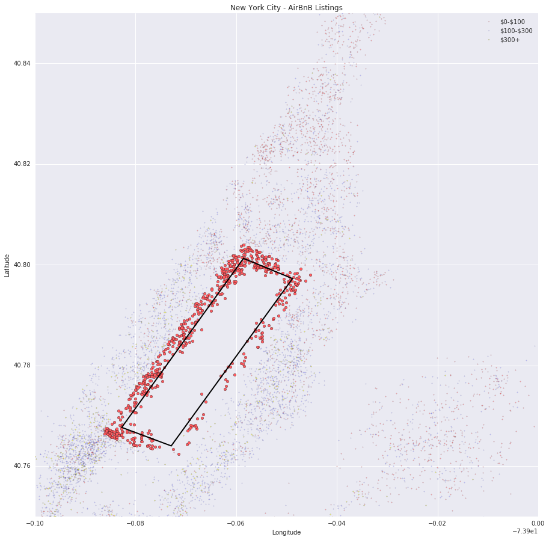
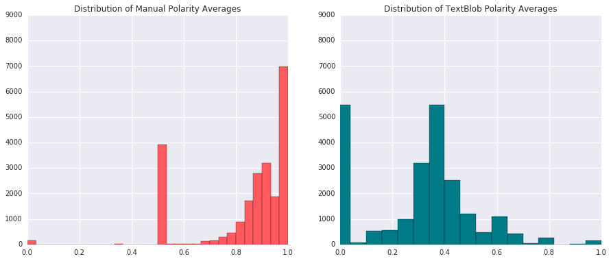
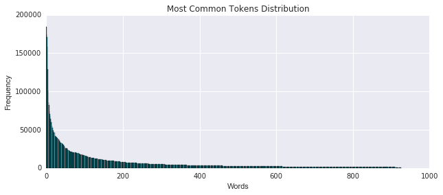
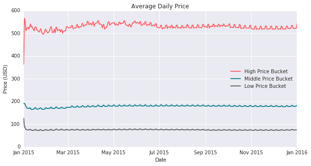
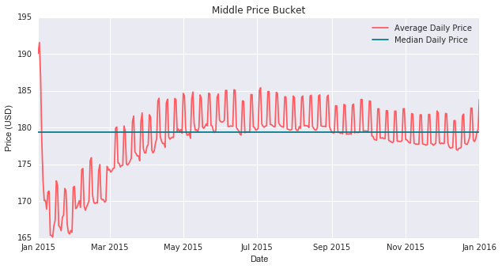
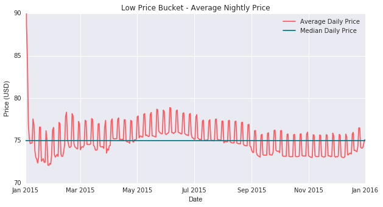

## [Overview](../index.md)

## [Data Exploration](../data_exploration/exploration.md)

## [Preprocessing](../preprocessing/preprocessing.md)

# Feature Creation

## [Model Building](../model_building/model.md)

## [Conclusion](../conclusion/conclusion.md)

### Feature Creation and Analysis

In this section, we seek to explore additional features outside of those that were originally given to us in the `listings.csv` file. Specifically in this section we will explore:

1. **Proximity to Central Park:** Properties that line the outside of Central Park often carry higher prices as a result of the scenic views they have to offer - which is often a feature in high demand especially amongst tourists.

2. **Sentiment Analysis on Listing Title and Reviews:** This helps us quantify our reviews. We are able to see how positive and negative reviews affect listing price points. We know that a strong positive reviews can stimulate demand, while weak and negatives add a downward pressure on price. In addition, we know that more attractive titles tend to get more clicks and page views than those with bland or even negative titles. We run sentiment analysis on both the listing title and the reviews to help quantify these phenomena.

3. **Distance to Neaerest Subway:** Transportation in New York City is largely dependent on the New York City subway. Therefore there exists a premium on listings that are near the subway and offer reduced travel time.

4. **Seasonality Data:** Understanding the effect that specific dates, weeks, and seasons have on listing prices in New York City.

These additional features hope to serve as additional data points that will help us better create a model that accurately outputs the predicted price for which a listing should be priced at.

### Import Libaries:


```python
import numpy as np
import pandas as pd
import scipy as sp
import re
import csv
import nltk
import seaborn as sns
from datetime import datetime
from matplotlib.path import Path
import matplotlib.patches as patches
import matplotlib.pyplot as plt
from collections import Counter
%matplotlib inline
```


```python
#GLOBAL VARIABLES
BNB_BLUE = '#007A87'
BNB_RED = '#FF5A5F'
BNB_DARK_GRAY = '#565A5C'
BNB_LIGHT_GRAY = '#CED1CC'
```


```python
listings = pd.read_csv('listings_clean.csv', delimiter=',').iloc[:, 1:]
calendar = pd.read_csv('calendar.csv', delimiter=',', usecols=range(4))
```

### Proximity to Central Park

Our goal in encoding a feature aimed at identifying properties on the perimeter of Central Park is to identify potential idiosyncratic points of error. Central Park offers scenic views and a central location that often catches the attention of a potential visitors looking for an Airbnb. In addition, Central Park is one of the top tourist spots people visit when coming to New York City. By identifying these properties, we hope to create a feature that better enables us to predict price.


```python
streets = listings['street'].tolist()
streets_cleansed = []

# Clean Street Data
for street in streets:
    i = street.find(',')
    streets_cleansed.append(street[:i])

listings['streets_cleansed'] = streets_cleansed

# List of Streets on Central Park
park_streets = ['West 110th Street', 'W 110th St', '5th Ave', '5th Avenue', 'Central Park', 
                'Central Park South', 'Central Park West', 'Central Park North', 'Central Park East', 'West 59th Street']

listings['on_park'] = listings['streets_cleansed'].isin(park_streets)

park = listings[listings['on_park'] == True]
```

The first method shown above takes preselected streets outlining the park and compares it with the street names in the listings dataframe to find which listings border Central Park. The problem with this method is that is relatively imprecise as far as determining actual proximity and location of these listings. It also produced a relatively small number of homes that bordered Central Park. This shows us that the addresses provided were fairly inaccurate and we ended up removing the `street` predictor all together.


```python
verts = [
    (-73.958546, 40.801266),
    (-73.948807, 40.797251),
    (-73.972904, 40.764011),
    (-73.982735, 40.767682),
    (0., 0.), # ignored
        ]

# draws rectangle outlining Central Park
codes = [Path.MOVETO,
         Path.LINETO,
         Path.LINETO,
         Path.LINETO,
         Path.CLOSEPOLY,
         ]

path = Path(verts, codes)
patch = patches.PathPatch(path,facecolor = 'none', lw=2)

on_park = []
for index, row in listings.iterrows():
    on_park.append(path.contains_point((row['longitude'], row['latitude']) , radius = -.005))

    
listings['on_park'] = on_park
park = listings[listings['on_park'] == True]

# Remove non-exact entries
park = park[park['is_location_exact'] == 1]

print park.shape
```

    (646, 28)


```python
listings['on_park'].loc[listings['on_park'] == False] = 0.0
listings['on_park'].loc[listings['on_park'] == True] = 1.0
```


```python
on_park_data = listings['on_park']
```

Using this, we first draw a rectangle based on the latitude and longitude coordinates outlining Central Park. From this using a radius parameter we find the listings that fall within this radius parameteter and store the boolean value of whether a point falls on/within the park in the `on_park` feature. From there we create a column on our `listings` dataset tracking the boolean values.

The scatter plot below geographically highlights the listings that are classified as being on Central Park. The number of listings that are identified as being on Central Park is dependent on how we set our radius in our `path.contains_point` function. As expected, as radius grows so does the number of listings. However, it is important to tune this radius parameter to achieve a setting that maximizes predictive potency. 


```python
# Outline price buckets
intervals = [0,100,300,10000]
leg_labels = []

# Get Labels for Legend
for i in range(0,len(intervals) - 1):
    if i == len(intervals) - 2:
        leg_labels.append('\${}+'.format(intervals[i]))
    else:
        leg_labels.append("\${}-\${}".format(intervals[i], intervals[i+1]))    

buckets = []
x = listings.drop('id', 1)

# Divide up into buckets
for i in range(0, len(intervals) - 1):
    buckets.append(x[(x['price'] > intervals[i]) & (x['price'] < intervals[i+1])])

# Plot listings on scatter
fig = plt.figure(figsize=(15, 15))
ax = fig.add_subplot(111)


# Plot all listings by price bucket
for i in range(0, len(buckets)):
    ax.scatter(buckets[i]['longitude'], buckets[i]['latitude'], alpha = alphas[i], c=colors[i], s=2)

# Plot Central Park Listings
ax.scatter(park['longitude'], park['latitude'], s=20, alpha = 1, c = BNB_RED)

# Figure attributes
ax.set_title('New York City - AirBnB Listings')
ax.set_xlabel('Longitude')
ax.set_ylabel('Latitude')
ax.legend(labels=leg_labels, loc = 'best')
ax.add_patch(patch)
ax.set_xlim(-74,-73.9)
ax.set_ylim(40.75,40.85)

plt.show()
```





### Sentiment Analysis on Listing Title and Reviews

### Building a Bag-of-Words Feature

Using a little bit of Natural Language Processing, we set out to create a bag-of-words feature. To do this, we disregard grammar and average the polarity of a given segment of text to arrive at a sentiment analysis feature, which is represented in this case as a float. 

#### Concatenation of Listing Titles with Reviews
We want to perform sentiment analysis on a 'segment of text', and our only very meaningful textual features are the listing title and any reviews associated with that listing. We first concatenate the two together (or maybe more if there's more than one review).

###### Load the Data:


```python
# Read in the data 
listings = pd.read_csv('listings_clean.csv', delimiter=',')
listing_uncleaned = pd.read_csv('listings.csv', delimiter = ',')
reviews = pd.read_csv('reviews.csv', delimiter=',')

# Split into predictor and response
y = listings['price']

# Append price at the end of the listings table
del listings['price']
x = listings
              
listings = listings.join(y)
```


```python
titles = []
for item in listings['id'].values:
    titles.append(listing_uncleaned['name'].loc[listing_uncleaned['id'] == item].values[-1])
```


```python
x['name'] = titles
```

Below is a preview of some of the titles in our listings datafile.


```python
x['name'].head(n=5)
```


    0          Stay like a real New Yorker! 
    1      Apartment 20 Minutes Times Square
    2    Option of 2 Beds w Private Bathroom
    3    Charming Bright West Village Studio
    4          Charming Apartment in Chelsea
    Name: name, dtype: object


In addition, below are some of the reviews on the listings that guests have left behind. Right away we can see that the reviews range with regards to their lengths and content. In addition, they also range in the language in which they are written in. For example the second review appears to be written in German, while the fifth review appears to be written in French. This is something we should be cognizant of when constructing our bag of words feature.

We may have to do a little bit of cleaning on our review dataset as well.


```python
# Preview Dataframe
reviews.head(n=10)
```


<div>
<table border="1" class="dataframe">
  <thead>
    <tr style="text-align: right;">
      <th></th>
      <th>listing_id</th>
      <th>id</th>
      <th>date</th>
      <th>reviewer_id</th>
      <th>reviewer_name</th>
      <th>comments</th>
    </tr>
  </thead>
  <tbody>
    <tr>
      <th>0</th>
      <td>1180670</td>
      <td>14705995</td>
      <td>6/24/14</td>
      <td>10875598</td>
      <td>Gregory</td>
      <td>Ok, if you like the location and don't mind an...</td>
    </tr>
    <tr>
      <th>1</th>
      <td>4457617</td>
      <td>24432844</td>
      <td>12/28/14</td>
      <td>24502047</td>
      <td>Amber</td>
      <td>Kleine s�_��e WG, super gelegen, sehr freundli...</td>
    </tr>
    <tr>
      <th>2</th>
      <td>722394</td>
      <td>9248781</td>
      <td>12/16/13</td>
      <td>6821360</td>
      <td>Giri</td>
      <td>Extremely disappointed.</td>
    </tr>
    <tr>
      <th>3</th>
      <td>4074444</td>
      <td>23983183</td>
      <td>12/15/14</td>
      <td>8822691</td>
      <td>Wendy</td>
      <td>Exactly as described.</td>
    </tr>
    <tr>
      <th>4</th>
      <td>68046</td>
      <td>11797670</td>
      <td>4/15/14</td>
      <td>12231047</td>
      <td>Virginie</td>
      <td>Appartement tr̬s sympa, accueillant. A quelque...</td>
    </tr>
    <tr>
      <th>5</th>
      <td>68774</td>
      <td>23987149</td>
      <td>12/15/14</td>
      <td>23170531</td>
      <td>Anthony</td>
      <td>The reservation was canceled the day before ar...</td>
    </tr>
    <tr>
      <th>6</th>
      <td>920951</td>
      <td>16985911</td>
      <td>8/5/14</td>
      <td>16614692</td>
      <td>Anthony</td>
      <td>Very Nice and comfortable. Great location - Ma...</td>
    </tr>
    <tr>
      <th>7</th>
      <td>462454</td>
      <td>13159495</td>
      <td>5/20/14</td>
      <td>14129237</td>
      <td>Amanda</td>
      <td>Sunserae was a phenomenal host. Incredible loc...</td>
    </tr>
    <tr>
      <th>8</th>
      <td>2207015</td>
      <td>13088178</td>
      <td>5/19/14</td>
      <td>14336410</td>
      <td>Laurie</td>
      <td>Our rental was great. It was just as described...</td>
    </tr>
    <tr>
      <th>9</th>
      <td>1773664</td>
      <td>11945863</td>
      <td>4/20/14</td>
      <td>9979725</td>
      <td>Eric</td>
      <td>fantastique\ndavid simply the best !</td>
    </tr>
  </tbody>
</table>
</div>


We can see that some of our reviews aren't in English, that there are additional non-English characters and symbols (\n), and also we know that some cells are empty. We can manually try to clean this data and also use NLP libraries to help out. We do a bit of both with the libraries ```nltk``` and ```text blob```.

##### Drop Rows with NaN values (empty reviews)


```python
print 'Reviews before NaNs dropped: ', reviews.shape[0]
# Delete reviews entries with NaN values (empty review)
reviews = reviews.dropna(axis=0)
print 'Reviews after NaNs dropped: ', reviews.shape[0]
```

    Reviews before NaNs dropped:  277659
    Reviews after NaNs dropped:  277495


#### Concatentation Function
We need to write function to combine our two datasets so that every unique listing id not only links to its property features, but also the reviews associated with that property. These are stored in ```reviews.csv``` while the listing titles are stored in ```listings.csv```.


```python
# creates empty array to store concatenated text
empty_concat = []

# iterates through each listing id
for item in x['id'].unique():
    # checks to see if the corresponding listing id has a review
    # if so it concatenates the listing title with the reivew
    if item in reviews['listing_id'].unique():
        empty_concat.append(str(x['name'].loc[x['id'] == item].values[-1]) + ' ' + str(reviews['comments'].loc[reviews['listing_id'] == item].values[:-1]))
    else:
        empty_concat.append(str(x['name'].loc[x['id'] == item].values[-1]))
```

We've now stored our concatenated reviews and listings and need to think about cleaning up our "bag of words" a little bit. If we remove all tokens that have to do with NYC neighborhoods, this can help reduce collinearity with our other geographic-based features. Lets get those terms:


```python
neighborhood_words = []

for item in listings['id'].values:
    neighborhood_words.append(listing_uncleaned['neighbourhood_cleansed'].loc[listing_uncleaned['id'] == item].values[-1])

x['neighborhood_names'] = neighborhood_words
```


```python
# Get Neighborhood words to remove geographic correlation from our 'bag-of-wods'
nbs = x['neighborhood_names'].unique().tolist()
nbs = [nb.lower().split() for nb in nbs]
nbs = set([item for sublist in nbs for item in sublist])
```

### Getting the reviews in shape for analysis

An important tool we used was stemming: grabbing the "stem" of a word which is the same for all conjugations, declensions, forms etc. of the word. This is great for quickly identifying connotation or polarity and also counting frequency of word appearances. If a word is neither an English stop-word or related to a NYC neighborhood, we add it to our 'bag of words' for a given listing.


```python
from nltk.stem import SnowballStemmer
stemmer = SnowballStemmer('english')

from nltk.corpus import stopwords
stops = set(stopwords.words("english"))

bags = empty_concat
bag_of_words = []

# Make characters all english alphabet
for review in bags:
    # Use regular expressions to do a find-and-replace for alphabet
    replaced = re.sub("[^a-zA-Z]", " ", review)
        
    # All lower
    lower_case = replaced.lower()
    
    # Put in list
    words = lower_case.split()
    
    # Exclude stop-words and neighborhood words
    words = [stemmer.stem(w) for w in words if ((not w in stops) & (not w in nbs))]
    listing_words = ' '.join(words)     
    bag_of_words.append(listing_words)
```

##### Save to `bag_of_words.csv`:
Because this was such a long operation, it's good to save time and cache the data in a .csv file.


```python
# Output bag_of_words feature to csv
bag = pd.DataFrame(x['id'])
bag['bag_of_words'] = bag_of_words
bag.to_csv('bag_of_words.csv')

bag.head(n=10)
```


<div>
<table border="1" class="dataframe">
  <thead>
    <tr style="text-align: right;">
      <th></th>
      <th>id</th>
      <th>bag_of_words</th>
    </tr>
  </thead>
  <tbody>
    <tr>
      <th>0</th>
      <td>1069266.0</td>
      <td>stay like real new yorker love place mention l...</td>
    </tr>
    <tr>
      <th>1</th>
      <td>1846722.0</td>
      <td>apart minut time squar probabl find better hos...</td>
    </tr>
    <tr>
      <th>2</th>
      <td>2061725.0</td>
      <td>option bed w privat bathroom miao one best hos...</td>
    </tr>
    <tr>
      <th>3</th>
      <td>44974.0</td>
      <td>charm bright studio great locat bus subway cit...</td>
    </tr>
    <tr>
      <th>4</th>
      <td>4701675.0</td>
      <td>charm apart</td>
    </tr>
    <tr>
      <th>5</th>
      <td>68914.0</td>
      <td>calm sunni apt tr xcc xac bell exp xcc xa rien...</td>
    </tr>
    <tr>
      <th>6</th>
      <td>4832596.0</td>
      <td>larg furnish sunni room</td>
    </tr>
    <tr>
      <th>7</th>
      <td>2562510.0</td>
      <td>br privat room li</td>
    </tr>
    <tr>
      <th>8</th>
      <td>3005360.0</td>
      <td>hip luxuri bd great apart legit bedroom comfi ...</td>
    </tr>
    <tr>
      <th>9</th>
      <td>2431607.0</td>
      <td>bright airi room would definit recommend glori...</td>
    </tr>
  </tbody>
</table>
</div>


#### Manual Sentiment Prediction Method

Once we have our bags of words, we need to perform sentiment prediciton. We implemented a manual strategy and compared it to NLP package libraries. First with the manual strategy which compared the stems in a bag to a publicly available corpus of positive and negative words available at:

http://www.cs.uic.edu/~liub/FBS/opinion-lexicon-English.rar


```python
# Load positive and negative word corpera
positive = pd.read_csv('positive-words.txt', encoding='latin1')
negative = pd.read_csv('negative-words.txt', encoding='latin1')

pos_lib_full = positive.iloc[:, 0].tolist()
neg_lib_full = negative.iloc[:, 0].tolist()
new = []

for each in positive.iloc[:, 0].tolist():
    word = each.encode('ascii', 'ignore')
    neg_lib_full.append(word)

for each in negative.iloc[:, 0].tolist():
    word = each.encode('ascii', 'ignore')
    new.append(word)

# Make corpus sets for faster lookup
pos_lib_stems = [stemmer.stem(str(w)) for w in pos_lib_full]
pos_lib = set(pos_lib_full + pos_lib_stems)

neg_lib_full = new
neg_lib_stems = [stemmer.stem(str(w)) for w in neg_lib_full]
neg_lib = set(neg_lib_full + neg_lib_stems)
```

Once our corpera are loaded, we make a function corpus_predict() which outputs polarity averages for a list of segments of text.


```python
# Score Positivity/Negativity from Reviews

# Count positive and negative word appearances,
# returns polarity averages as a list for each review
def corpus_predict(texts):
    polarities = []
    
    for i in range(0, len(texts)):
        opinion = texts[i].split()
        pos_count, neg_count = 0., 0.
        polarity = 0.5
        for word in opinion:
            if word in pos_lib:
                pos_count += 1.
            elif word in neg_lib:
                neg_count += 1.
        
        if (pos_count == 0.) & (neg_count == 0.):
            pass
        else:
            polarity = pos_count/(pos_count + neg_count)
        polarities.append(polarity)
        
    return polarities
```


```python
full_bag = bag['bag_of_words'].tolist()
man_polarities = corpus_predict(full_bag)
```

#### Library Sentiment Prediction Methods

We also tried sentiment prediction on the same bags of words with Natural Language Tool Kit and TextBlob.


```python
from nltk.sentiment.vader import SentimentIntensityAnalyzer
sid = SentimentIntensityAnalyzer()

nltk_polarities = []

for each in full_bag:
    each = " ".join(each)
    ss = sid.polarity_scores(each)
    nltk_polarities.append(ss.values())
print 'Polarities appended in form [neg, neu, pos, compound]'
```


```python
from textblob import TextBlob

tb_polarities = []

for i, each in enumerate(full_bag):
    blob = TextBlob(each)
    tb_polarities.append(blob.sentiment.polarity)
```


```python
# Initiate Figure
fig, (ax1, ax2) = plt.subplots(1, 2, figsize = (15, 6))
BINS = 30

# Plot Manual Polarity Average Distribution
ax1.hist(man_polarities, bins = BINS, color = BNB_RED)
ax1.set_title('Distribution of Manual Polarity Averages')
ax1.set_xlim([0,1])
ax1.set_ylim([0,9000])

# Plot Text Blob Polarity Average Distribution
ax2.hist(tb_polarities, bins = BINS, color = BNB_BLUE)
ax2.set_title('Distribution of TextBlob Polarity Averages')
ax2.set_xlim([0,1])
ax2.set_ylim([0,9000])

plt.show()
```





Above we can compare the the manual sentiment analysis versus the libary package method from Text Blob. Our first version had a tendency to classify text segments as overly positive, probably because our negative words corpus wasn't exhaustive enough. This could be fixed, but we decided to go with the Text Blob method for polarity averages as a feature.

#### The Most Common Words:

Additionally its useful to know the most common words in our listing reviews as this can be used to create multinomial feature vectors for each listing.


```python
# Flatten List
list_bag = [w.split() for w in full_bag]
all_words = [item for sublist in list_bag for item in sublist]

# Get 1000 most common tokens
most_common = Counter(all_words).most_common(1000)

# Remove words shorter than length 2
common_words = [w for w in most_common if len(w[0]) > 2]
```


```python
ax = plt.figure(111, figsize = (10,4))

plt.bar(range(len(common_words)), [w[1] for w in common_words], align='center', color = BNB_BLUE)
plt.xlim([0,1000])
plt.title('Most Common Tokens Distribution')
plt.xlabel('Words')
plt.ylabel('Frequency')

plt.show()
```





This right-skewed curve is what one could expect for the most appearing tokens - it also lends itself well to creating a multinomial feature vector where we can count how many times each bag-of-words has any of the most-appearing tokens. We'll leave that for another day.

### Distance to Nearest Subway

There is a premium associated with living near a subway station in New York City. The reason being is that living near a subway station makes travel in the city much easier, and opens up the possibility for you to to travel virtually anywhere in the city by train. Just as permanent residents in New York City staying in apartments pay a premium for living next to a subway stop, so must users looking to rent an Airbnb. Therefore, by identifying the distance from that each listing is from its nearest subway station we are better able to account for this location price premium.


```python
# taken from https://data.ny.gov/Transportation/NYC-Transit-Subway-Entrance-And-Exit-Data/i9wp-a4ja/data
transit = pd.read_csv('Transit.csv', delimiter = ',')

# preview of transit data
transit.head(n=5)
```


<div>
<table border="1" class="dataframe">
  <thead>
    <tr style="text-align: right;">
      <th></th>
      <th>Division</th>
      <th>Line</th>
      <th>Station Name</th>
      <th>Station Latitude</th>
      <th>Station Longitude</th>
      <th>Route1</th>
      <th>Route2</th>
      <th>Route3</th>
      <th>Route4</th>
      <th>Route5</th>
      <th>...</th>
      <th>ADA</th>
      <th>ADA Notes</th>
      <th>Free Crossover</th>
      <th>North South Street</th>
      <th>East West Street</th>
      <th>Corner</th>
      <th>Entrance Latitude</th>
      <th>Entrance Longitude</th>
      <th>Station Location</th>
      <th>Entrance Location</th>
    </tr>
  </thead>
  <tbody>
    <tr>
      <th>0</th>
      <td>BMT</td>
      <td>4 Avenue</td>
      <td>25th St</td>
      <td>40.660397</td>
      <td>-73.998091</td>
      <td>R</td>
      <td>NaN</td>
      <td>NaN</td>
      <td>NaN</td>
      <td>NaN</td>
      <td>...</td>
      <td>False</td>
      <td>NaN</td>
      <td>False</td>
      <td>4th Ave</td>
      <td>25th St</td>
      <td>SE</td>
      <td>40.660323</td>
      <td>-73.997952</td>
      <td>(40.660397, -73.998091)</td>
      <td>(40.660323, -73.997952)</td>
    </tr>
    <tr>
      <th>1</th>
      <td>BMT</td>
      <td>4 Avenue</td>
      <td>25th St</td>
      <td>40.660397</td>
      <td>-73.998091</td>
      <td>R</td>
      <td>NaN</td>
      <td>NaN</td>
      <td>NaN</td>
      <td>NaN</td>
      <td>...</td>
      <td>False</td>
      <td>NaN</td>
      <td>False</td>
      <td>4th Ave</td>
      <td>25th St</td>
      <td>SW</td>
      <td>40.660489</td>
      <td>-73.998220</td>
      <td>(40.660397, -73.998091)</td>
      <td>(40.660489, -73.998220)</td>
    </tr>
    <tr>
      <th>2</th>
      <td>BMT</td>
      <td>4 Avenue</td>
      <td>36th St</td>
      <td>40.655144</td>
      <td>-74.003549</td>
      <td>N</td>
      <td>R</td>
      <td>NaN</td>
      <td>NaN</td>
      <td>NaN</td>
      <td>...</td>
      <td>False</td>
      <td>NaN</td>
      <td>True</td>
      <td>4th Ave</td>
      <td>36th St</td>
      <td>NW</td>
      <td>40.654490</td>
      <td>-74.004499</td>
      <td>(40.655144, -74.003549)</td>
      <td>(40.654490, -74.004499)</td>
    </tr>
    <tr>
      <th>3</th>
      <td>BMT</td>
      <td>4 Avenue</td>
      <td>36th St</td>
      <td>40.655144</td>
      <td>-74.003549</td>
      <td>N</td>
      <td>R</td>
      <td>NaN</td>
      <td>NaN</td>
      <td>NaN</td>
      <td>...</td>
      <td>False</td>
      <td>NaN</td>
      <td>True</td>
      <td>4th Ave</td>
      <td>36th St</td>
      <td>NE</td>
      <td>40.654365</td>
      <td>-74.004113</td>
      <td>(40.655144, -74.003549)</td>
      <td>(40.654365, -74.004113)</td>
    </tr>
    <tr>
      <th>4</th>
      <td>BMT</td>
      <td>4 Avenue</td>
      <td>36th St</td>
      <td>40.655144</td>
      <td>-74.003549</td>
      <td>N</td>
      <td>R</td>
      <td>NaN</td>
      <td>NaN</td>
      <td>NaN</td>
      <td>...</td>
      <td>False</td>
      <td>NaN</td>
      <td>True</td>
      <td>4th Ave</td>
      <td>36th St</td>
      <td>NW</td>
      <td>40.654676</td>
      <td>-74.004306</td>
      <td>(40.655144, -74.003549)</td>
      <td>(40.654676, -74.004306)</td>
    </tr>
  </tbody>
</table>
<p>5 rows × 32 columns</p>
</div>


```python
print 'The shape of our transit data is ' + str(transit.shape)
```

    The shape of our transit data is (1868, 32)


```python
print 'There are ' + str(len(transit['Station Name'].unique())) + ' unique stations in our transit data set.'
```

    There are 356 unique stations in our transit data set.


```python
# creates empty array to story longitude and latitude values of station entrances
avg_lat = np.zeros([len(transit['Station Name'].unique()),])
avg_long = np.zeros([len(transit['Station Name'].unique()),])

# iterates through each station and averages longitude and latitude coordinates
counter = 0
for item in transit['Station Name'].unique():
        avg_lat[counter] = np.mean(transit['Entrance Latitude'].loc[transit['Station Name'] == item])
        avg_long[counter] = np.mean(transit['Entrance Longitude'].loc[transit['Station Name'] == item])
        counter += 1
```

Because there are several entrances for each subway stop in New York City, we chose to simplify our calculation of distance from the subway by averaging the latitude and longitude for the subway entrances for each subway stop. This will help expedite the run time of our function given that there are 1,868 total subway stops in New York, which when we iterate through each listing would have a high expected run time, making it computationally expensive. So by averaging, we are able to expedite the computational calculation time, without sacrificing degrees of accuracy.


```python
# creates a pandas dataframe to store the average longitude and latitudes to one station location
transit_location = pd.DataFrame({'Station Name': transit['Station Name'].unique(),'Latitude': avg_lat, 'Longitude': avg_long})
```


```python
# creates an empty array to store the distance from the nearest subway for each listing
dist_transit = np.zeros([len(listings),])

index = 0
# iterates through each listing
for index, item in listings.iterrows():
    min_dist = 1000
    
    # checks each of the 356 stations for the closest station
    for counter, row in transit_location.iterrows():
        # measures distance on a Euclidean distance basis
        dist = np.sqrt((item['latitude'] - row['Latitude'])**2+(item['longitude'] - row['Longitude'])**2)
        # if the current distance is less than the stored minimum distance, than the current distance becomes the
        # min distance
        if dist < min_dist:
            dist_transit[index] = dist
            min_dist = dist
    index +=1
```

For each listing in our `listings.csv` file, we go through each subway stop and calculate the distance from the Airbnb listing and the subway stop. For iteration through our listing ID, we store the minimum distance value in a *dist_transit* array, so that we can keep track of the minimum distance to the subway for each listing ID. Because this exercise is computationally expensive, we choose to export our data table to .csv file. This way, we can just import the data as an additional feature and add it to the dataframe from `listings.csv`.

### Seasonality Data

To observe the effect of seasonality on listing price, we should first visualize how price within price bukcets varies as a function of date. To do so, we split our calendar into the three price buckets of $0-$100, $100-$300, and $300+ that we used define the points on our price scatter plot overlayed against the map of New York City. Using these price buckets, we hope to see how the price of listing is affected by the date. In addition, this will help us observe some of the more macro trends regarding the effects of seasonality, holidays, and weekends have on listing price.

***NOTE ON CLEANING CALENDAR.CSV:*** Please note that we had to do some manual data cleaning due to the semi-corrupted nature of our data file. The price column in our calendar.csv file was using the comma - ',' - in the csv file to separate prices that were greater than one thousand into two numbers - values before the comma - and - values after the commas. So we had to manually go into the .csv file and correct these errors, allowing us to conduct our seasonality data analysis.


```python
# creates empty array to store the listing IDs of into price buckets
high_bucket = []
mid_bucket = []
low_bucket = []

# iterates through each row in the calendar dataframe
for index, item in calendar.iterrows():
    # checks to see which price bucket our listing IDs fall in 
    if item['listing_id'] in buckets[0]['id'].unique():
        low_bucket.append(item)
    elif item['listing_id'] in buckets[1]['id'].unique():
        mid_bucket.append(item)
    elif item['listing_id'] in buckets[2]['id'].unique():
        high_bucket.append(item)
```

We first sort the listing IDs into arrays based on their corresponding listing prices. The listings IDs that fall in the $0-$100 price range will have their IDs placed in the *low_bucket*, those listings in the $100-$300 price range will have their IDs placed in the *mid_bucket*, and those listings in the $300+ price range will have their listing IDs placed in the *high_bucket* array.


```python
# crtes a calendar dates array consisting of all the unique calendar dates (366)
calendar_dates = np.array(calendar['date'].unique())

# converts arrays to pandas dataframes
high_bucket = pd.DataFrame(high_bucket)
mid_bucket = pd.DataFrame(mid_bucket)
low_bucket = pd.DataFrame(low_bucket)

# empty array to store the average daily price information based on price bucket
high_seasonality_data = np.empty([len(calendar_dates),1])
mid_seasonality_data = np.empty([len(calendar_dates),1])
low_seasonality_data = np.empty([len(calendar_dates),1])

index = 0

# iterates each day of the calendar
for item in calendar_dates:
    calendar_dates[index] = datetime.strptime(item,'%m/%d/%y').date()
    high_seasonality_data[index, 0] = np.mean(high_bucket['price'].loc[high_bucket['date'] == item])
    mid_seasonality_data[index, 0] = np.mean(mid_bucket['price'].loc[mid_bucket['date'] == item])
    low_seasonality_data[index, 0] = np.mean(low_bucket['price'].loc[low_bucket['date'] == item])
    index += 1
```

So what we aim to do is take the average daily listing price per day for each price bucket and graph it as a function of time over the year. This will help us track how average price within each bucket varies as a function of time. This will enable to view things such as the impact of seasonality and how weekends affect Airbnb listing prices.


```python
plt.figure(figsize=(10, 5))

# prints all buckets (high, mid, and low) containing seasonality data
plt.plot(calendar_dates, high_seasonality_data, label = 'High Price Bucket', color = BNB_RED)
plt.plot(calendar_dates, mid_seasonality_data, label = 'Middle Price Bucket', color = BNB_BLUE)
plt.plot(calendar_dates, low_seasonality_data, label = 'Low Price Bucket', color = BNB_DARK_GRAY)

plt.title('Average Daily Price')
plt.xlabel('Date')
plt.ylabel('Price (USD)')
plt.legend(loc = 'best')

plt.show()
```





From this graph we can see small, short-term fluctuations in price. This seems to indicate the presence of weekly factor, and potentially the categorization of a weekday versus a weekend. However, to verify our findings we must bucket on its own appropriate price scale.

#### High Price Bucket


```python
# plots only listings in the high price bucket
plt.figure(figsize=(10, 5))

plt.plot(calendar_dates, high_seasonality_data, color = BNB_RED, label = 'Average Daily Price')
plt.plot(calendar_dates, np.median(high_seasonality_data)*np.ones([len(high_seasonality_data),1]), color = BNB_BLUE, label = 'Median Daily Price')

plt.title('High Price Bucket')
plt.xlabel('Date')
plt.ylabel('Price (USD)')
plt.legend(loc = 'best')
plt.ylim(460,580)

plt.show()
```


We can see that the data appears to fluctuate around a median of $530 in the high-bucket daily price graph. The graph shows an amplitude of about 30 in which prices range between around $500 and $560. The maximum daily price peaks at arond $565 on New Years Day, and quickly drops below the its median value. In addition, we can observe the short-term fluctuations seeming to suggest that certain weekly spikes. In fact, if we count the number of spikes we will find that there are indeed 52 weeks, representing the 52 weeks in a year. As far as larger time period trends are concerns, we can see that as we move from March into the spring and summer months, we can observe a price increase that carries us above the median price. However, the price begins to drop as we transition towards the autumn months.

#### Middle Price Bucket


```python
# plots only listings in the middle price bucket
plt.figure(figsize=(10, 5))

plt.plot(calendar_dates, mid_seasonality_data, color = BNB_RED ,label = 'Average Daily Price')
plt.plot(calendar_dates, np.median(mid_seasonality_data)*np.ones([len(mid_seasonality_data),1]), color = BNB_BLUE, label = 'Median Daily Price')

plt.title('Middle Price Bucket')
plt.xlabel('Date')
plt.ylabel('Price (USD)')
plt.legend(loc = 'best')

plt.show()
```





The middle price bucket, chart follows a trend similar to that of the high price bucket. This time we see out data centered around a median nightly price of just under $180, with an amplitude of about $10 causing the prices to range from about $170 to $190. The trends are largely the same especially when evaluating movements as percentage movements.

#### Low Price Bucket


```python
# plots only listings in the low price bucket
plt.figure(figsize=(10, 5))

plt.plot(calendar_dates, low_seasonality_data, color = BNB_RED ,label = 'Average Daily Price')
plt.plot(calendar_dates, np.median(low_seasonality_data)*np.ones([len(low_seasonality_data),1]), color = BNB_BLUE, label = 'Median Daily Price')

plt.title('Low Price Bucket - Average Nightly Price')
plt.xlabel('Date')
plt.ylabel('Price (USD)')
plt.legend(loc = 'best')
plt.ylim(70,90)

plt.show()
```





The low price bucket data is centered around a median daily price of $75, with values mainly ranging from $73 to about $78. We again see the same weekly spikes in addition to larger seasonal trends in which the transitioning from spring to summer yields higher average daily prices.

**Seasonality Takeaways:** We find that cross listings price ranges, that calendar date is an important feature in predicting the exact price of Airbnb listings. This can cause prices to fluctuate around their median based on changing demand that results from changes in the date that someone wishes to stay in a listing. This allows us to draw three key conclusions on the effect of calendar data.

* **Weekends:** The weekly spikes in housing prices lead us to believe that there is indeed a strong weekend effect that causes daily prices of Airbnb listings to spike. This intuitively makes sense because we expect people to travel more on weekends as opposed to weekdays. This increased travel on weekends creates an increase in demand that puts an upward pressure on price. As demand drops, following Sunday, so does price. This weekly cycle causes the small fluctuations in the price that we observe on all 4 graphs.


* **Spring and Summer Months:** In all price bucket graphs, we can see that April begins to mark the pivot point in which we begin to see a rise in listing prices. The warmer weather, coupled with the fact that children and teenagers finish school lead to an increase in demand for housing in the summer months. This fact is best evidence by the fact that the average daily listing price is nearly always above its median value. As noted before, potential reasons include increased travel in the warmer months. Another potential reason, one in which I've observed first hand, is the fact that there is an increased demand in housing that results from the the influx of summer interns that enter the city. However, given our current data set we cannot conclusively determine the root of this trend. We would need additional data to be able to conclusively determine the cause of this spike.


* **Holidays:** One of the more clear examples of holidays affecting pricing data is observed on New Years Day. New Years Eve into New Years Day represents the biggest demand for housing in New York City. Many visitors from around the world travel to New York to watch the world famous ball drop happen in Time Square. This excess demand causes the sharp spike in prices that we observe on 01/01/15. For all three price bucket graphs, the maximum daily price occurs on January 1st, 2015. There is a sharp price drop that occurs following New Years Day as people post-New Years no longer require housing. This is the most clear example of the influence that holiday season can have on housing data because this instance is free from the effects of seasonal impact (spring and summer months).


**Using Seasonality to Predict Price:** Our approach to predicting price as a function of seasonality is one that stems from the idea that seasonality is a factor that disturbs natural price equilibrium. This assumption seems reasonable especially from a supply and demand perspective in which we know that the price spikes we observe result from disequilibrium (due to excess demand) that places an upward pressure on price. Therefore, our approach entails using the seasonality charts we produced by price bucket to calculate the average price disruption that results from listing on certain calendar dates. So on a given date for a given listing, we will take the price that our model outputs and add or subtract the difference between the average daily price and the median price at that date. Such a method will help us capture the trends that we observed above and fairly accuractly predict price as a function of the date.


### Output Feature Data


```python
# exports transit location / distance information to a csv
exported_data = pd.DataFrame({'id': listings['id'].values, 'distance_to_subway': dist_transit, 'on_park': on_park_data.values, 'polarities': tb_polarities})
exported_data = exported_data[['id', 'on_park', 'polarities', 'distance_to_subway']]

exported_data.head(n=5)
```


<div>
<table border="1" class="dataframe">
  <thead>
    <tr style="text-align: right;">
      <th></th>
      <th>id</th>
      <th>on_park</th>
      <th>polarities</th>
      <th>distance_to_subway</th>
    </tr>
  </thead>
  <tbody>
    <tr>
      <th>0</th>
      <td>1069266.0</td>
      <td>0.0</td>
      <td>0.366428</td>
      <td>0.005522</td>
    </tr>
    <tr>
      <th>1</th>
      <td>1846722.0</td>
      <td>0.0</td>
      <td>0.350812</td>
      <td>0.000389</td>
    </tr>
    <tr>
      <th>2</th>
      <td>2061725.0</td>
      <td>0.0</td>
      <td>0.423866</td>
      <td>0.002333</td>
    </tr>
    <tr>
      <th>3</th>
      <td>44974.0</td>
      <td>0.0</td>
      <td>0.385203</td>
      <td>0.001290</td>
    </tr>
    <tr>
      <th>4</th>
      <td>4701675.0</td>
      <td>0.0</td>
      <td>0.000000</td>
      <td>0.004014</td>
    </tr>
  </tbody>
</table>
</div>


```python
exported_data.to_csv('feature_data.csv')
```
