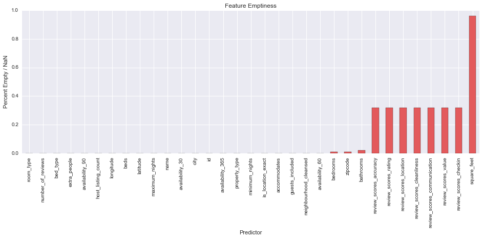
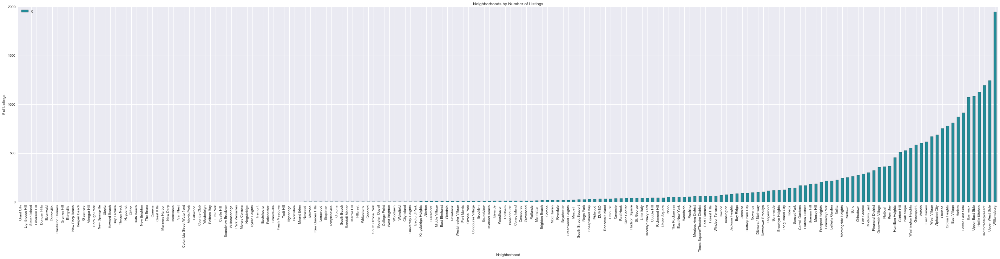
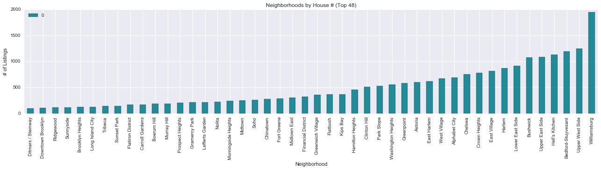
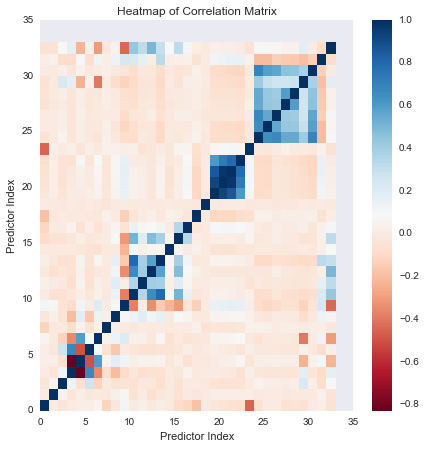

## [Overview](../index.md)

## [Data Exploration](../data_exploration/exploration.md)

# Preprocessing

## [Model Building](../model_building/model.md)

## [Feature Creation](../feature_creation/features.md)

### Cleaning and Preprocessing Airbnb Data
Now that we have a good understanding of what our data looks like, the Airbnb datasets provided need to be cleaned and edited for optimal model usage. This includes performing initial feature selection, imputing missing data, examining collinearity, performing variable transformations, and further pre-processing.

### Import Libraries


```python
import sys
import pandas as pd
import seaborn as sns
import numpy as np
import matplotlib.pyplot as plt
from collections import Counter
from sklearn import preprocessing
from sklearn.neighbors import KNeighborsRegressor as KNN
from sklearn.neighbors import KNeighborsClassifier as KNNc
import sklearn.metrics as Metrics
import warnings
%matplotlib inline
```


```python
# Global variables
BNB_BLUE = '#007A87'
BNB_RED = '#FF5A5F'
BNB_DARK_GRAY = '#565A5C'
BNB_LIGHT_GRAY = '#CED1CC'

# Global settings
warnings.filterwarnings('ignore')
```

### Initial Feature Selection
As a baseline, we can start by removing features that we intuitively sense will not be of great importance to a listing's price. These can be further explored later, if need be. This includes 18 features:</p>
* `scrape_id`: Not related to actual property data.
* `last_scraped`: All within first three days of January, not related to actual property data.
* `picture_url`: Could perform visual analysis and mentioned in 'Further Exploration' in the overview. We, however, will not do that. 
* `host_id`: Ties a host to the property; high unique count makes it unattractive to use.
* `host_name`: Not related to actual property data; no textual importance.
* `host_since`: Not specific to the listing - arguable how it can be a beneficial feature; no textual importance.
* `host_picture_url`: Irrelevant to property data; could perform visual analysis.
* `street`: Generic names; location data captured with lower unique count in other geographical features.
* `neighbourhood`: The `neighbourhood_cleansed` feature presents the same data in a better format.
* `state`: All listings are in the state of NY - this is useless. We clean before removing this feature just in case.
* `market`: All listings should be in the NY market - this is useless. 
* `country`: All listings are in the USA - this is useless.
* `weekly_price`: Function of daily price - should not be a predictor.
* `monthly_price`: Function of daily price - should not be a predictor.
* `calendar_updated`: Does not say much about the property data.
* `calendar_last_scraped`: All within first three days of January, irrelevant to actual property data.
* `first_review`: Time irrelevant to property data, high unique count.
* `last_review`: Time irrelevant to property data, high unique count.


```python
# Read in the data 
listings = pd.read_csv('datasets/listings.csv', delimiter=',')

# Split into predictor and response
y = listings['price']
del listings['price']

# Store number of entries and features
entries = listings.shape[0]
features = listings.shape[1]
```


```python
# Features to drop
bad_features = ['scrape_id', 'last_scraped', 'picture_url', 'host_picture_url', 
                'host_id', 'neighbourhood', 'state', 'market', 'country',
                'weekly_price', 'monthly_price', 'calendar_last_scraped',
                'host_name', 'host_since', 'street', 'calendar_updated',
                'first_review', 'last_review']

listings.drop(bad_features, axis=1, inplace=True)
features = listings.shape[1]

print 'Number of entries:', entries
print 'Number of features:', features
listings.head(n=3)
```

    Number of entries: 27392
    Number of features: 33


<div>
<table border="1" class="dataframe">
  <thead>
    <tr style="text-align: right;">
      <th></th>
      <th>id</th>
      <th>name</th>
      <th>...</th>
      <th>review_scores_value</th>
      <th>host_listing_count</th>
    </tr>
  </thead>
  <tbody>
    <tr>
      <th>0</th>
      <td>1069266</td>
      <td>Stay like a real New Yorker!</td>
      <td>...</td>
      <td>9.0</td>
      <td>1</td>
    </tr>
    <tr>
      <th>1</th>
      <td>1846722</td>
      <td>Apartment 20 Minutes Times Square</td>
      <td>...</td>
      <td>8.0</td>
      <td>2</td>
    </tr>
    <tr>
      <th>2</th>
      <td>2061725</td>
      <td>Option of 2 Beds w Private Bathroom</td>
      <td>...</td>
      <td>10.0</td>
      <td>4</td>
    </tr>
  </tbody>
</table>
<p>3 rows × 33 columns</p>
</div>


### Feature Emptiness and Initial Cleaning

Before imputing missing values, we should examine the percentage of values that are missing from each feature. Imputing data for a feature with too much missing data can bias the model.


```python
# percent_empty
# 
# Function to return percent of missing data in column
# Input: df (data frame)
# Output: None
def percent_empty(df):
    
    bools = df.isnull().tolist()
    percent_empty = float(bools.count(True)) / float(len(bools))
    
    return percent_empty, float(bools.count(True))

# Store emptiness for all features
emptiness = []

missing_columns = []

# Get emptiness for all features
for i in range(0, listings.shape[1]):
    p, n = percent_empty(listings.iloc[:,i])
    if n > 0:
        missing_columns.append(listings.columns.values[i])
    emptiness.append(round((p), 2))
    
empty_dict = dict(zip(listings.columns.values.tolist(), emptiness))

# Plot emptiness graph
empty = pd.DataFrame.from_dict(empty_dict, orient = 'index').sort_values(by=0)
ax = empty.plot(kind = 'bar', color='#E35A5C', figsize = (16, 5))
ax.set_xlabel('Predictor')
ax.set_ylabel('Percent Empty / NaN')
ax.set_title('Feature Emptiness')
ax.legend_.remove()

plt.show()
```





The percent emptiness graph shows that `square_feet` is over 90% empty. This is too empty for imputation, so we remove this feature.


```python
listings.drop('square_feet', axis=1, inplace=True)
missing_columns.remove('square_feet')
features = listings.shape[1]
```

We need to also make sure making sure that all quantitative predictors and response variables are float. This will allow us to better deal with categorical data, and NaN entries in the float data.

#### Erroneous Entries
We also remove entries (listings) that have faulty data such as:

* There are 0 bedrooms
* There are 0 bathrooms
* There are 0 beds
* Price is $0


```python
# Convert to floats
y = y.apply(lambda s: float(s[1:].replace(',','')))
listings['extra_people'] = listings['extra_people'].apply(lambda s: float(s[1:].replace(',','')))
```


```python
# List of columns to be converted to floating point
to_float = ['id', 'latitude', 'longitude', 'accommodates',
            'bathrooms', 'bedrooms', 'beds', 'guests_included', 
            'extra_people', 'minimum_nights', 'maximum_nights', 
            'availability_30', 'availability_60', 'availability_90', 
            'availability_365', 'number_of_reviews', 'review_scores_rating', 
            'review_scores_accuracy', 'review_scores_cleanliness', 
            'review_scores_checkin', 'review_scores_communication', 
            'review_scores_location', 'review_scores_value', 'host_listing_count']

# Converted columns to floating point
for feature_name in to_float:
    listings[feature_name] = listings[feature_name].astype(float)
```


```python
# Delete bad entries
listings = listings[listings.bedrooms != 0]
listings = listings[listings.beds != 0]
listings = listings[listings.bathrooms != 0]

listings = listings.join(y)
listings = listings[listings.price != 0]

print 'Number of entries removed: ', entries - listings.shape[0]
entries = listings.shape[0]
```

    Number of entries removed:  2399


#### Trimming Neighborhood Entries
When we explored our data we saw that geography was very important to pricing, especially on Manhattan. The `neighbourhood_cleansed` feature could therefore be important. Looking at the distribution below we notice it is heavily left-skewed.


```python
# Get number of listings in neighborhoods
nb_counts = Counter(listings.neighbourhood_cleansed)
tdf = pd.DataFrame.from_dict(nb_counts, orient='index').sort_values(by=0)

# Plot number of listings in each neighborhood
ax = tdf.plot(kind='bar', figsize = (50,10), color = BNB_BLUE, alpha = 0.85)
ax.set_title("Neighborhoods by Number of Listings")
ax.set_xlabel("Neighborhood")
ax.set_ylabel("# of Listings")
plt.show()

print "Number of Neighborhoods:", len(nb_counts)
```





    Number of Neighborhoods: 186


We see that the majority of the neighborhoods have less than 100 listings. We currently have 186 neighborhoods - all of these categorical predictors when one-hot encoded will weaken predictive power, so we will only keep neighborhoods with more than 100 listings.


```python
# Delete neighborhoods with less than 100 entries
for i in nb_counts.keys():
    if nb_counts[i] < 100:
        del nb_counts[i]
        listings = listings[listings.neighbourhood_cleansed != i]

# Plot new neighborhoods distribution
tdf = pd.DataFrame.from_dict(nb_counts, orient='index').sort_values(by=0)
ax = tdf.plot(kind='bar', figsize = (22,4), color = BNB_BLUE, alpha = 0.85)
ax.set_title("Neighborhoods by House # (Top 48)")
ax.set_xlabel("Neighborhood")
ax.set_ylabel("# of Listings")

plt.show()

print 'Number of entries removed: ', entries - listings.shape[0]
entries = listings.shape[0]
```





    Number of entries removed:  2372


### Multicollinearity and More Preprocessing 
Looking through `zipcode` and `city` we realize that there is a lot of erroneous and incomplete data in these features. We will likely remove these features, but will examine multicollinearity to see how much is captured by other geographical features comparably. Before doing so, we need to deal with our missing values. To examine multicollinearity, we will temporarily drop all NaN values and label encode our data.


```python
# encode_categorical
# 
# Function to label encode categorical variables.
# Input: array (array of values)
# Output: array (array of encoded values)
def encode_categorical(array):
    if not array.dtype == np.dtype('float64'):
        return preprocessing.LabelEncoder().fit_transform(array) 
    else:
        return array
```


```python
# Temporary listings dataframe
temp_listings = listings.copy()

# Delete additional entries with NaN values
temp_listings = temp_listings.dropna(axis=0)

# Encode categorical data
temp_listings = temp_listings.apply(encode_categorical)
```


```python
# Compute matrix of correlation coefficients
corr_matrix = np.corrcoef(temp_listings.T)

corr_df = pd.DataFrame(data = corr_matrix, columns = temp_listings.columns, 
             index = temp_listings.columns)
```


```python
# Display heat map 
plt.figure(figsize=(7, 7))
plt.pcolor(corr_matrix, cmap='RdBu')
plt.xlabel('Predictor Index')
plt.ylabel('Predictor Index')
plt.title('Heatmap of Correlation Matrix')
plt.colorbar()

plt.show()
```





After inspecting the data, we notice that `zipcode` and `city` are very correlated to each other - and both are also fairly correlated to latitude and longitude. Since these features are very messy, and have a high count of uniques (180+ for each) we will remove them. We also notice that the availability features (`availability_30`, `availability_60`, `availability_90`, and `availability_365`) are all highly correlated. We remove all but `availability_365`, as it is the least correlated to the other features.


```python
# Unsuppress Output
pd.options.display.max_columns = 5
pd.options.display.max_rows = 5
corr_df
```


<div>
<table border="1" class="dataframe">
  <thead>
    <tr style="text-align: right;">
      <th></th>
      <th>id</th>
      <th>name</th>
      <th>...</th>
      <th>host_listing_count</th>
      <th>price</th>
    </tr>
  </thead>
  <tbody>
    <tr>
      <th>id</th>
      <td>1.000000</td>
      <td>0.000507</td>
      <td>...</td>
      <td>0.022666</td>
      <td>-0.047687</td>
    </tr>
    <tr>
      <th>name</th>
      <td>0.000507</td>
      <td>1.000000</td>
      <td>...</td>
      <td>0.041064</td>
      <td>-0.037688</td>
    </tr>
    <tr>
      <th>...</th>
      <td>...</td>
      <td>...</td>
      <td>...</td>
      <td>...</td>
      <td>...</td>
    </tr>
    <tr>
      <th>host_listing_count</th>
      <td>0.022666</td>
      <td>0.041064</td>
      <td>...</td>
      <td>1.000000</td>
      <td>-0.076214</td>
    </tr>
    <tr>
      <th>price</th>
      <td>-0.047687</td>
      <td>-0.037688</td>
      <td>...</td>
      <td>-0.076214</td>
      <td>1.000000</td>
    </tr>
  </tbody>
</table>
<p>33 rows × 33 columns</p>
</div>


```python
# Remove features
listings.drop(['zipcode', 'city', 'availability_30', 
               'availability_60', 'availability_90'], axis=1, inplace=True)
```


```python
missing_columns.remove('zipcode')
```

#### KNN Imputation on Missing Values
To impute, we will take a slightly novel approach with KNN. We have multiple features with missing values, and KNN cannot impute on a column if other features have blank (NaN) entries. We can disregard features with missing values, but we could lose predictive power doing so. For example, the `beds` feature has less than 1% of it's data missing - if we are imputing on another feature (ie. `bedrooms`) and don't use `beds`, we sacrifice the predictive power it could offer.

The approach we took is as follows: go through all features with missing values, and cross validate to find the best *k* for each feature. Since there is numerous missing columns, we need to temporarily impute using the median for all variables, except the target feature, to be able to conduct KNN on a given column. We repeat this method for all columns with missing entries to perform KNN across all columns.

Since `property_type` is the only categorical variable with missing values left, we will impute it at the end with KNN classification (not regression). Finally, we drop the `name` predictor because it is unique for every property. We later use this predictor in a Bag of Words feature we create, but `name` itself will not be useful predictor for us. We leave `id` in for now as we will use it to build new features later.


```python
# Remove features
listings.drop('name', axis=1, inplace=True)
```


```python
# KNN_predict
# 
# Function to predict missing data using KNN
# Input: df_missing (dataframe)
#        df_filled (dataframe)
#        column_name (string)
#        k (integer)
# Output: df_predict (dataframe of predicted values)
def KNN_predict(df_missing, df_temp, df_filled, column_name, k):
    
    # Training and test set
    y = df_filled[column_name]
    X_filled = df_filled.drop(column_name, axis = 1)
    X_missing = df_temp.drop(column_name, axis = 1)
    
    # Predict with KNN
    if df_filled[column_name].dtype == np.dtype('float64'):
        knn = KNN(n_neighbors = k, n_jobs = -1)
    else:
        knn = KNNc(n_neighbors = k, n_jobs = -1)
    knn.fit(X_filled, y)
    df_predict = df_missing.copy()
    df_predict[column_name] = knn.predict(X_missing)
    
    return df_predict

# KNN_fill
# 
# Function to predict missing data for all columns using KNN
# and temporary median displacement for other missing values in
# other columns
# Input: df (dataframe)
#        missing_columns (list of strings)
# Output: df_final (filled dataframe)
def KNN_fill(df, missing_columns):
    
    # Separate the rows with missing data information
    df_missing = df[pd.isnull(df).any(axis=1)]
    df_filled = df[~pd.isnull(df).any(axis=1)]
    test_ind = int(0.3 * len(df_filled.index))

    # Find an appropriate k for KNN
    best_ks = [] 

    # Go through all columns with missing data, skip property type
    for column in missing_columns:
        # Impute with median temporarily (only quantitative missing values in our
        # model at this point so no need for mode)
        temp_df = df_missing.copy()
        for c in missing_columns:
            # Do not impute selected column
            if c != column:
                temp_df[c].fillna((temp_df[c].median()), inplace = True)

        # Create 10 simulated test and train set from df_filled
        for k in range(10):  
            RSS = []
            scores = []
            
            # For each simulated test and train set, try k-values: 1 to 15 (counting by 2)
            for k in range(1, 15, 2):
                df_shuffled = df_filled.sample(frac=1)
                df_test = df_shuffled.iloc[:test_ind, :]
                df_train = df_shuffled.iloc[test_ind:, :]

                #Fill rows with missing information
                df_pred = KNN_predict(df_test, df_test, df_train, column, k)

                #Compute score of filled in data
                if df[column].dtype == np.dtype('float64'):
                    RSS.append(((df_pred[column] - df_test[column])**2).mean())
                else:
                    scores.append(Metrics.accuracy_score(df_test[column], df_pred[column], normalize = True))


            # Record the k that yields best score
            if df[column].dtype == np.dtype('float64'):
                best_ks.append(np.argmin(RSS) + 1)
            else:
                best_ks.append(np.argmax(scores) + 1)

        # Take the mean of the best k over 100 simulations
        best_k = int(np.mean(best_ks))

        # Fill rows with missing information, using the optimal k
        df_missing = KNN_predict(df_missing, temp_df, df_filled, column, best_k)
        
        # Print column done
        print 'Done imputing', column
        
    # Concatenate rows with no missing info and the row we filled in
    df_final = pd.concat([df_filled, df_missing])
    df_final = df_final.sort_index()
    
    return df_final
```


```python
# Encode categorical variables
listings = listings.apply(encode_categorical)

# Impute missing values with KNN
del listings['price']
listings_clean = KNN_fill(listings, missing_columns)

# Append price to data
listings = listings.join(y)
listings_clean = listings_clean.join(y)
```

    Done imputing property_type
    Done imputing bathrooms
    Done imputing bedrooms
    Done imputing beds
    Done imputing review_scores_rating
    Done imputing review_scores_accuracy
    Done imputing review_scores_cleanliness
    Done imputing review_scores_checkin
    Done imputing review_scores_communication
    Done imputing review_scores_location
    Done imputing review_scores_value


```python
# Round values
for c in missing_columns:
    listings_clean[c] = listings_clean[c].round()
```


```python
# Output cleaned dataframe
listings_clean.to_csv(path_or_buf='datasets/listings_clean.csv')
```
